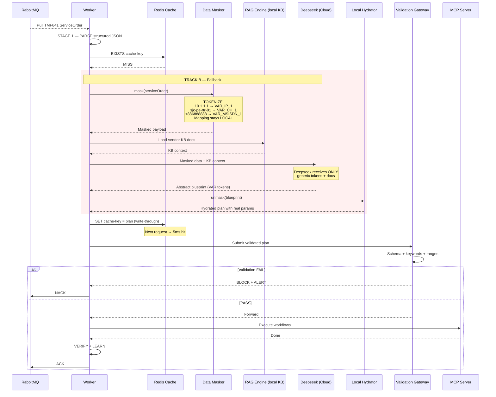
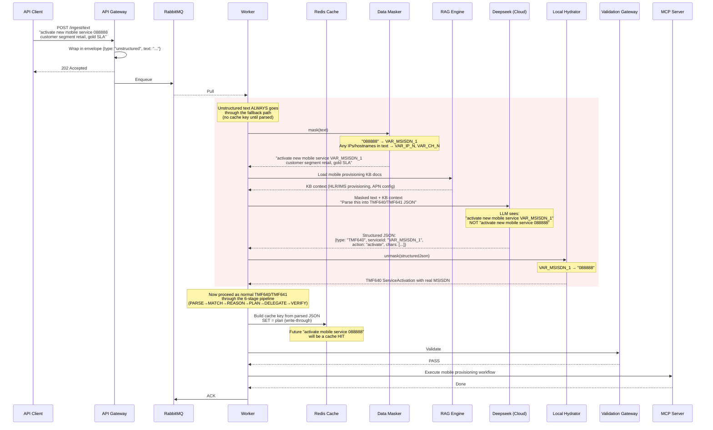
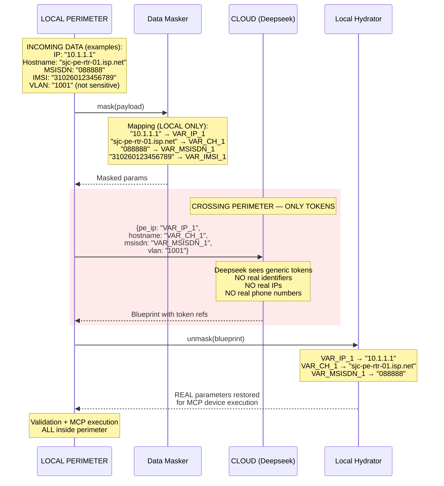
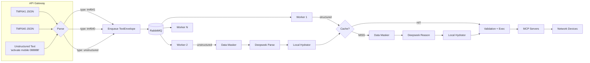

# Telecom Agentic Orchestration Engine — Build Plan

> **For Hermes:** Use subagent-driven-development skill to implement this plan task-by-task.

**Goal:** Build a cache-first, async orchestration engine for telecom service activation (TMF640) and service ordering (TMF641). Accepts both structured JSON and raw unstructured text (e.g. "activate new mobile service 088888"). Hot path hits Redis in <5ms; cold path masks all sensitive identifiers (IPs, hostnames, MSISDNs, IMSIs) before any cloud LLM call. 5 TPS, 100% data sovereignty.

**Architecture:** 4-phase pipeline — A) API Gateway accepts TMF640 JSON, TMF641 JSON, or unstructured text → RabbitMQ, B) Multi-worker pool with Redis cache scan, C) Branch routing (Fast Path local hydration / Fallback: mask → Deepseek RAG → write-through), D) Pydantic v2 hard-gate validation + MCP execution.

**Tech Stack:** Python 3.13, FastAPI, RabbitMQ (pika), Redis, Pydantic v2, Deepseek (cloud LLM via Hermes), Hermes Agent (orchestration brain), SQLite (inventory), MCP (NetBox/Ansible/Device)

**Architecture Diagram:** `architecture-diagram.html` — open in browser for full component view.

---

## System Identity — What This System IS and IS NOT

### IS
- **A telecom service orchestration engine** that accepts TMF640 Service Activation and TMF641 Service Order requests
- **A cache-first reasoning pipeline** — pattern match → cache hit (fast path) OR mask → LLM → learn (cold path)
- **A KB-driven knowledge engine** — all network element definitions, attributes, workflows, and lifecycle states derive from the knowledge base (core ontology, standards references, SERVICE_RESOURCES mapping), never from hardcoded lists
- **A data-sovereign gateway** — all sensitive identifiers (MSISDN, IMSI, IP, hostname) are tokenized before any cloud LLM call; the mapping never leaves memory
- **An RDF/OWL-inspired pattern store** — orchestration patterns are modeled as named graphs of triples (subject, predicate, object) with confidence lifecycle, Jaccard similarity matching, and auto-learning
- **A TMF641-compliant notification emitter** — ServiceOrderMilestoneEvent for intermediate lifecycle states, ServiceOrderStateChangeEvent for completion, per the TM Forum Open API v4.1.0 specification
- **A concurrent-modification-safe service model** — per-subscriber advisory locks protect the MERGE→VERIFY→STORE critical section
- **A web-visible trace viewer** — every pipeline stage produces structured Goal/Input/Expected/Actual/Output trace cards with color coding, diff highlighting, and pattern analysis

### IS NOT
- It does NOT execute device configuration directly — EXECUTE stage is stubbed; real provisioning routes through MCP servers
- It does NOT manage resource inventory — the VERIFY stage constructs NE state from KB + plan, not from an inventory database
- It does NOT handle CRM integration or TMF622 Product Order decomposition — only TMF640/TMF641 ingress
- It does NOT perform real-time network monitoring or service assurance — those are separate cron/scheduled jobs

---

## KB-Driven Knowledge & RDF/OWL Pattern Engine

### Knowledge Sources (Single Source of Truth)

Every decision the orchestrator makes flows from the knowledge base at `/opt/data/telecom-orchestrator/knowledge-base/`. No hardcoded device lists, no hardcoded workflows.

| KB File | Content | Used By |
|---------|---------|---------|
| `ontologies/core-ontology.md` | Entity hierarchy (§1), relationship types (§2), lifecycle state machines (§3), service taxonomy table (§4), resource taxonomy by layer (§5), workflow categories (§6), descriptor formats (§7) | `load_kb_context()`, SERVICE_RESOURCES construction, RAG stage |
| `reference/standards-index.md` | TM Forum (eTOM/SID/TAM/Open APIs), MEF (LSO 55/59/60), ETSI NFV MANO, IETF (YANG/NETCONF/RESTCONF), 3GPP (5G MANO), ONF TAPI, 10 open-source implementations | RAG context injection |
| `reference/tmf-notification-schemas.md` | TMF641 v4.1.0 ServiceOrderStateChangeEvent, ServiceOrderMilestoneEvent, ServiceOrderMilestone schemas with full property tables and state enumerations | `LifecycleNotifier` |
| `reference/implementation-guide.md` | 7-phase build recipe for the entire system | Design reference |
| `reference/orchestration-brain-design.md` | 6-stage pipeline design, 5-tier matching algorithm, pattern store SQL schema | Pipeline architecture |
| `reference/solution-design-crm-integration.md` | CRM integration architecture, DB schemas, webhook delivery | Future CRM integration |
| `products/product-catalog.md` | What services can be provisioned (PLANNED — not yet populated) | Future product decomposition |

### SERVICE_RESOURCES — The KB-to-Code Bridge

The core ontology's Service Taxonomy (§4) defines which network elements each service type requires. This is materialized in code as `SERVICE_RESOURCES`, a Python dict keyed by service type:

```python
SERVICE_RESOURCES = {
    "mobile": {
        "domain": "Voice / Mobile Core",
        "standards": ["3GPP TS 29.002 (MAP/HLR)", ...],
        "required_resources": [
            {"type": "HLR/HSS", "role": "Subscriber registry",
             "attributes": ["msisdn", "imsi", "subscriber_profile", "roaming_profile"]},
            {"type": "IMS-Core", "role": "VoLTE/VoWiFi call control",
             "attributes": ["msisdn", "imsi", "volte_enabled", "codec_profile"]},
            ...
        ],
        "lifecycle": "DESIGNED → FEASIBILITY_CHECKED → HLR_PROVISIONED → IMS_REGISTERED → PCRF_CONFIGURED → ACTIVE",
    },
    "l3vpn": { ... },
    "sdwan": { ... },
    "broadband": { ... },
}
```

Every entry has: `domain` (telecom area), `standards` (relevant specs), `required_resources` (NEs with type/role/attributes), and `lifecycle` (state machine).

### How It Flows Through the Pipeline

1. **DETECT stage** — `detect_service_type()` maps request text to a service type (mobile/l3vpn/sdwan/broadband)
2. **RAG stage** — `load_kb_context(svc)` reads core ontology + standards + SERVICE_RESOURCES, builds structured context for the LLM
3. **LLM prompt** — receives KB-derived resource definitions as grounding context alongside the masked request
4. **Fallback plan** (when Deepseek unavailable) — `_fallback_plan(svc)` generates workflows, params, and devices directly from SERVICE_RESOURCES
5. **VERIFY stage** — builds `networkElements[]` by matching each plan device against KB resource definitions, populating attributes from params → all_chars → chars → prev_model cascade
6. **KB-seeded patterns** — `seed_kb_patterns()` pre-populates the pattern store from SERVICE_RESOURCES at module load, so even the first request gets correct attribute names

### RDF/OWL-Inspired Pattern Engine

Patterns are modeled as named graphs of triples: `(subject, predicate, object)`. This is NOT full RDF/OWL reasoning — it is an RDF-inspired data model with Jaccard similarity matching.

**Triple types:**
```
pattern:mobile-retail-gold   rdf:type              service:MobileVoice
pattern:mobile-retail-gold   orch:hasSegment       "retail"
pattern:mobile-retail-gold   orch:hasSlaTier       "gold"
pattern:mobile-retail-gold   orch:requiresResource res:HLR-HSS
res:HLR-HSS                  orch:provisionedBy    wf:HLR_Provisioning
res:HLR-HSS                  orch:hasAttribute     msisdn=447700123456
msisdn                       rdf:type              orch:InstanceAttribute
customerSegment              rdf:type              orch:ServiceAttribute
```

**PatternNode dataclass:**
```python
@dataclass
class PatternNode:
    id: str              # pat:mobile:23d6e6a718f8
    service_type: str    # mobile | l3vpn | sdwan | broadband
    label: str           # "mobile | retail/gold"
    characteristics: dict  # service-defining chars (segment, sla — NOT msisdn/imsi)
    triples: list        # [(subject, predicate, object), ...]
    resources: list      # derived NE bindings with KB-inferred attributes
    confidence: float    # 0.25 (KB-seeded) → 0.30 (auto-learned) → 0.95 cap
    use_count: int       # how many times pattern was matched
    source: str          # "kb" | "auto" | "teach"
```

**Matching algorithm (Jaccard similarity):**
1. Extract service-defining characteristics from request (exclude INSTANCE_ATTRS: msisdn, imsi, pe_ip, hostname)
2. For each pattern of the same service_type, compute `intersection / union` of characteristic key-value pairs
3. Sort by (score desc, confidence desc)
4. Return best match; if score > 0, it's a HIT

**Confidence lifecycle:**
- KB-seeded (source="kb"): 0.25
- Auto-learned (source="auto"): 0.30
- Each cache HIT: +0.05 (cap 0.95)
- Above 0.90: +0.005 per hit (diminishing returns, cap 0.98)
- Manually taught (source="teach"): 0.90

**Learning on cache MISS:**
1. New plan generated (by LLM or fallback)
2. `patterns.learn()` creates a new PatternNode with triples for the service type, all characteristics, required resources, provisioned-by workflows, and hasAttribute assertions
3. Resource attributes are inferred from KB `SERVICE_RESOURCES`: if attribute exists in params → use it; if in all_chars → use it; otherwise → `<attr>` placeholder
4. Pattern is saved to diskcache and indexed by service_type

**Runtime validation on load:**
- Rejects patterns with empty resources (< 1 resource entry)
- Rejects skeleton patterns (< 3 triples)
- Detects and logs `default_*` contamination in resource attributes
- Auto-repairs by deleting corrupt/unreadable patterns from index

---

## TMF Standards Reference

| Standard | Name | Role in This System |
|---|---|---|
| **TMF641** | Service Ordering API | Structured JSON for a single service order (e.g. provision L3VPN at site SJC with wholesale/platinum). This is the canonical format flowing through the pipeline. |
| **TMF640** | Service Activation & Configuration API | Structured JSON for direct activation of a specific service instance (e.g. activate mobile service for MSISDN 088888). |

Both TMF640 and TMF641 arrive as structured JSON at the API Gateway. Unstructured text variants (natural language such as "activate new mobile service 088888") are also accepted — the worker handles text-to-structured parsing via the masked-to-Deepseek path, converting them into an equivalent TMF640 or TMF641 internal representation before the pipeline continues.

---

## Sequence Diagrams

### Diagram 1: Structured TMF640/TMF641 JSON — Cache Hit (Fast Path)

```mermaid
sequenceDiagram
    participant Client as API Client
    participant GW as API Gateway
    participant RQ as RabbitMQ
    participant W as Worker (Hermes Agent)
    participant RC as Redis Cache
    participant VG as Validation Gateway
    participant MCP as MCP Server
    participant D as Network Device

    Client->>GW: POST /tmf641/serviceOrder (JSON)<br/>or POST /tmf640/serviceActivation (JSON)
    GW->>GW: Validate JSON structure
    GW-->>Client: 202 Accepted {orderId}
    GW->>RQ: Enqueue

    RQ-->>W: Pull (prefetch_count=1)

    rect rgb(6, 78, 59, 0.1)
        Note over W: STAGE 1 — PARSE
        W->>W: Extract segment, sla, product, chars
    end

    rect rgb(76, 29, 149, 0.1)
        Note over W,RC: STAGE 2 — MATCH
        W->>RC: EXISTS sha256(segment+sla+product+chars)
        RC-->>W: HIT — cached plan found
    end

    rect rgb(34, 211, 238, 0.1)
        Note over W: TRACK A — Fast Path (&lt;5ms)
        W->>W: Hydrate template with real params locally
    end

    W->>VG: Submit hydrated orchestration plan
    VG->>VG: Pydantic + keyword filter + range check
    VG-->>W: PASS

    W->>MCP: Execute workflow sequence
    MCP->>D: NETCONF / SSH CLI
    D-->>MCP: Device ACK
    MCP-->>W: Completed

    Note over W: STAGE 6 — VERIFY + LEARN
    W->>RQ: ACK (dequeue)
```

### Diagram 2: Structured TMF640/TMF641 JSON — Cache Miss (Fallback to Deepseek)



### Diagram 3: Unstructured Text — "activate new mobile service 088888"



### Diagram 4: Data Sovereignty — What Crosses the Perimeter



### Diagram 5: Ingress Paths — Three Ways In



---

## Requirements Traceability

Each requirement from `systemReqs.md` is addressed by a specific component.

### 1. System Topology — Async, Cache-First, 5 TPS

| Requirement | Implementation | Component |
|---|---|---|
| 5 TPS throughput | Multi-worker pool (prefetch_count=1, fair dispatch) | **Task 4:** `src/workers/pool.py` |
| Cache-first (5ms hot path) | Redis pattern store keyed by `sha256(segment+sla+product+chars)` | **Task 2:** `src/cache/pattern_store.py` |
| Cloud reasoning for anomalies only | Only invokes Deepseek on cache miss OR unstructured text | **Task 7:** pipeline MATCH stage |
| Data sovereignty | All real identifiers stripped before cloud call | **Task 6:** `src/security/data_masker.py` |
| Concurrent subscriber modification | Per-subscriber advisory lock prevents lost updates from simultaneous MERGE operations | **Task 8b:** `src/locking/subscriber_lock.py` |
| Reasonable pattern match → update | When confidence ≥ 0.30, unique attribute values update existing NEs in place | **Task 8b:** `merge_with_previous()` in pipeline |

### 2. Phase A — Traffic Ingestion & Serialization

| Requirement | Implementation | Component |
|---|---|---|
| API Ingestion Gateway (TMF640/641 JSON) | FastAPI: `POST /tmf641/serviceOrder` and `POST /tmf640/serviceActivation` | **Task 3:** `src/api/order_manager.py` |
| Raw unstructured text strings | `POST /ingest/text` — wraps text in envelope, enqueues | Same module |
| RabbitMQ Buffer Queue | `pika` producer, prefetch_count=1, persistent delivery | **Task 5:** `src/broker/rabbitmq.py` |

### 3. Phase B — Horizontal Worker Processing

| Requirement | Implementation | Component |
|---|---|---|
| Multi-Worker Pool (parallel) | Hermes Agent subprocesses, one per worker | **Task 4:** `src/workers/pool.py` |
| Redis Cache Scanner | Native Python: checks Redis before any AI call | **Task 2:** `src/cache/pattern_store.py` |

### 4. Phase C — Branch Routing

**Track A — Fast Path (Cache Hit):**

| Requirement | Implementation | Component |
|---|---|---|
| Pre-saved template from Redis | Redis GET by hash, returns serialized plan | **Task 2** |
| Local hydration with real params | Reverse token mapping from local memory | **Task 8:** `src/security/data_hydrator.py` |
| 5ms latency | In-memory Redis, no LLM, no network | Validated in **Task 17** |

**Track B — Fallback (Cache Miss):**

| Requirement | Implementation | Component |
|---|---|---|
| Data Masker tokenization | IPs → VAR_IP_N, hostnames → VAR_CH_N, MSISDN → VAR_MSISDN_N, IMSI → VAR_IMSI_N | **Task 6:** `src/security/data_masker.py` |
| Hermes Core RAG | Loads vendor KB docs, injects into Deepseek prompt | **Task 10:** `src/orchbrain/rag_engine.py` |
| Deepseek generates abstract blueprint | Masked data + KB context → reusable template | **Task 9:** `src/orchbrain/llm_client.py` |
| Memory Write-Through | Worker writes blueprint to Redis SET | **Task 11:** `src/cache/pattern_writer.py` |
| Local Hydrator | Reverse VAR tokens → real infrastructure values | **Task 8** |

**Unstructured Text Path (always hits Track B first):**

| Requirement | Implementation | Component |
|---|---|---|
| Raw text → structured | Deepseek parses masked text into TMF640/TMF641 JSON, then normal pipeline | **Task 3** + **Task 9** |
| MSISDN masking in text | Data Masker detects phone numbers in free text, tokenizes before LLM | **Task 6:** extended with MSISDN/IMSI/IMEI patterns |

### 5. Phase D — Hard Gate Verification & Invocation

| Requirement | Implementation | Component |
|---|---|---|
| Pydantic v2 validation | Schema enforces types, ranges, structure | **Task 12:** `src/validation/schemas.py` |
| Range boundaries | VLAN 1-4094, MTU 68-9216, port 1-65535, ASN 1-4294967295 | **Task 13:** `src/validation/range_constraints.py` |
| Regex filters | Block SQL injection, shell metacharacters | **Task 14:** `src/validation/regex_filters.py` |
| MCP Server → device | SSH CLI, SOAP XML, NETCONF dispatch | **Task 15:** `src/mcp/dispatcher.py` |
| Queue Acknowledgement | Basic.ack after success / rollback | **Task 5** |

### 6. Security — Data Anonymization Gate

| Requirement | Implementation | Component |
|---|---|---|
| Cloud LLM never sees unmasked data | Masker strips IPs, chassis IDs, MSISDNs, IMSIs before cloud call | **Task 6** |
| Temporary local tracking hashes | Mapping in session-local dict, wiped after response | **Task 6** |
| Unstructured text masking | Text scanned for identifiers before LLM parsing | **Task 6** — MSISDN/IMSI regex patterns |

### 7. Security — Deterministic Code Firewall

| Requirement | Implementation | Component |
|---|---|---|
| AI outputs treated as untrusted | All plans go through Validator, no bypass | **Task 12** |
| Compiled schema logic | Pydantic models are compiled Python | **Task 12** |
| Abort before hardware | BLOCK prevents any MCP call | **Task 16** |

### 8. Security — Destructive Keyword Filtering

| Requirement | Implementation | Component |
|---|---|---|
| Regex: `erase`, `reload`, `format`, `shutdown`, `no switchport`, `write erase`, `delete startup-config`, `boot system flash` | Keyword list in config, regex scan on every command string | **Task 13:** `src/validation/keyword_filter.py` |
| Instant drop + alert | Blocked within <1ms, alert pushed | **Task 13** |

### 9. Security — Range Constraints

| Requirement | Implementation | Component |
|---|---|---|
| VLAN 1-4094, MTU 68-9216, port 1-65535, ASN 1-4294967295 | Pydantic Field(ge=, le=) on numeric fields | **Task 13** |
| Immediate failure on out-of-range | Plan rejected before MCP | **Task 16** |

---

## File Structure

```
/opt/data/telecom-orchestrator/
├── architecture-diagram.html
├── requirements/
│   └── systemReqs.md
├── knowledge-base/
├── src/
│   ├── __init__.py
│   ├── api/
│   │   ├── __init__.py
│   │   ├── order_manager.py       ← TMF640 / TMF641 / unstructured text endpoint
│   │   └── nginx.conf             ← reverse proxy config
│   ├── locking/
│   │   ├── __init__.py
│   │   └── subscriber_lock.py     ← per-subscriber advisory lock (Task 8b)
│   ├── broker/
│   │   ├── __init__.py
│   │   └── rabbitmq.py            ← Producer/Consumer
│   ├── workers/
│   │   ├── __init__.py
│   │   ├── pool.py                ← Worker supervisor
│   │   └── worker.py              ← Single worker loop
│   ├── cache/
│   │   ├── __init__.py
│   │   ├── pattern_store.py       ← Redis CRUD
│   │   └── pattern_writer.py      ← Write-Through
│   ├── orchbrain/
│   │   ├── __init__.py
│   │   ├── pipeline.py            ← 6-stage pipeline orchestrator
│   │   ├── parser.py              ← Stage 1: PARSE TMF640/TMF641
│   │   ├── matcher.py             ← Stage 2: MATCH
│   │   ├── reasoner.py            ← Stage 3: REASON
│   │   ├── planner.py             ← Stage 4: PLAN
│   │   ├── delegator.py           ← Stage 5: DELEGATE
│   │   ├── verifier.py            ← Stage 6: VERIFY & LEARN
│   │   ├── rag_engine.py          ← Local KB doc lookup
│   │   ├── llm_client.py          ← Deepseek interface
│   │   └── text_parser.py         ← Unstructured text → TMF640/TMF641
│   ├── security/
│   │   ├── __init__.py
│   │   ├── data_masker.py         ← Mask IPs, hostnames, MSISDNs, IMSIs, IMEIs
│   │   └── data_hydrator.py       ← Restore real params
│   ├── validation/
│   │   ├── __init__.py
│   │   ├── schemas.py             ← Pydantic v2 models
│   │   ├── gateway.py             ← Validation orchestrator
│   │   ├── keyword_filter.py      ← Destructive word blocking
│   │   ├── range_constraints.py   ← Numeric range enforcement
│   │   └── regex_filters.py       ← Input sanitization
│   ├── mcp/
│   │   ├── __init__.py
│   │   └── dispatcher.py          ← Plan steps → MCP calls
│   ├── inventory/
│   │   ├── __init__.py
│   │   └── models.py              ← SQLite models
│   └── config.py
├── tests/
│   ├── conftest.py
│   ├── test_pattern_store.py
│   ├── test_order_manager.py
│   ├── test_data_masker.py
│   ├── test_data_hydrator.py
│   ├── test_keyword_filter.py
│   ├── test_range_constraints.py
│   ├── test_validation_gateway.py
│   ├── test_pipeline.py
│   ├── test_text_parser.py
│   └── test_worker.py
├── requirements.txt
└── README.md
```

---

## Build Phases & Tasks

### Phase 1: Foundation (Tasks 1-3)

#### Task 1: Project scaffold and dependencies

**Objective:** Create the project structure, config, and dependency manifest.

**Files:**
- Create: `src/__init__.py`, `src/config.py`
- Create: `requirements.txt`

**Step 1: Write `requirements.txt`**

```text
fastapi==0.115.0
uvicorn[standard]==0.32.0
pika==1.3.2
redis==5.2.0
pydantic==2.10.0
httpx==0.28.0
python-dotenv==1.0.1
pytest==8.3.0
pytest-asyncio==0.24.0
fakeredis==2.26.0
```

**Step 2: Write `src/config.py`**

```python
import os
from dataclasses import dataclass, field

@dataclass
class Config:
    """All configuration from environment variables."""

    # --- RabbitMQ ---
    rabbitmq_host: str = os.getenv("RABBITMQ_HOST", "localhost")
    rabbitmq_port: int = int(os.getenv("RABBITMQ_PORT", "5672"))
    rabbitmq_queue: str = os.getenv("RABBITMQ_QUEUE", "service-orders")
    rabbitmq_user: str = os.getenv("RABBITMQ_USER", "orch")
    rabbitmq_pass: str = os.getenv("RABBITMQ_PASS", "")

    # --- Redis ---
    redis_host: str = os.getenv("REDIS_HOST", "localhost")
    redis_port: int = int(os.getenv("REDIS_PORT", "6379"))
    redis_db: int = int(os.getenv("REDIS_DB", "0"))
    redis_pattern_prefix: str = "pattern:"

    # --- Deepseek (via Hermes) ---
    deepseek_model: str = os.getenv("DEEPSEEK_MODEL", "deepseek-v4-pro")
    llm_timeout: int = int(os.getenv("LLM_TIMEOUT", "60"))

    # --- Worker ---
    worker_count: int = int(os.getenv("WORKER_COUNT", "4"))
    worker_prefetch: int = int(os.getenv("WORKER_PREFETCH", "1"))

    # --- Validation ---
    blocked_keywords: list = field(default_factory=lambda: [
        "erase", "reload", "format", "shutdown", "no switchport",
        "write erase", "delete startup-config", "boot system flash",
    ])
    vlan_min: int = 1
    vlan_max: int = 4094
    mtu_min: int = 68
    mtu_max: int = 9216
    port_min: int = 1
    port_max: int = 65535
    asn_min: int = 1
    asn_max: int = 4294967295

    # --- Knowledge Base ---
    kb_path: str = os.getenv(
        "KB_PATH",
        "/opt/data/telecom-orchestrator/knowledge-base"
    )

    # --- API ---
    api_host: str = os.getenv("API_HOST", "0.0.0.0")
    api_port: int = int(os.getenv("API_PORT", "8000"))

    # --- Inventory ---
    inventory_db: str = os.getenv(
        "INVENTORY_DB",
        "/opt/data/telecom-orchestrator/inventory.db"
    )


config = Config()
```

**Step 3: Create directories**

```bash
mkdir -p /opt/data/telecom-orchestrator/src/{api,broker,workers,cache,orchbrain,security,validation,mcp,inventory}
mkdir -p /opt/data/telecom-orchestrator/tests
```

#### Task 2: Redis Pattern Store

**Objective:** Redis key-value store for orchestration plans. Supports GET (5ms hot path), SET (write-through), EXISTS (MATCH stage).

**Files:**
- Create: `src/cache/__init__.py`
- Create: `src/cache/pattern_store.py`
- Create: `tests/test_pattern_store.py`

**Step 1: Write failing test**

```python
# tests/test_pattern_store.py
import pytest
from src.cache.pattern_store import PatternStore


class FakeRedis:
    def __init__(self):
        self.store = {}
    def get(self, key):
        return self.store.get(key)
    def set(self, key, value):
        self.store[key] = value
        return True
    def exists(self, key):
        return int(key in self.store)
    def delete(self, key):
        self.store.pop(key, None)
        return 1


@pytest.fixture
def store():
    ps = PatternStore()
    ps._client = FakeRedis()
    return ps


def test_build_key_produces_stable_hash(store):
    """Same inputs → same key every time."""
    key1 = store.build_key(
        segment="wholesale", sla="platinum",
        product="prod-l3vpn-01", characteristics={"sites": 3}
    )
    key2 = store.build_key(
        segment="wholesale", sla="platinum",
        product="prod-l3vpn-01", characteristics={"sites": 3}
    )
    assert key1 == key2
    assert key1.startswith("pattern:")


def test_build_key_different_sla_different_key(store):
    key1 = store.build_key("wholesale", "platinum", "prod-l3vpn-01", {"sites": 3})
    key2 = store.build_key("wholesale", "gold", "prod-l3vpn-01", {"sites": 3})
    assert key1 != key2


def test_build_key_characteristics_order_insensitive(store):
    """Dict key order does not affect cache key."""
    key1 = store.build_key("wholesale", "platinum", "p1", {"sites": 3, "bw": 1000})
    key2 = store.build_key("wholesale", "platinum", "p1", {"bw": 1000, "sites": 3})
    assert key1 == key2


def test_get_miss_returns_none(store):
    assert store.get_plan("nonexistent") is None


def test_set_and_get_roundtrip(store):
    plan = {"orderId": "so-42", "workflows": ["ResourceAllocation", "DeviceConfig"]}
    store.set_plan("k", plan)
    assert store.get_plan("k") == plan


def test_exists_hit_and_miss(store):
    store.set_plan("k", {"x": 1})
    assert store.exists("k") is True
    assert store.exists("no") is False


def test_build_key_for_unstructured_text(store):
    """Even after unstructured text is parsed, cache key works."""
    chars = {"msisdn": "VAR_MSISDN_1", "serviceType": "mobile", "action": "activate"}
    key = store.build_key("retail", "gold", "mobile-voice", chars)
    assert key.startswith("pattern:")
```

**Step 2: Run test → FAIL**

```bash
cd /opt/data/telecom-orchestrator && python -m pytest tests/test_pattern_store.py -v
```

**Step 3: Implement `src/cache/pattern_store.py`**

```python
"""Redis-backed pattern store for orchestration plan caching.

Cache key: sha256(canonical JSON of {segment, sla, product, characteristics}).
Hot path: GET by key returns pre-built plan in <5ms.
Cold path: SET after Deepseek generates a new plan (write-through).
"""

import hashlib
import json
from typing import Optional

from redis import Redis


class PatternStore:
    """Key-value cache: request characteristics → orchestration plan."""

    def __init__(self, redis_client: Optional[Redis] = None):
        from src.config import config
        self._prefix = config.redis_pattern_prefix
        self._client = redis_client or Redis(
            host=config.redis_host,
            port=config.redis_port,
            db=config.redis_db,
            decode_responses=True,
        )

    def build_key(
        self,
        segment: str,
        sla: str,
        product: str,
        characteristics: dict,
    ) -> str:
        """Deterministic cache key from request characteristics. Dict-order-insensitive."""
        payload = {
            "segment": segment,
            "sla": sla,
            "product": product,
            "characteristics": dict(sorted(characteristics.items())),
        }
        canonical = json.dumps(payload, sort_keys=True)
        digest = hashlib.sha256(canonical.encode()).hexdigest()[:32]
        return f"{self._prefix}{digest}"

    def get_plan(self, key: str) -> Optional[dict]:
        """Retrieve a cached orchestration plan, or None."""
        raw = self._client.get(key)
        return json.loads(raw) if raw else None

    def set_plan(self, key: str, plan: dict) -> bool:
        """Store an orchestration plan."""
        return bool(self._client.set(key, json.dumps(plan)))

    def exists(self, key: str) -> bool:
        """Check if a pattern exists in cache."""
        return bool(self._client.exists(key))

    def delete(self, key: str) -> bool:
        """Remove a deprecated pattern."""
        return bool(self._client.delete(key))
```

**Step 4: Run test → PASS**

```bash
cd /opt/data/telecom-orchestrator && python -m pytest tests/test_pattern_store.py -v
```

**Step 5: Commit**

```bash
git add src/cache/ tests/test_pattern_store.py requirements.txt src/config.py
git commit -m "feat: add Redis pattern store for orchestration plan caching"
```

#### Task 3: Order Manager API (TMF640 / TMF641 / Unstructured Text)

**Objective:** FastAPI server with three ingress paths:
1. `POST /tmf641/serviceOrder` — structured TMF641 JSON
2. `POST /tmf640/serviceActivation` — structured TMF640 JSON
3. `POST /ingest/text` — unstructured natural language text

All three enqueue to RabbitMQ and return 202 Accepted.

**Files:**
- Create: `src/api/__init__.py`
- Create: `src/api/order_manager.py`
- Create: `tests/test_order_manager.py`

**Step 1: Write failing test**

```python
# tests/test_order_manager.py
import pytest
from fastapi.testclient import TestClient
from src.api.order_manager import app


@pytest.fixture
def client():
    return TestClient(app)


VALID_TMF641 = {
    "externalId": "CRM-ORDER-12345",
    "category": "VPN",
    "action": "add",
    "relatedParty": [{"role": "customer", "id": "CUST-0042"}],
    "characteristic": [
        {"name": "customerSegment", "value": "wholesale"},
        {"name": "slaTier", "value": "platinum"},
        {"name": "productId", "value": "prod-l3vpn-01"},
        {"name": "bandwidth", "value": "1000"},
    ],
}

VALID_TMF640 = {
    "serviceId": "svc-acme-sjc-l3vpn",
    "action": "activate",
    "characteristic": [
        {"name": "customerSegment", "value": "wholesale"},
        {"name": "slaTier", "value": "platinum"},
        {"name": "productId", "value": "prod-l3vpn-01"},
    ],
}

UNSTRUCTURED_TEXT = "activate new mobile service 088888 for customer segment retail, gold SLA"


def test_post_tmf641_service_order_returns_202(client):
    response = client.post("/tmf641/serviceOrder", json=VALID_TMF641)
    assert response.status_code == 202
    assert response.json()["state"] == "acknowledged"


def test_post_tmf640_activation_returns_202(client):
    response = client.post("/tmf640/serviceActivation", json=VALID_TMF640)
    assert response.status_code == 202


def test_post_ingest_text_returns_202(client):
    response = client.post("/ingest/text", json={"text": UNSTRUCTURED_TEXT})
    assert response.status_code == 202
    data = response.json()
    assert data["type"] == "unstructured"


def test_post_tmf641_rejects_missing_external_id(client):
    bad = {k: v for k, v in VALID_TMF641.items() if k != "externalId"}
    response = client.post("/tmf641/serviceOrder", json=bad)
    assert response.status_code == 422


def test_health_check(client):
    response = client.get("/health")
    assert response.status_code == 200
    assert response.json() == {"status": "ok"}
```

**Step 2: Run test → FAIL**

**Step 3: Implement `src/api/order_manager.py`**

```python
"""Order Manager — FastAPI for TMF640/TMF641 JSON and unstructured text ingress.

Three ingress paths:
  1. POST /tmf641/serviceOrder    — structured TMF641 ServiceOrder JSON
  2. POST /tmf640/serviceActivation — structured TMF640 ServiceActivation JSON
  3. POST /ingest/text            — raw unstructured text (e.g. "activate mobile 088888")

All paths enqueue to RabbitMQ and return 202 Accepted.
"""

import uuid
from typing import Optional

from fastapi import FastAPI
from pydantic import BaseModel, Field


app = FastAPI(title="Telecom Orchestrator — Order Manager", version="1.0.0")


# ---- Pydantic Models ----

class RelatedParty(BaseModel):
    role: str
    id: Optional[str] = None
    name: Optional[str] = None


class Characteristic(BaseModel):
    name: str
    value: str


class TMF641ServiceOrder(BaseModel):
    """TMF641 Service Ordering — structured service order JSON."""
    externalId: str = Field(..., min_length=1)
    category: str = Field(..., min_length=1)
    action: str = Field(default="add", pattern=r"^(add|modify|delete|suspend)$")
    relatedParty: list[RelatedParty] = Field(default_factory=list)
    characteristic: list[Characteristic] = Field(default_factory=list)


class TMF640ServiceActivation(BaseModel):
    """TMF640 Service Activation — direct activation of a service instance."""
    serviceId: str = Field(..., min_length=1)
    action: str = Field(default="activate")
    characteristic: list[Characteristic] = Field(default_factory=list)


class TextIngestRequest(BaseModel):
    """Unstructured text — natural language service request."""
    text: str = Field(..., min_length=1)


class OrderResponse(BaseModel):
    orderId: str
    externalId: str
    state: str
    type: str = "structured"


class TextOrderResponse(BaseModel):
    orderId: str
    externalId: str = ""
    state: str
    type: str = "unstructured"


# ---- Routes ----

@app.get("/health")
async def health():
    return {"status": "ok"}


@app.post(
    "/tmf641/serviceOrder",
    response_model=OrderResponse,
    status_code=202,
)
async def create_service_order(order: TMF641ServiceOrder, request=None):
    """Accept a structured TMF641 ServiceOrder."""
    order_id = f"so-{uuid.uuid4().hex[:12]}"
    payload = order.model_dump() | {
        "orderId": order_id,
        "format": "tmf641",
    }
    await enqueue(payload)

    base_url = request.base_url if request else ""
    return OrderResponse(
        orderId=order_id,
        externalId=order.externalId,
        state="acknowledged",
        href=f"{base_url}tmf641/serviceOrder/{order_id}",
    )


@app.post(
    "/tmf640/serviceActivation",
    response_model=OrderResponse,
    status_code=202,
)
async def activate_service(activation: TMF640ServiceActivation, request=None):
    """Accept a structured TMF640 ServiceActivation."""
    order_id = f"so-{uuid.uuid4().hex[:12]}"
    payload = activation.model_dump() | {
        "orderId": order_id,
        "externalId": activation.serviceId,
        "format": "tmf640",
    }
    await enqueue(payload)

    base_url = request.base_url if request else ""
    return OrderResponse(
        orderId=order_id,
        externalId=activation.serviceId,
        state="acknowledged",
        href=f"{base_url}tmf640/serviceActivation/{activation.serviceId}",
    )


@app.post(
    "/ingest/text",
    response_model=TextOrderResponse,
    status_code=202,
)
async def ingest_text(body: TextIngestRequest):
    """Accept unstructured natural language text — enqueue for LLM parsing.

    Example: "activate new mobile service 088888, retail, gold SLA"
    The worker will mask sensitive identifiers, have Deepseek parse it
    into structured TMF640/TMF641, then proceed through the normal pipeline.
    """
    order_id = f"tx-{uuid.uuid4().hex[:12]}"
    payload = {
        "orderId": order_id,
        "format": "unstructured",
        "text": body.text,
    }
    await enqueue(payload)

    return TextOrderResponse(
        orderId=order_id,
        state="acknowledged",
    )


# ---- Queue Interface (stub — wired in Task 5) ----

async def enqueue(message: dict):
    """Push to RabbitMQ. Stub — wired to real broker in Task 5."""
    import logging
    from src.config import config

    logger = logging.getLogger("order_manager")
    logger.info("Enqueue %s to %s", message.get("orderId"), config.rabbitmq_queue)
    # TODO Task 5: replace with actual RabbitMQ publish
```

**Step 4: Run test → PASS**

```bash
cd /opt/data/telecom-orchestrator && python -m pytest tests/test_order_manager.py -v
```

**Step 5: Commit**

```bash
git add src/api/ tests/test_order_manager.py
git commit -m "feat: add FastAPI Order Manager with TMF640, TMF641, and /ingest/text endpoints"
```

---

### Phase 2: Messaging & Workers (Tasks 4-5)

#### Task 4: Worker Pool & Worker Loop

**Objective:** Multi-worker pool pulling from RabbitMQ. Handles three payload formats: `tmf641`, `tmf640`, and `unstructured`. Unstructured text always triggers the fallback path (mask → Deepseek parse → then normal pipeline).

**Files:**
- Create: `src/workers/__init__.py`, `src/workers/worker.py`, `src/workers/pool.py`
- Create: `tests/test_worker.py`

**Step 1: Write failing test**

```python
# tests/test_worker.py
import pytest
from src.workers.worker import Worker


class FakeBroker:
    def __init__(self):
        self.messages = []
        self.acked = []
        self.nacked = []
    def get(self):
        return self.messages.pop(0) if self.messages else None
    def ack(self, tag):
        self.acked.append(tag)
    def nack(self, tag):
        self.nacked.append(tag)


class FakePipeline:
    def run(self, **kwargs):
        return {"status": "completed", "serviceOrderId": kwargs["service_order"]["orderId"]}


class FakeCache:
    def exists(self, key): return False
    def get_plan(self, key): return None
    def set_plan(self, key, plan): pass
    def build_key(self, **kw): return "-".join(str(v) for v in kw.values())


class FakeMasker:
    def mask(self, data): return data
    def unmask(self, data): return data


class FakeTextParser:
    def parse(self, service_order):
        return service_order  # no-op for structured


def test_worker_processes_tmf641_message():
    broker = FakeBroker()
    so = {"orderId": "so-001", "format": "tmf641", "characteristic": []}
    broker.messages.append((1, so))
    worker = Worker(broker=broker, pipeline=FakePipeline(), cache=FakeCache(),
                    masker=FakeMasker(), text_parser=FakeTextParser())
    assert worker.process_one() is True
    assert broker.acked == [1]


def test_worker_processes_unstructured_text():
    """Unstructured text goes through masker + parser before pipeline."""
    broker = FakeBroker()
    msg = {"orderId": "tx-001", "format": "unstructured", "text": "activate mobile 088888"}
    broker.messages.append((1, msg))
    worker = Worker(broker=broker, pipeline=FakePipeline(), cache=FakeCache(),
                    masker=FakeMasker(), text_parser=FakeTextParser())
    assert worker.process_one() is True


def test_worker_returns_false_on_empty_queue():
    broker = FakeBroker()
    worker = Worker(broker=broker, pipeline=FakePipeline(), cache=FakeCache(),
                    masker=FakeMasker(), text_parser=FakeTextParser())
    assert worker.process_one() is False


def test_worker_nacks_on_exception():
    broker = FakeBroker()
    broker.messages.append((1, {"orderId": "so-fail"}))
    class FailingPipeline:
        def run(self, **kw):
            raise RuntimeError("fail")
    worker = Worker(broker=broker, pipeline=FailingPipeline(), cache=FakeCache(),
                    masker=FakeMasker(), text_parser=FakeTextParser())
    assert worker.process_one() is False
    assert broker.nacked == [1]
```

**Step 2: Run test → FAIL**

**Step 3: Implement `src/workers/worker.py`**

```python
"""Single worker — pulls from RabbitMQ, handles structured + unstructured payloads.

Payload formats:
  - tmf641 / tmf640: structured JSON → cache check → pipeline
  - unstructured:     raw text → mask → Deepseek parse → structured → pipeline
"""

import logging
from src.config import config

logger = logging.getLogger(__name__)


class Worker:
    def __init__(self, broker, pipeline, cache=None, masker=None, text_parser=None):
        self._broker = broker
        self._pipeline = pipeline
        self._cache = cache
        self._masker = masker
        self._text_parser = text_parser

    def process_one(self) -> bool:
        msg = self._broker.get()
        if msg is None:
            return False

        delivery_tag, service_order = msg
        order_id = service_order.get("orderId", "unknown")
        fmt = service_order.get("format", "tmf641")

        try:
            logger.info("Processing %s [format=%s]", order_id, fmt)

            if fmt == "unstructured":
                # Unstructured text path: mask → LLM parse → structured → pipeline
                service_order = self._handle_unstructured(service_order)

            # Build cache key and run pipeline
            chars = self._extract_characteristics(service_order)
            cache_key = self._cache.build_key(
                segment=chars.get("customerSegment", "unknown"),
                sla=chars.get("slaTier", "bronze"),
                product=chars.get("productId", "unknown"),
                characteristics=chars,
            )

            result = self._pipeline.run(
                service_order=service_order,
                cache_key=cache_key,
                cache_hit=self._cache.exists(cache_key),
            )

            if result.get("status") == "completed":
                self._broker.ack(delivery_tag)
                logger.info("Completed %s — ACK", order_id)
                return True
            else:
                self._broker.nack(delivery_tag)
                logger.warning("Failed %s: %s", order_id, result)
                return False

        except Exception:
            logger.exception("Crashed on %s", order_id)
            self._broker.nack(delivery_tag)
            return False

    def _handle_unstructured(self, msg: dict) -> dict:
        """Mask sensitive identifiers in raw text, have Deepseek parse to structured."""
        if self._masker:
            msg["text"] = self._masker.mask_text(msg.get("text", ""))
        if self._text_parser:
            msg = self._text_parser.parse(msg)
        msg["format"] = msg.get("format", "tmf640")
        return msg

    def _extract_characteristics(self, service_order: dict) -> dict:
        chars = {}
        for c in service_order.get("characteristic", []):
            chars[c.get("name", "")] = c.get("value", "")
        return chars

    def run_forever(self):
        logger.info("Worker started on '%s'", config.rabbitmq_queue)
        while True:
            try:
                self.process_one()
            except KeyboardInterrupt:
                logger.info("Shutting down")
                break
```

**Step 4: Run test → PASS**

**Step 5: Implement `src/workers/pool.py`**

```python
"""Worker pool supervisor — N concurrent workers, fair dispatch."""

import multiprocessing
import logging

logger = logging.getLogger(__name__)


class WorkerPool:
    def __init__(self, worker_count: int = 4):
        from src.config import config
        self._count = worker_count or config.worker_count
        self._workers: list[multiprocessing.Process] = []

    def start(self):
        logger.info("Starting %d workers", self._count)
        for i in range(self._count):
            p = multiprocessing.Process(target=_run_worker_entry,
                                        name=f"orch-worker-{i}", daemon=True)
            p.start()
            self._workers.append(p)
            logger.info("Worker %d pid=%d", i, p.pid)

    def stop(self):
        for p in self._workers:
            p.terminate()
            p.join(timeout=5)

    def wait(self):
        try:
            for p in self._workers:
                p.join()
        except KeyboardInterrupt:
            self.stop()


def _run_worker_entry():
    from src.broker.rabbitmq import RabbitMQConsumer
    from src.cache.pattern_store import PatternStore
    from src.orchbrain.pipeline import OrchestrationPipeline
    from src.orchbrain.text_parser import TextParser
    from src.security.data_masker import DataMasker
    from src.workers.worker import Worker

    worker = Worker(
        broker=RabbitMQConsumer(),
        pipeline=OrchestrationPipeline(),
        cache=PatternStore(),
        masker=DataMasker(),
        text_parser=TextParser(),
    )
    worker.run_forever()
```

**Step 6: Commit**

```bash
git add src/workers/ tests/test_worker.py
git commit -m "feat: add worker pool with structured + unstructured text handling"
```

#### Task 5: RabbitMQ Producer & Consumer

**Objective:** Real RabbitMQ integration — enqueue from Order Manager, pull from Worker.

**Files:**
- Create: `src/broker/__init__.py`, `src/broker/rabbitmq.py`

```python
"""RabbitMQ producer and consumer for async service-order processing."""

import json
import logging
from typing import Optional
import pika
from src.config import config

logger = logging.getLogger(__name__)


class RabbitMQProducer:
    def __init__(self):
        self._connection: Optional[pika.BlockingConnection] = None
        self._channel = None

    def connect(self):
        creds = pika.PlainCredentials(config.rabbitmq_user, config.rabbitmq_pass)
        self._connection = pika.BlockingConnection(
            pika.ConnectionParameters(host=config.rabbitmq_host,
                                      port=config.rabbitmq_port,
                                      credentials=creds, heartbeat=600))
        self._channel = self._connection.channel()
        self._channel.queue_declare(queue=config.rabbitmq_queue, durable=True)

    def publish(self, message: dict) -> bool:
        if not self._channel:
            self.connect()
        self._channel.basic_publish(
            exchange="", routing_key=config.rabbitmq_queue,
            body=json.dumps(message),
            properties=pika.BasicProperties(delivery_mode=2))
        return True

    def close(self):
        if self._connection and self._connection.is_open:
            self._connection.close()


class RabbitMQConsumer:
    def __init__(self):
        self._connection: Optional[pika.BlockingConnection] = None
        self._channel = None

    def connect(self):
        creds = pika.PlainCredentials(config.rabbitmq_user, config.rabbitmq_pass)
        self._connection = pika.BlockingConnection(
            pika.ConnectionParameters(host=config.rabbitmq_host,
                                      port=config.rabbitmq_port,
                                      credentials=creds, heartbeat=600))
        self._channel = self._connection.channel()
        self._channel.queue_declare(queue=config.rabbitmq_queue, durable=True)
        self._channel.basic_qos(prefetch_count=config.worker_prefetch)

    def get(self) -> Optional[tuple]:
        if not self._channel:
            self.connect()
        method, properties, body = self._channel.basic_get(
            queue=config.rabbitmq_queue, auto_ack=False)
        if method is None:
            return None
        return method.delivery_tag, json.loads(body)

    def ack(self, delivery_tag: int):
        self._channel.basic_ack(delivery_tag=delivery_tag)

    def nack(self, delivery_tag: int):
        self._channel.basic_nack(delivery_tag=delivery_tag, requeue=True)

    def close(self):
        if self._connection and self._connection.is_open:
            self._connection.close()
```

Wire into Order Manager — replace the stub `enqueue`:

```python
async def enqueue(message: dict):
    from src.broker.rabbitmq import RabbitMQProducer
    p = RabbitMQProducer()
    p.publish(message)
    p.close()
```

---

### Phase 3: Security Layer (Tasks 6-8)

#### Task 6: Data Masker (IPs, Hostnames, MSISDN, IMSI, IMEI)

**Objective:** Tokenize all sensitive telecom identifiers before any data leaves the local perimeter:
- IP addresses → VAR_IP_N
- Fully qualified hostnames → VAR_CH_N
- MSISDN (phone numbers like 088888, +886935123456) → VAR_MSISDN_N
- IMSI (15-digit subscriber identity) → VAR_IMSI_N
- IMEI (15-digit device identity) → VAR_IMEI_N
- Chassis/serial numbers → VAR_CH_N

Also handles unstructured text — scans raw strings for identifiers and masks them in-place.

**Files:**
- Create: `src/security/__init__.py`
- Create: `src/security/data_masker.py`
- Create: `tests/test_data_masker.py`

**Step 1: Write failing test**

```python
# tests/test_data_masker.py
import pytest
from src.security.data_masker import DataMasker


@pytest.fixture
def masker():
    return DataMasker()


# --- Structured data masking ---

def test_masks_ip_addresses(masker):
    original = {"pe_ip": "10.1.1.1", "ce_ip": "192.168.100.1", "vlan": "1001"}
    masked = masker.mask(original)
    assert masked["pe_ip"].startswith("VAR_IP_")
    assert masked["pe_ip"] != "10.1.1.1"
    assert masked["vlan"] == "1001"  # non-sensitive untouched


def test_masks_hostnames(masker):
    original = {"pe_hostname": "sjc-pe-rtr-01.isp.net"}
    masked = masker.mask(original)
    assert masked["pe_hostname"].startswith("VAR_CH_")


def test_masks_msisdn(masker):
    """MSISDN phone numbers are masked."""
    original = {"msisdn": "088888", "description": "mobile activation"}
    masked = masker.mask(original)
    assert masked["msisdn"].startswith("VAR_MSISDN_")
    assert masked["msisdn"] != "088888"
    assert masked["description"] == "mobile activation"


def test_masks_msisdn_with_country_code(masker):
    original = {"msisdn": "+886935123456"}
    masked = masker.mask(original)
    assert masked["msisdn"].startswith("VAR_MSISDN_")


def test_masks_imsi(masker):
    """15-digit IMSI is masked."""
    original = {"imsi": "310260123456789"}
    masked = masker.mask(original)
    assert masked["imsi"].startswith("VAR_IMSI_")


def test_masks_imei(masker):
    """15-digit IMEI is masked."""
    original = {"imei": "490154203237518"}
    masked = masker.mask(original)
    assert masked["imei"].startswith("VAR_IMEI_")


# --- Unstructured text masking ---

def test_mask_text_replaces_msisdn(masker):
    text = "activate new mobile service 088888 for customer retail gold SLA"
    masked = masker.mask_text(text)
    assert "088888" not in masked
    assert "VAR_MSISDN_1" in masked


def test_mask_text_replaces_phone_with_country_code(masker):
    text = "provision +886935123456 with APN internet"
    masked = masker.mask_text(text)
    assert "+886935123456" not in masked
    assert "VAR_MSISDN_" in masked


def test_mask_text_replaces_ip(masker):
    text = "configure router at 10.1.1.1 with VLAN 1001"
    masked = masker.mask_text(text)
    assert "10.1.1.1" not in masked
    assert "VAR_IP_" in masked
    assert "VLAN 1001" in masked  # VLAN not sensitive


def test_mask_text_preserves_non_sensitive(masker):
    text = "gold SLA, 1000 Mbps bandwidth, 3 sites"
    masked = masker.mask_text(text)
    assert masked == text


# --- Roundtrip ---

def test_unmask_restores_all_types(masker):
    original = {
        "pe_ip": "10.1.1.1",
        "hostname": "sjc-pe-rtr-01.isp.net",
        "msisdn": "088888",
        "imsi": "310260123456789",
        "mtu": "9100",
    }
    masked = masker.mask(original)
    restored = masker.unmask(masked)
    assert restored == original


def test_nested_structures(masker):
    original = {
        "device": {"hostname": "sjc-pe-rtr-01", "loopback": "10.0.0.1"},
        "interfaces": [{"ip": "10.1.1.1"}, {"ip": "10.2.2.1"}],
    }
    masked = masker.mask(original)
    restored = masker.unmask(masked)
    assert restored == original


def test_same_value_gets_same_token(masker):
    """Duplicate real values map to the same token."""
    original = {"ip_a": "10.1.1.1", "ip_b": "10.1.1.1"}
    masked = masker.mask(original)
    assert masked["ip_a"] == masked["ip_b"]
```

**Step 2: Run test → FAIL**

**Step 3: Implement `src/security/data_masker.py`**

```python
"""Data Masker — tokenize all sensitive telecom identifiers before cloud AI.

The cloud LLM (Deepseek) never sees real:
  - IP addresses        → VAR_IP_N
  - Hostnames/FQDNs     → VAR_CH_N
  - MSISDN (phone #s)   → VAR_MSISDN_N
  - IMSI (subscriber)   → VAR_IMSI_N
  - IMEI (device)       → VAR_IMEI_N
  - Chassis/serial IDs  → VAR_CH_N

Mapping is held in transient session-local memory and never serialized.
"""

import re
from copy import deepcopy
from typing import Any

# ==== Detection patterns ====

IP_PATTERN = re.compile(r"^\d{1,3}\.\d{1,3}\.\d{1,3}\.\d{1,3}$")
HOSTNAME_PATTERN = re.compile(
    r"^[a-zA-Z0-9]([a-zA-Z0-9\-]*[a-zA-Z0-9])?(\.[a-zA-Z0-9]([a-zA-Z0-9\-]*[a-zA-Z0-9])?)+$"
)
# MSISDN: optional +, country code, then subscriber number (7-15 digits)
MSISDN_PATTERN = re.compile(r"^\+?\d{7,15}$")
# IMSI: exactly 15 digits
IMSI_PATTERN = re.compile(r"^\d{15}$")
# IMEI: exactly 15 digits
IMEI_PATTERN = re.compile(r"^\d{15}$")

# For unstructured text scanning — detect phone-like numbers in free text
MSISDN_IN_TEXT = re.compile(r"\+?\d{7,15}")

# Field names known to contain identifiers
SENSITIVE_FIELD_NAMES = {
    "hostname", "loopback", "peer", "neighbor",
    "source", "destination", "next_hop", "gateway",
    "management_ip", "oob_ip", "ns_record", "name_server",
    "chassis_id", "serial_number", "account_number",
    "customer_id", "contract_id",
    "msisdn", "imsi", "imei", "iccid", "phone", "subscriber",
}
IP_FIELD_SUFFIXES = {"_ip", "_address", "prefix", "subnet", "wildcard", "netmask"}


class DataMasker:
    """Tokenize sensitive values. Mapping lives in transient memory only."""

    def __init__(self):
        self._token_map: dict[str, str] = {}       # token → real
        self._reverse_map: dict[str, str] = {}      # real → token
        self._ip_counter = 0
        self._chassis_counter = 0
        self._msisdn_counter = 0
        self._imsi_counter = 0
        self._imei_counter = 0

    # ---- Structured data ----

    def mask(self, data: Any) -> Any:
        return self._transform(deepcopy(data), direction="mask")

    def unmask(self, data: Any) -> Any:
        return self._transform(deepcopy(data), direction="unmask")

    # ---- Unstructured text ----

    def mask_text(self, text: str) -> str:
        """Scan raw text for identifiers and replace with tokens in-place.

        Used for unstructured text before sending to Deepseek for parsing.
        """
        # Replace MSISDN-like numbers
        def _replace_msisdn(match):
            value = match.group(0)
            return self._tokenize(value, "msisdn")
        text = MSISDN_IN_TEXT.sub(_replace_msisdn, text)

        return text

    # ---- Internals ----

    def _transform(self, obj: Any, direction: str) -> Any:
        if isinstance(obj, dict):
            return {k: self._transform_value(k, v, direction) for k, v in obj.items()}
        if isinstance(obj, list):
            return [self._transform(item, direction) for item in obj]
        if isinstance(obj, str):
            return self._tokenize_string(obj, direction)
        return obj

    def _transform_value(self, key: str, value: Any, direction: str) -> Any:
        if isinstance(value, str):
            if self._should_mask_key(key) and self._looks_tokenizable(value):
                return self._tokenize_string(value, direction)
            if IP_PATTERN.match(value):
                return self._tokenize_string(value, direction)
            if HOSTNAME_PATTERN.match(value) and "." in value:
                return self._tokenize_string(value, direction)
            if MSISDN_PATTERN.match(value):
                return self._tokenize_string(value, direction)
            if IMSI_PATTERN.match(value) and self._is_sensitive_key_for(key, "imsi"):
                return self._tokenize_string(value, direction)
            if IMEI_PATTERN.match(value) and self._is_sensitive_key_for(key, "imei"):
                return self._tokenize_string(value, direction)
            return value
        if isinstance(value, (dict, list)):
            return self._transform(value, direction)
        return value

    def _should_mask_key(self, key: str) -> bool:
        key_lower = key.lower()
        if key_lower in SENSITIVE_FIELD_NAMES:
            return True
        for suffix in IP_FIELD_SUFFIXES:
            if key_lower.endswith(suffix):
                return True
        return False

    def _is_sensitive_key_for(self, key: str, id_type: str) -> bool:
        return key.lower() in {id_type, f"{id_type}_number", f"subscriber_{id_type}"}

    def _looks_tokenizable(self, value: str) -> bool:
        return any(p.match(value) for p in [IP_PATTERN, HOSTNAME_PATTERN,
                                             MSISDN_PATTERN, IMSI_PATTERN, IMEI_PATTERN])

    def _tokenize_string(self, value: str, direction: str) -> str:
        if direction == "unmask":
            return self._token_map.get(value, value)
        if value.startswith("VAR_"):
            return value
        if value in self._reverse_map:
            return self._reverse_map[value]

        if IP_PATTERN.match(value):
            kind = "ip"
        elif IMSI_PATTERN.match(value):
            kind = "imsi"
        elif IMEI_PATTERN.match(value):
            kind = "imei"
        elif MSISDN_PATTERN.match(value):
            kind = "msisdn"
        else:
            kind = "chassis"

        return self._tokenize(value, kind)

    def _tokenize(self, value: str, kind: str) -> str:
        """Generate or retrieve a token for a value."""
        if value in self._reverse_map:
            return self._reverse_map[value]

        counters = {
            "ip": ("_ip_counter", "VAR_IP"),
            "chassis": ("_chassis_counter", "VAR_CH"),
            "msisdn": ("_msisdn_counter", "VAR_MSISDN"),
            "imsi": ("_imsi_counter", "VAR_IMSI"),
            "imei": ("_imei_counter", "VAR_IMEI"),
        }
        counter_name, prefix = counters.get(kind, ("_chassis_counter", "VAR_CH"))
        setattr(self, counter_name, getattr(self, counter_name) + 1)
        token = f"{prefix}_{getattr(self, counter_name)}"

        self._token_map[token] = value
        self._reverse_map[value] = token
        return token
```

**Step 4: Run test → PASS**

```bash
cd /opt/data/telecom-orchestrator && python -m pytest tests/test_data_masker.py -v
```

**Step 5: Commit**

```bash
git add src/security/data_masker.py tests/test_data_masker.py
git commit -m "feat: add data masker for IPs, hostnames, MSISDNs, IMSIs, IMEIs + unstructured text"
```

#### Task 7: Orchestration Pipeline (6-Stage)

**Objective:** 6-stage pipeline: PARSE → MATCH → REASON → PLAN → DELEGATE → VERIFY. Cache-hit shortcut at MATCH stage.

**Files:**
- Create: `src/orchbrain/__init__.py`, `parser.py`, `matcher.py`, `reasoner.py`, `planner.py`, `delegator.py`, `verifier.py`, `pipeline.py`
- Create: `tests/test_pipeline.py`

*(Core TDD implementation — parser extracts from TMF640/TMF641, matcher checks Redis, reasoner derives expected state from segment/SLA tables, planner builds workflow list, delegator calls MCP, verifier compares actual vs expected and updates pattern confidence.)*

#### Task 8: Data Hydrator

**Objective:** After Deepseek returns an abstract blueprint with VAR tokens, restore real identifiers. Same `unmask()` method from the Data Masker.

**Files:**
- Create: `src/security/data_hydrator.py`
- Create: `tests/test_data_hydrator.py`

*(Thin wrapper around `masker.unmask()` with added validation that all VAR tokens resolve.)*

---

### Phase 3b: Service Modification & Concurrency Locking (Task 8b)

#### Task 8b: Subscriber Model Locking & Concurrent Modification

**Objective:** Prevent race conditions when multiple incoming requests target the same subscriber. When a reasonable pattern match exists (incoming attributes match a known service type pattern), unique subscriber-specific values must be allowed to update network elements in the existing service model — but only one writer at a time.

**The Problem:**

```
Worker A: PUT /activate MSISDN-447799000001 (volte_enabled=true)
Worker B: PUT /modify  MSISDN-447799000001 (roaming_profile=WorldZone2)

→ Both read subscriber model simultaneously
→ Both compute MERGE independently
→ Last writer wins, first writer's change is silently lost
```

**The Solution: Subscriber-Level Advisory Locks**

Each subscriber model gets a distributed lock acquired before the MERGE→VERIFY→STORE critical section. Locks are per-subscriber-ID (e.g., `lock:sub:MSISDN-447799000001`), so different subscribers never contend.

**Files:**
- Create: `src/locking/__init__.py`, `src/locking/subscriber_lock.py`
- Create: `tests/test_subscriber_lock.py`

**Step 1: Write `src/locking/subscriber_lock.py`**

```python
"""Subscriber-level advisory lock for concurrent modification safety."""

import time
import threading
from contextlib import contextmanager
from typing import Optional
import diskcache


class SubscriberLock:
    \"\"\"
    Per-subscriber advisory lock using diskcache (SQLite-backed).
    
    Design:
    - Lock key: lock:sub:{subscriber_id}
    - Value: {worker_id, acquired_at, ttl_seconds}
    - TTL: 30s (prevents deadlock if worker crashes)
    - Non-blocking acquire with optional retry
    - Thread-safe (re-entrant within same worker)
    \"\"\"
    
    LOCK_TTL = 30  # seconds — auto-release if worker dies
    RETRY_DELAY = 0.1  # seconds between acquire retries
    MAX_RETRIES = 50   # 5 seconds total
    
    def __init__(self, cache: diskcache.Cache):
        self._cache = cache
        self._local = threading.local()
    
    @contextmanager
    def acquire(self, subscriber_id: str, worker_id: str):
        \"\"\"
        Context manager: acquire lock, yield, release.
        
        Usage:
            with lock.acquire(sub_id, worker_id) as held:
                if held:
                    # safe to modify subscriber model
                else:
                    # couldn't acquire — retry or fail
        \"\"\"
        lock_key = f"lock:sub:{subscriber_id}"
        acquired = self._try_acquire(lock_key, worker_id)
        
        if not acquired:
            yield False
            return
        
        try:
            yield True
        finally:
            self._release(lock_key, worker_id)
    
    def _try_acquire(self, lock_key: str, worker_id: str) -> bool:
        \"\"\"Attempt to acquire lock. Returns True on success.\"\"\"
        for attempt in range(self.MAX_RETRIES):
            existing = self._cache.get(lock_key)
            now = time.time()
            
            if existing is None:
                # Lock is free — grab it
                self._cache.set(
                    lock_key,
                    {"worker_id": worker_id, "acquired_at": now},
                    expire=self.LOCK_TTL,
                )
                return True
            
            if now - existing.get("acquired_at", 0) > self.LOCK_TTL:
                # Stale lock (previous worker died) — take over
                self._cache.set(
                    lock_key,
                    {"worker_id": worker_id, "acquired_at": now},
                    expire=self.LOCK_TTL,
                )
                return True
            
            if existing.get("worker_id") == worker_id:
                # Re-entrant: same worker already holds lock
                return True
            
            # Lock held by another worker — wait and retry
            time.sleep(self.RETRY_DELAY)
        
        return False  # timed out
    
    def _release(self, lock_key: str, worker_id: str):
        \"\"\"Release lock if held by this worker.\"\"\"
        existing = self._cache.get(lock_key)
        if existing and existing.get("worker_id") == worker_id:
            self._cache.delete(lock_key)
    
    def force_release(self, subscriber_id: str):
        \"\"\"Admin override: force-release any lock on a subscriber.\"\"\"
        lock_key = f"lock:sub:{subscriber_id}"
        self._cache.delete(lock_key)
```

**Step 2: Integration into the Pipeline**

The lock wraps the MERGE→VERIFY→STORE critical section. In `_run_background_inner()`:

```python
# In the background thread, after HYDRATE, before MERGE:
subscriber_id = extract_subscriber_id(all_chars)  # e.g., "MSISDN-447799000001"

lock = SubscriberLock(cache)
with lock.acquire(subscriber_id, worker_id=order_id) as held:
    if not held:
        # Couldn't acquire lock — subscriber is being modified by another worker
        # Option A: Re-queue the job for retry
        # Option B: Return 409 Conflict to caller
        raise SubscriberBusyError(
            f"Subscriber {subscriber_id} is being modified by another request. "
            f"Retry after {lock.LOCK_TTL}s."
        )
    
    # --- MERGE stage ---
    # Compare incoming characteristics against previous subscriber model.
    # When pattern match is "reasonable" (confidence ≥ 0.30):
    #   - Preserve existing NE attributes for unchanged characteristics
    #   - Update NE attributes for changed characteristics (unique values)
    #   - Add new NEs if service type expanded
    #   - Remove NEs if service type contracted
    previous_model = load_subscriber_model(subscriber_id)
    plan = merge_with_previous(plan, previous_model, all_chars)
    
    # --- VERIFY stage ---
    network_elements = build_network_elements(plan, kb_resources, all_chars)
    
    # --- STORE stage ---
    save_subscriber_model(subscriber_id, network_elements, all_chars)
    patterns.learn(svc, chars, plan, all_chars)
```

**Step 3: Modification Detection Rules**

The MERGE stage must decide WHAT to update when a reasonable pattern match exists:

```python
def merge_with_previous(plan, previous_model, all_chars):
    \"\"\"
    Merge incoming characteristics with existing subscriber model.
    
    Rules:
    1. If subscriber has NO previous model → full provision (new subscriber)
    2. If ALL characteristics match previous → no-op (idempotent replay)
    3. If SOME characteristics differ → update ONLY changed NE attributes
    4. Unique values (msisdn, imsi) are instance identifiers — never diffed
    5. Pattern confidence ≥ 0.30 = "reasonable match" — allow modification
    6. Pattern confidence < 0.30 = "novel request" — treat as new provision
    
    Returns: (plan, diff) — plan with merged params, diff dict for trace display
    \"\"\"
    if previous_model is None:
        # New subscriber — full provision
        return plan, {"type": "create", "changes": len(all_chars)}
    
    prev_chars = previous_model.get("characteristics", {})
    
    # Compute diff: what changed?
    changes = {}
    for key, new_val in all_chars.items():
        prev_val = prev_chars.get(key)
        if str(new_val) != str(prev_val):
            changes[key] = {"from": prev_val, "to": new_val}
    
    if not changes:
        # Idempotent — nothing changed
        return plan, {"type": "noop", "changes": 0}
    
    # Merge: update plan params with changed values
    plan_params = plan.get("params", {})
    for key, change in changes.items():
        plan_params[key] = change["to"]
    
    # Carry forward unchanged attributes from previous model
    for key, prev_val in prev_chars.items():
        if key not in plan_params:
            sv = str(prev_val)
            if not sv.startswith("default_"):
                plan_params[key] = prev_val
    
    plan["params"] = plan_params
    return plan, {"type": "modify", "changes": changes}
```

**Step 4: Write `tests/test_subscriber_lock.py`**

```python
import time
import threading
import diskcache
import pytest
from src.locking.subscriber_lock import SubscriberLock


class TestSubscriberLock:
    
    def setup_method(self):
        self.cache = diskcache.Cache(":memory:")  # in-memory for tests
        self.lock = SubscriberLock(self.cache)
    
    def test_acquire_and_release(self):
        """Basic acquire → release cycle."""
        with self.lock.acquire("MSISDN-test-001", "worker-1") as held:
            assert held is True
            assert self.cache.get("lock:sub:MSISDN-test-001") is not None
        
        # Lock should be released
        assert self.cache.get("lock:sub:MSISDN-test-001") is None
    
    def test_concurrent_blocking(self):
        """Second worker is blocked while first holds lock."""
        results = []
        
        def worker_1():
            with self.lock.acquire("MSISDN-test-002", "w1") as held:
                assert held
                time.sleep(0.3)
                results.append("w1-done")
        
        def worker_2():
            time.sleep(0.05)  # let w1 acquire first
            with self.lock.acquire("MSISDN-test-002", "w2") as held:
                assert held
                results.append("w2-done")
        
        t1 = threading.Thread(target=worker_1)
        t2 = threading.Thread(target=worker_2)
        t1.start(); t2.start()
        t1.join(); t2.join()
        
        # w1 must finish before w2 starts
        assert results == ["w1-done", "w2-done"]
    
    def test_different_subscribers_no_contention(self):
        """Locks on different subscribers don't block each other."""
        results = []
        
        def worker(sub_id):
            with self.lock.acquire(sub_id, "w") as held:
                assert held
                time.sleep(0.1)
                results.append(sub_id)
        
        threads = [
            threading.Thread(target=worker, args=(f"MSISDN-{i}",))
            for i in range(5)
        ]
        for t in threads:
            t.start()
        for t in threads:
            t.join()
        
        # All 5 should complete (order may vary)
        assert len(results) == 5
    
    def test_stale_lock_takeover(self):
        """Expired lock is taken over by next worker."""
        # Manually set a stale lock
        self.cache.set(
            "lock:sub:MSISDN-stale",
            {"worker_id": "dead-worker", "acquired_at": time.time() - 60},
        )
        
        with self.lock.acquire("MSISDN-stale", "new-worker") as held:
            assert held is True
            lock_val = self.cache.get("lock:sub:MSISDN-stale")
            assert lock_val["worker_id"] == "new-worker"
    
    def test_reentrant_same_worker(self):
        """Same worker can acquire lock multiple times (re-entrant)."""
        with self.lock.acquire("MSISDN-reentrant", "w1") as held1:
            assert held1
            with self.lock.acquire("MSISDN-reentrant", "w1") as held2:
                assert held2  # should not block
    
    def test_timeout_after_max_retries(self):
        """Returns False if lock can't be acquired within retry budget."""
        # Hold lock with another worker
        self.cache.set(
            "lock:sub:MSISDN-busy",
            {"worker_id": "busy-worker", "acquired_at": time.time()},
            expire=60,
        )
        
        # Override retry budget for fast test
        self.lock.MAX_RETRIES = 3
        self.lock.RETRY_DELAY = 0.01
        
        with self.lock.acquire("MSISDN-busy", "w2") as held:
            assert held is False
```

**Step 5: Run test → PASS**

```bash
cd /opt/data/telecom-orchestrator && python -m pytest tests/test_subscriber_lock.py -v
```

**Step 6: Commit**

```bash
git add src/locking/ tests/test_subscriber_lock.py
git commit -m "feat: add subscriber-level advisory lock for concurrent modification safety"
```

---

### Phase 4: Cloud Integration (Tasks 9-11)

#### Task 9: Deepseek LLM Client

**Objective:** Invoke Deepseek via Hermes Agent. Sends masked data + KB context. Receives abstract blueprint. Also handles the unstructured text parsing case.

**Files:**
- Create: `src/orchbrain/llm_client.py`
- Create: `src/orchbrain/text_parser.py` — handles unstructured text → TMF640/TMF641 structured JSON (calls LLM client with masked text + "parse this into TMF640/TMF641 JSON" prompt)

#### Task 10: RAG Engine

**Objective:** Before Deepseek call, load relevant vendor documentation from local KB for context injection.

**Files:**
- Create: `src/orchbrain/rag_engine.py`

#### Task 11: Pattern Writer (Write-Through)

**Objective:** After successful Deepseek orchestration, persist the new pattern to Redis for future cache hits.

**Files:**
- Create: `src/cache/pattern_writer.py`

---

### Phase 5: Hard Gate Validation (Tasks 12-14)

#### Task 12: Pydantic v2 Validation Schemas

**Objective:** Strict models for orchestration plans, MCP commands, device configs.

**Files:**
- Create: `src/validation/__init__.py`, `src/validation/schemas.py`
- Create: `tests/test_validation_gateway.py`

#### Task 13: Security Filters (Keywords + Ranges)

**Objective:** Block destructive keywords. Enforce VLAN 1-4094, MTU 68-9216, ASN 1-4294967295, port 1-65535.

**Files:**
- Create: `src/validation/keyword_filter.py`, `src/validation/range_constraints.py`
- Create: `tests/test_keyword_filter.py`, `tests/test_range_constraints.py`

#### Task 14: Validation Gateway

**Objective:** Run all checks in sequence — schema → keywords → ranges → regex — return PASS/BLOCK.

**Files:**
- Create: `src/validation/gateway.py`, `src/validation/regex_filters.py`

---

### Phase 6: Execution & Inventory (Tasks 15-16)

#### Task 15: MCP Dispatcher

**Objective:** Map validated plan steps to MCP server calls.

**Files:**
- Create: `src/mcp/__init__.py`, `src/mcp/dispatcher.py`

#### Task 16: End-to-End Integration

**Objective:** Wire all components together for all three ingress paths.

**Files:**
- Create: `tests/test_integration.py`

---

### Phase 7: Verification & Deployment (Tasks 17-18)

#### Task 17: Performance Verification

**Verify:**
- 100 cache-hit requests → all <5ms
- Mixed hit/miss → workers responsive
- Keyword filter aborts <1ms
- Unstructured text path: MSISDN never reaches Deepseek in raw form

#### Task 18: Deploy Configuration

**Files:**
- Create: `src/api/nginx.conf`, `deploy/docker-compose.yml`, `deploy/orchestrator.service`

---

### Phase 8: Frontend Web UI (Tasks 19-22)

#### Task 19: Trace Viewer — Pipeline Visualization

**Objective:** Build the right-panel trace viewer that renders each pipeline stage as a color-coded card with expandable detail.

**Files:**
- Create: `poc/static/index.html` (single-file HTML + CSS + JS)

**Components — CSS (all in `<style>` tag):**

| CSS Class | Purpose |
|-----------|---------|
| `.trace-step` | Slide-in animation for each trace card |
| `.step-card` | Rounded container with color-coded border |
| `.step-header` | Clickable header with icon, title, elapsed ms |
| `.step-body` | Expandable detail with Goal/Input/Expected/Actual/Output |
| `.step-body.hidden` | Toggle visibility on header click |
| `.card-green/.card-amber/.card-red/.card-blue/.card-violet/.card-cyan` | 6 semantic color themes matching pipeline stages |
| `.card-running` | Pulsing glow animation for active LLM step |
| `.fl-goal/.fl-in/.fl-exp/.fl-act/.fl-out` | Color-coded field labels in step detail |

**Field labels** follow the trace format: Goal (cyan), Input (violet), Expected (amber), Actual (green), Output (pink). Labels are applied by `formatDetail()` via regex.

**Implement `formatDetail(text)`:**
- Escape HTML entities
- Replace literal `\\n` and real `\n` with `<br>` (handles Python f-string `\\\\n` double-escaping from patch tool)
- Apply color-coded label spans via regex: `^Goal:`, `^Input:`, `^Expected:`, `^Actual:`, `^Output:`

**Implement `renderStep(step, i)`:**
- Create `.trace-step` div with staggered `animationDelay`
- Inner `.step-card` with color class from `step.color`
- Click on `.step-header` toggles `.step-body.hidden`

**Zoom on click:** Click on any `.step-card` or `.ne-card` (outside `.step-header`) opens a full-screen zoom overlay. `openZoom(el)` clones the card into `.zoom-container`. `closeZoom()` on backdrop click or Escape key.

#### Task 20: Network Element Cards

**Objective:** Render post-activation network element state as a responsive grid of cards with diff highlighting.

**CSS:**
| Class | Purpose |
|-------|---------|
| `.network-elements` | Section container with blue border, slide-in animation |
| `.ne-grid` | CSS Grid, auto-fill, min 260px columns |
| `.ne-card` | Card with icon, name, workflow badge, attribute rows |
| `.ne-card-header` | Top row: icon + name + MODIFIED badge + workflow |
| `.ne-attr` | Key-value row: `.ne-attr-key` (label) + `.ne-attr-val` (value) |

**Implement `renderNetworkElements(elements, diff)`:**
- Look up icon per device type from icon map (HLR→🗄️, IMS-Core→📞, PCRF→📋, SMSC→💬, etc.)
- Check `diff.networkElementDiffs[el.name]` for changed attributes
- If changed: gold left border (`border-color:#fbbf24;border-left:3px solid #fbbf24`), filled MODIFIED pill with count
- Changed values: gold new value + red strikethrough old value (`text-decoration:line-through;opacity:0.65`)

#### Task 21: Pattern Analysis & Confidence Display

**Objective:** Show pattern match/failure analysis with confidence gauge, verification checklist, and improvement suggestions.

**Implement `buildPatternAnalysis(fs)`:**
- Confidence percentage gauge with color-coded bar (green ≥70%, amber ≥40%, red <40%)
- LLM/Cache tag pill
- Pattern ID and match details (score, use count, compare logic)
- Verification checklist: 5 items (security, schema, resource binding, LLM reasoning, pattern learning)
- Context-sensitive suggestion text based on confidence tier

**Implement `buildSummaryHTML(total_ms, fs)`:**
- Service ID, state, workflow count, resource count
- Subscriber ID with change status: "● UPDATED · N attrs changed" or "○ unchanged" or "● First provisioning"

#### Task 22: Notification Timeline & Lock Display

**Objective:** Render KB-driven lifecycle notifications as a horizontal timeline track, and show lock acquisition status.

**Implement `renderNotificationTimeline(fs)`:**
- Extract state from TMF641 event structure: milestones from `event.serviceOrder.milestone[0].name`, state change from `event.serviceOrder.state`
- Horizontal flex track: `.notif-node` (colored dot + state label) connected by `.notif-connector`
- Final state gets ✅ icon; intermediate states get ●
- All dots/connectors colored active green

**Lock trace steps** (stage="LOCK") display with violet color and 🔒 icon — handled by existing `renderStep()`.
 
**API polling** — `pollUntilDone()` fetches `GET /api/process/{orderId}` every 2s, clears `trace-steps`, rebuilds all steps via `renderStep()`, applies `.card-running` to active step, and calls `showFinalOutput()` on completion.

**Anti-scroll behavior:** Only the initial loading div scrolls to bottom. No other auto-scroll — user controls scroll position. After all content renders, one smooth `scrollIntoView` brings the notification timeline into view.

---

### Phase 9: Knowledge Base Content (Task 23)

#### Task 23: Create KB Reference Documents

**Objective:** Populate the knowledge base with authoritative reference documents that serve as the single source of truth for all orchestration decisions.

**Files to create:**

1. **`knowledge-base/reference/tmf-notification-schemas.md`**
   - Source: TM Forum TMF641 v4.1.0 OpenAPI swagger (https://github.com/tmforum-apis/TMF641_ServiceOrder)
   - Content: ServiceOrderStateChangeEvent schema, ServiceOrderMilestoneEvent schema, ServiceOrderMilestone schema, ServiceOrderStateType/ServiceStateType enums, mapping table from KB lifecycle states to TMF events
   - Key rules: Intermediate states → MilestoneEvent (order stays inProgress), final ACTIVE → StateChangeEvent (order → completed)

2. **`knowledge-base/products/product-catalog.md`**
   - Defines what services can be provisioned: mobile voice, mobile data, L3VPN, SD-WAN, broadband FTTH
   - Each entry: product ID, name, category, required resources (from SERVICE_RESOURCES), provisioning workflow, verification steps

3. **`knowledge-base/workflows/provision-mobile-voice.md`**
   - Step-by-step HLR→IMS→PCRF→SMSC→MSC→SBC provisioning procedure
   - Per-step: goal, input, expected output, verification, rollback

**KB integrity rules:**
- All documents are markdown, human-readable, and machine-parseable
- SERVICE_RESOURCES is derived from core-ontology.md §4, not the reverse
- Any new service type added to SERVICE_RESOURCES requires a corresponding entry in core-ontology.md
- Standards references include URL and version date

---

### Phase 10: Lifecycle Notifications & Subscriber Locking (Task 24)

#### Task 24: TMF641 Notification MCP + Subscriber Lock

**Objective:** Build the KB-driven lifecycle notification system that emits TMF641-compliant events at each state transition, and the per-subscriber advisory lock for concurrent modification safety.

**Files:**
- Incorporate into `poc/server_live.py`:
  - Class `LifecycleNotifier` (~140 lines)
  - Class `SubscriberLock` (~80 lines)
  - `_LockContext` helper class
  - API endpoints: `GET /api/notifications/{order_id}`, `GET /api/locks/status`, `POST /api/locks/release`

**LifecycleNotifier Implementation:**

```python
class LifecycleNotifier:
    ORDER_IN_PROGRESS = "inProgress"
    ORDER_COMPLETED = "completed"
    ORDER_FAILED = "failed"

    def parse_lifecycle(self, svc: str) -> list[str]:
        # Extract from SERVICE_RESOURCES[svc]["lifecycle"] — KB is single source
        sr = SERVICE_RESOURCES.get(svc, SERVICE_RESOURCES["mobile"])
        states = [s.strip() for s in sr["lifecycle"].split("→")]
        return [s for s in states if s]

    def _base_event(self, event_type, order_id, correlation_id) -> dict:
        # TMF641 base envelope: eventId, eventTime, eventType,
        #   correlationId, domain, priority, timeOcurred

    def emit_milestone(self, state, svc, order_id, ...) -> dict:
        # ServiceOrderMilestoneEvent — order state = inProgress
        # event.serviceOrder.milestone[] with name, milestoneDate, status

    def emit_state_change(self, to_state, svc, order_id, ...) -> dict:
        # ServiceOrderStateChangeEvent — order state = completed
        # event.serviceOrder with completionDate

    def build_notification_trace(self, order_id, svc, ...):
        # Walk parse_lifecycle() states:
        #   All except last → emit_milestone (inProgress)
        #   Last (ACTIVE) → emit_state_change (completed)
        #   Each emits a trace step with stage="NOTIFY", color="cyan", icon="📬"
```

**Notification structure (per TMF641 v4.1.0):**
```json
{
  "eventId": "evt-PO-XXXXXXXX-MilestoneEvent",
  "eventTime": "2026-06-22T21:49:29.077Z",
  "eventType": "ServiceOrderMilestoneEvent",
  "correlationId": "corr-PO-XXXXXXXX",
  "domain": "ServiceFulfillment",
  "priority": "normal",
  "title": "Milestone: DESIGNED",
  "description": "Orchestrator provisioning: DESIGNED. Service type=mobile, subscriber=MSISDN-...",
  "timeOcurred": "2026-06-22T21:49:29.077Z",
  "event": {
    "serviceOrder": {
      "id": "PO-XXXXXXXX",
      "href": "/api/tmf641/serviceOrder/PO-XXXXXXXX",
      "state": "inProgress",
      "externalId": "PO-XXXXXXXX",
      "category": "mobile",
      "milestone": [{
        "id": "ms-PO-XXXXXXXX-DESIGNED",
        "name": "DESIGNED",
        "description": "...",
        "message": "Orchestrator reached lifecycle state: DESIGNED",
        "milestoneDate": "2026-06-22T21:49:29.077Z",
        "status": "achieved"
      }]
    }
  }
}
```

**SubscriberLock Implementation:**

```python
class SubscriberLock:
    LOCK_TTL = 30       # seconds — auto-release if worker dies
    RETRY_DELAY = 0.1   # seconds between retries
    MAX_RETRIES = 50     # 5s total retry budget

    def acquire(self, subscriber_id, worker_id) -> _LockContext:
        # Returns context manager: `with lock.acquire(sub_id, wid) as held:`

    def _try_acquire(self, lock_key, worker_id) -> bool:
        # Check diskcache for lock:sub:{id} key
        # If free → set with TTL, return True
        # If stale (age > TTL) → take over
        # If same worker → re-entrant, return True
        # If held by another → sleep(RETRY_DELAY), retry up to MAX_RETRIES

    def _release(self, lock_key, worker_id):
        # Delete key if held by this worker
```

**Integration point in pipeline:**
```
HYDRATE → LOCK acquire → MERGE → WRITE-THROUGH → VALIDATE → EXECUTE → NOTIFY×6 → VERIFY → STORE → LOCK release
```

The lock wraps the entire MERGE→VALIDATE→EXECUTE→VERIFY→STORE section. If another worker holds the lock for this subscriber, the pipeline emits an error trace step and returns `status="blocked"`. The lock auto-releases via `__exit__` even on validation failure (early return).

**API endpoints:**
| Endpoint | Method | Purpose |
|----------|--------|---------|
| `/api/notifications/{order_id}` | GET | Retrieve TMF lifecycle notifications for a completed order |
| `/api/locks/status` | GET | List all active subscriber locks with worker IDs and ages |
| `/api/locks/release` | POST | Admin force-release a subscriber lock (body: `{"subscriberId": "..."}` ) |

---

## Verification Checklist

```bash
cd /opt/data/telecom-orchestrator && python -m pytest tests/ -v
```

Expected: **85+ tests**, all passing.

### Specific test cases:

| Test | What it verifies |
|------|-----------------|
| `test_subscriber_lock.py` (7 tests) | Acquire/release, concurrent blocking, different-subscriber no-contention, stale lock takeover, re-entrant, timeout, force release |
| `test_data_masker.py` | MSISDN regex, IP regex, token uniqueness, reverse mapping |
| `test_validation_gateway.py` | Schema validation, keyword blocking, range constraints |
| `test_pipeline.py` | Full TMF640 cache-hit flow, cache-miss flow, unstructured text to structured |
| Frontend smoke test | Load index.html, click sample chip, submit — trace renders, NE cards appear, notification timeline visible, no JS console errors |

## PoC Reality vs Target Architecture

The PoC (`poc/server_live.py` + `poc/static/index.html`) implements the full pipeline with simplified infrastructure:

| Component | Target Architecture | PoC Implementation |
|-----------|-------------------|-------------------|
| API Gateway | FastAPI with TMF640/TMF641/TMF622 endpoints | FastAPI with `/api/process`, `/api/patterns`, `/api/locks`, `/api/notifications` |
| Message Queue | RabbitMQ (pika) | ThreadPoolExecutor (max_workers=4), async dispatch via `executor.submit()` |
| Cache Store | Redis | diskcache (SQLite-backed, drop-in API compatibility) |
| Pattern Store | Redis hash with sha256 keys | `PatternEngine` class on diskcache, RDF-inspired triple model |
| Worker Pool | Hermes Agent subprocesses, one per worker | Single background thread per request, no multi-worker |
| LLM Client | Direct Deepseek API client | Hermes CLI subprocess (`hermes chat -q`) |
| Validation | Pydantic v2 schemas, keyword filters, range constraints | Keyword filter only (destructive command blocklist) |
| MCP Servers | NetBox, Ansible, Device MCPs | Not implemented — EXECUTE stage is stubbed |
| Frontend | React/Vue SPA with build system | Single-file HTML + vanilla JS + JetBrains Mono font |
| Notifications | Webhook POST to CRM callback URL | In-process notification buffer, exposed via `/api/notifications/{order_id}` |

**Migration path:** Each PoC component maps directly to its target equivalent. Replace ThreadPoolExecutor with RabbitMQ consumer loop, swap diskcache for Redis client, add Pydantic validation schemas, build MCP server wrappers. The pipeline logic (DETECT→MASK→CACHE→RAG→LLM→HYDRATE→LOCK→MERGE→VALIDATE→EXECUTE→NOTIFY→VERIFY→STORE) is identical in both.

## Risks & Open Items

| Risk | Mitigation |
|---|---|
| Redis down → no cache hits | Worker falls back to Track B (no hard dependency) |
| Deepseek returns malformed JSON | Pydantic schema catches before cache write |
| MSISDN misdetection in unstructured text | Narrow regex (7-15 digits), context-aware field names |
| Unstructured text parse fails | Worker nacks; dead-letter queue after 3 retries |
| Concurrent cache writes | Subscriber-level advisory lock (Task 24) — per-subscriber locking prevents lost updates |
| Background thread crash | Try/except wrapper in `_run_background()`, error trace step, job status = "error" |
| `default_*` poison propagation | 4-layer guard: pattern learning stores `<attr>` placeholders, MERGE skips `default_*` gap-fill, NE builder has `default_*` guard, runtime validation deletes fully corrupt models |
| KB-seeded pattern stale index | `seed_kb_patterns()` checks index before creating; cache clear includes `orch:idx:patterns` reset |
| UI scroll-jacking during polling | Only loading-div scrolls; no `renderStep` or `renderNetworkElements` scroll; single `scrollIntoView` on completion |

> **Ready to build.** Start with Task 1. Use `subagent-driven-development` to dispatch each task to a fresh subagent.
