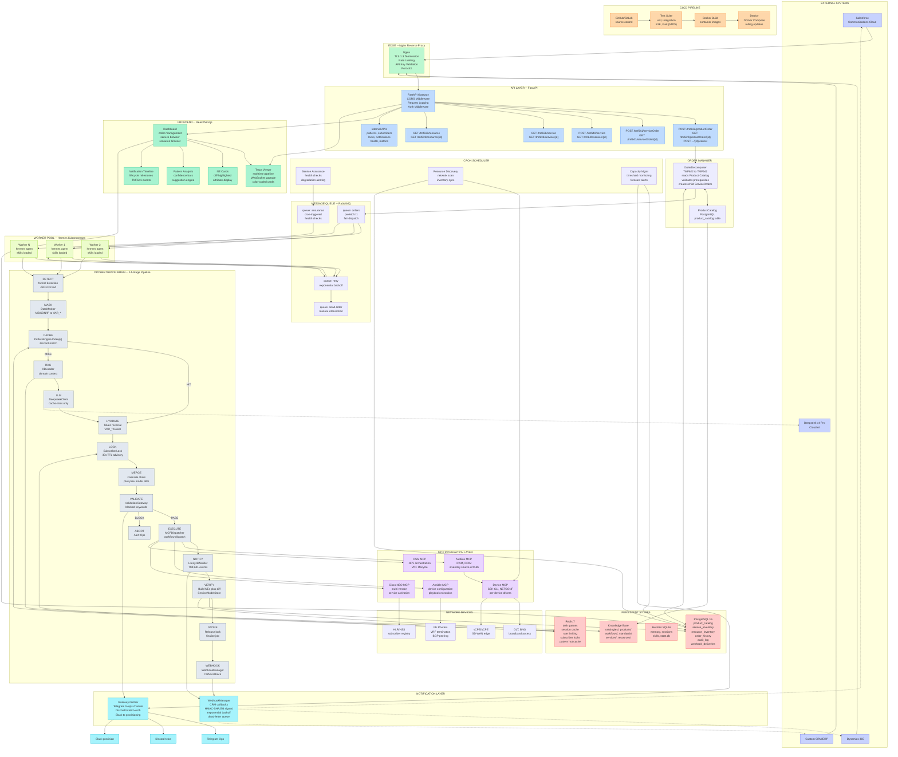

# End-State Component Diagram — Telecom Agentic Orchestration Engine

> **Standalone diagram document.** Renders as an interactive Mermaid diagram.
> View in any Mermaid-compatible renderer (GitHub, mermaid.live, VS Code, etc.)

---

## End-State Production Architecture

---

## Legend

| Color Zone | Layer | Description |
|------------|-------|-------------|
| **Purple** (external) | External Systems | CRM platforms, cloud AI -- outside the VPS perimeter |
| **Green** (edge) | Edge/Nginx | TLS termination, rate limiting, API key validation |
| **Blue** (api) | API Layer | FastAPI gateway, TMF-standard endpoints, internal APIs |
| **Gray** (pipeline) | Pipeline Engine | 14-stage orchestration pipeline |
| **Deep Purple** (mcp) | MCP Integration | Protocol servers bridging to network devices |
| **Red** (storage) | Persistent Stores | PostgreSQL, Redis, Hermes SQLite, KB files |
| **Cyan** (notify) | Notification | CRM webhooks, platform gateways (Telegram/Discord/Slack) |
| **Emerald** (frontend) | Frontend | React/Next.js dashboard with trace viewer |
| **Orange** (cicd) | CI/CD | Test suite, Docker build, deployment |
| **Lime** (workers) | Worker Pool | Hermes agent subprocesses pulling from RabbitMQ |

---

## Component Count

| Layer | Components |
|-------|-----------|
| External Systems | 4 (Salesforce, Dynamics, Custom CRM, Deepseek) |
| Edge | 1 (Nginx) |
| API Layer | 7 (Gateway + 5 TMF + Internal) |
| Order Manager | 2 (Decomposer + ProductCatalog) |
| Message Queue | 4 (orders, retry, dead-letter, assurance) |
| Worker Pool | 3 (W1, W2, WN) |
| Pipeline Engine | 14 stages |
| MCP Integration | 5 servers |
| Network Devices | 4 groups |
| Persistent Stores | 4 systems |
| Cron Scheduler | 3 jobs |
| Notification | 2 dispatchers + 3 platforms |
| Frontend | 5 components |
| CI/CD | 4 stages |
| **TOTAL** | **~70 connected nodes** |

---

> **Source:** Derived from `documentation/end-state-architectural-blueprint.md` and `end-state-component-specification.md`.
> **PoC Reference:** Current implementation at `poc/server_live.py` (1,848 lines) implements 7 of these 14 stages with stubbed MCP/EXECUTE.
