# Solution Design Document — Telecom Agentic Service & Resource Orchestrator

> **Document Version:** 1.0.0 | **Date:** 2026-06-23 | **Status:** End-State Target Architecture
> **Owner:** Orchestration Team
> **Standards:** TM Forum Open APIs (TMF622, TMF641, TMF640, TMF638, TMF639), MEF LSO, ETSI NFV MANO, IETF YANG, 3GPP
> **Implementation:** Python 3.13, FastAPI, RabbitMQ, PostgreSQL, Redis, Deepseek v4 Pro, Hermes Agent
> **PoC Baseline:** `poc/server_live.py` (1,848 lines) — Phase 1 delivery complete
> **Audience:** Business stakeholders, engineering leads, system architects, integration teams

---

## Table of Contents

1. [Executive Summary](#1-executive-summary)
2. [Design Philosophy & Principles](#2-design-philosophy--principles)
3. [End-to-End Provisioning Workflow](#3-end-to-end-provisioning-workflow)
4. [Customer Segment → Expected State Reasoning](#4-customer-segment--expected-state-reasoning)
5. [Service Domain Provisioning Details](#5-service-domain-provisioning-details)
6. [Pattern Learning & Confidence Lifecycle](#6-pattern-learning--confidence-lifecycle)
7. [Data Sovereignty & Security Model](#7-data-sovereignty--security-model)
8. [Async Processing & Concurrency](#8-async-processing--concurrency)
9. [Notification & CRM Integration](#9-notification--crm-integration)
10. [Trade-offs & Design Decisions](#10-trade-offs--design-decisions)
11. [Roadmap & Migration Path](#11-roadmap--migration-path)

---

## 1. Executive Summary

### 1.1 Business Problem Solved

Telecom service provisioning today is a multi-week, multi-team, error-prone process. Sales closes a deal in Salesforce. The order sits in a queue. A human reads it and manually decomposes it into network tasks. Someone logs into NetBox to allocate an IP. Someone else SSHs into a PE router to configure a VRF. Someone else files a ticket for BGP peering. Days pass. The customer calls to ask when their circuit will be ready.

The **Telecom Agentic Service & Resource Orchestrator** replaces this entirely with an automated, cache-first, AI-augmented pipeline that:

1. Accepts a TMF622 Product Order from any CRM (Salesforce, Dynamics 365, custom REST client)
2. Decomposes it into TMF641 Service Orders using product catalog rules
3. Matches the request against a learned pattern store — if it's seen this before, the plan is instant (< 5 ms)
4. If novel, reasons about required network elements using cloud AI (Deepseek v4 Pro) — but only after **all sensitive identifiers have been masked**
5. Executes the plan through real MCP servers (NetBox for IPAM, Ansible for config, Cisco NSO for service activation)
6. Pushes lifecycle notifications back to the CRM via signed webhook callbacks
7. Learns from every execution — the system gets faster and smarter over time

### 1.2 Key Metrics

| Metric | PoC (Phase 1) | Production Target |
|--------|---------------|-------------------|
| **Throughput** | ~1 request / 30 s (single-threaded) | 5 TPS sustained |
| **Cache-hit latency** | < 5 ms (diskcache) | < 5 ms (Redis) |
| **Cache-miss latency** | 15–90 s (Deepseek + single worker) | < 30 s (optimized pipeline) |
| **Order decomposition** | Not implemented | < 50 ms (PostgreSQL indexed) |
| **Webhook delivery** | Not implemented | < 500 ms (with 3× exponential backoff) |
| **Concurrent orders** | 1 (ThreadPoolExecutor, 4 threads) | 50 simultaneous (RabbitMQ + multi-worker) |
| **Service domains** | 1 (Mobile Voice) proven; 4 defined | 7 fully functional |
| **Data sovereignty** | MSISDN/IP masking proven | Extended to hostnames, ASNs, customer names |
| **Security gate** | 7 blocked keywords | 7 blocked keywords + Pydantic schema enforcement + range constraints |

### 1.3 Technology Stack

| Layer | Technology | Role |
|-------|-----------|------|
| **API Gateway** | Nginx (TLS termination, rate limiting, API key auth) | Ingress security |
| **API Framework** | FastAPI (Python 3.13) | REST endpoints, middleware, OpenAPI docs |
| **Message Queue** | RabbitMQ (5 queues, topic exchange) | Async job dispatch, dead-letter handling |
| **Cache & Locks** | Redis 7 | Pattern store, session cache, rate-limit counters, distributed advisory locks |
| **Persistent Store** | PostgreSQL 16 | Product catalog, service inventory, resource inventory, order history, audit log |
| **Knowledge Base** | Markdown filesystem + YAML templates | Domain ontologies, product definitions, workflow specs |
| **AI Reasoning** | Deepseek v4 Pro (via Hermes Agent) | Plan generation on cache miss |
| **MCP Integration** | NetBox, Ansible, Cisco NSO, OSM, Device MCP | Southbound provisioning |
| **Frontend** | React / Next.js | Dashboard, trace viewer, pattern analytics |
| **Orchestration** | Hermes Agent | Skill execution, memory, cron, multi-profile isolation |
| **CI/CD** | GitHub Actions | Lint → test → build → deploy → smoke |

### 1.4 Value Proposition

| Stakeholder | Value |
|-------------|-------|
| **Service Provider Operations** | Zero-touch provisioning from CRM order to active service. Reduction from days to minutes. |
| **Engineering** | No hardcoded device lists or workflows. Everything derives from the knowledge base. New products added by editing YAML. |
| **Security & Compliance** | All sensitive data (MSISDN, IMSI, IP, hostname) is tokenized before any cloud AI call. Token mapping never leaves the process memory. Full audit trail. |
| **CRM / Sales** | Real-time lifecycle notifications (TMF641) pushed back to CRM via signed webhooks. Order status visible without polling. |
| **Network Operations** | Telegram/Discord/Slack alerts on failures, security blocks, and SLA jeopardy. |
| **Finance** | Cache-first design means recurring orders are near-free (no LLM cost). Only novel patterns incur AI inference cost. |

---

## 2. Design Philosophy & Principles

### 2.1 Principle: Cache-First

> **"Never ask the LLM something you've already learned."**

Every incoming request is pattern-matched against the RDF-inspired triple store before any cloud AI call is made. The Jaccard similarity algorithm compares service-defining characteristics (customer segment, SLA tier, product type, bandwidth) against stored patterns. A match returns the exact orchestration plan used last time — sub-5 ms, zero LLM cost.

Only novel or significantly different requests reach Deepseek. After the LLM generates a plan, it is written through to the pattern store (confidence = 0.30, source = "auto"), so the next identical request is a cache hit. This is how the system gets faster and cheaper over time.

### 2.2 Principle: Data-Sovereign

> **"Real identifiers never cross the perimeter."**

The `DataMasker` runs as the **second pipeline stage** — after format detection, before any cloud call. Regex patterns identify MSISDNs, IMSIs, IP addresses, hostnames, and customer ASNs. Each is replaced with a `VAR_*` token (e.g., `VAR_MSISDN_1`, `VAR_IP_1`). The token → real-value mapping lives in transient Python memory only — never serialized, never written to disk, never leaves the process.

Deepseek receives a prompt like: *"Provision L3VPN for VAR_MSISDN_1 at site VAR_HOST_1 with bandwidth 1000 Mbps"* — alongside KB domain context about what an L3VPN requires. It reasons abstractly about the service type and returns a plan with the same VAR tokens. The `HYDRATE` stage (stage 7) reverses the tokens back to real values locally. At no point does the cloud see a real phone number, IP address, or hostname.

### 2.3 Principle: KB-Driven

> **"The knowledge base is the single source of truth."**

No network element list, attribute schema, lifecycle state, or workflow definition is hardcoded in the application. All domain knowledge lives in:

- `knowledge-base/ontologies/core-ontology.md` — Entity hierarchy, service taxonomy, resource taxonomy, lifecycle state machines
- `knowledge-base/products/*.yaml` — Product catalog entries with decomposition rules, required resources, and service templates
- `knowledge-base/workflows/*.md` — Step-by-step provisioning procedures per service type
- `knowledge-base/reference/standards-index.md` — Industry standards (TM Forum, MEF, ETSI, IETF, 3GPP)

The `SERVICE_RESOURCES` mapping in code is a materialized view of the KB — it is regenerated from the KB at startup. Adding a new service domain means: (1) add a product YAML, (2) define the lifecycle states, (3) list the required network elements. No code changes.

### 2.4 Principle: Defense-in-Depth

> **"Validate at every boundary."**

Security is not a single stage. It is layered:

| Layer | Mechanism | What It Blocks |
|-------|-----------|---------------|
| **Ingress** | Nginx rate limiting, API key / OAuth2 auth | Unauthenticated requests, DDoS |
| **Mask** | DataMasker regex tokenization | Sensitive data leakage to cloud |
| **LLM boundary** | Only masked text + KB context leaves perimeter | Real identifiers never exposed |
| **Hydrate** | Token reversal in local memory only | Cloud response reintegrated safely |
| **Validate (stage 10)** | BLOCKED_KEYWORDS scan against plan JSON + masked text | Destructive commands (erase, reload, format, shutdown, write erase, delete startup-config, boot system flash) |
| **Schema enforce** | Pydantic v2 model validation per product type | Malformed plans, missing required fields |
| **Range constraints** | VLAN 1–4094, MTU 68–9216, ASN 1–4294967295 | Out-of-bounds parameters |
| **Webhook** | HMAC-SHA256 signature on CRM callbacks | Tampered payloads, replay attacks |
| **Audit log** | Every state transition written to PostgreSQL | Forensic traceability |

### 2.5 Principle: Standards-Aligned

> **"Speak the industry's language."**

| Standard | Purpose | Implementation |
|----------|---------|---------------|
| **TMF622** | Product Ordering API | `POST /api/tmf622/productOrder` — CRM → orchestrator |
| **TMF641** | Service Ordering API + Notifications | Service order CRUD + `ServiceOrderMilestoneEvent`, `ServiceOrderStateChangeEvent` |
| **TMF640** | Service Activation API | Direct activation requests (legacy/compatibility) |
| **TMF638** | Service Inventory API | Query provisioned services |
| **TMF639** | Resource Inventory API | Query allocated resources |
| **MEF LSO** | Lifecycle state machine | DESIGNED → FEASIBILITY_CHECKED → … → ACTIVE → SUSPENDED → TERMINATED |
| **ETSI NFV MANO** | Resource lifecycle | PLANNED → ALLOCATED → CONFIGURING → IN_SERVICE → DECOMMISSIONED |
| **IETF YANG** | Device configuration model | NETCONF/RESTCONF via Device MCP |

### 2.6 Principle: Modular

> **"Each concern in its own module. Each module independently testable."**

The PoC's single-file `server_live.py` (1,848 lines) is decomposed into a proper `src/` package:

```
src/
├── api/          # FastAPI routers, middleware, schemas
├── engine/       # OrchestratorBrain, OrderDecomposer, PatternEngine, DeepseekClient
├── inventory/    # SQLAlchemy CRUD for PG tables
├── mcp/          # MCP server clients (NetBox, Ansible, NSO, OSM, Device)
├── notifications/ # LifecycleNotifier, WebhookManager, GatewayNotifier
├── security/     # DataMasker, ValidationGateway, SubscriberLock
├── workers/      # Hermes worker processes consuming RabbitMQ
└── cron/         # Assurance, discovery, capacity, maintenance jobs
```

Each module has unit tests (`tests/unit/`), integration tests (`tests/integration/`), contract tests (`tests/contract/`), and load tests (`tests/load/`).

---

## 3. End-to-End Provisioning Workflow

### 3.1 Complete Sequence: CRM Order → Active Service

The following Mermaid sequence diagram shows every participant in a full TMF622 Product Order flow — from CRM submission through decomposition, queuing, pipeline execution, MCP device provisioning, CRM callback, and platform notification.

```mermaid
sequenceDiagram
    participant CRM as CRM (Salesforce)
    participant NGX as API Gateway (Nginx)
    participant API as Order Manager (FastAPI)
    participant ODE as Order Decomposer
    participant PC as Product Catalog (PostgreSQL)
    participant RMQ as RabbitMQ
    participant W1 as Worker-1 (Hermes)
    participant W2 as Worker-2 (Hermes)
    participant OB as OrchestratorBrain
    participant DM as DataMasker
    participant PE as PatternEngine (Redis)
    participant KB as KB Context Loader
    participant DS as Deepseek v4 Pro
    participant VG as Validation Gateway
    participant MCP as MCP Dispatcher
    participant NB as NetBox MCP
    participant AN as Ansible MCP
    participant NSO as Cisco NSO MCP
    participant DEV as Network Devices
    participant LN as Lifecycle Notifier
    participant WM as Webhook Dispatcher
    participant GW as Gateway Notifier (Telegram/Discord/Slack)
    participant SI as Service Inventory (PostgreSQL)

    Note over CRM,SI: ═══════════ PHASE 1: ORDER INGEST & DECOMPOSITION ═══════════

    CRM->>NGX: POST /api/tmf622/productOrder<br/>{externalId, productOrderItem[], characteristic[]}
    NGX->>NGX: TLS termination, API key validation, rate check (50 req/s)
    NGX->>API: Forward validated TMF622 payload

    API->>API: validate_tmf622(payload)
    API->>ODE: decompose_product_order(tmf622_order)

    ODE->>PC: find_by_id("prod-l3vpn-01")
    PC-->>ODE: Product {decomposition_rules, required_resources, service_template}

    Note over ODE: Decomposition Rules for "Enterprise MPLS L3VPN":<br/>SO-1: Allocate IP Resources (VRF, subnet, RD/RT)<br/>SO-2: Provision VRF on PE Router<br/>SO-3: Configure BGP Peering<br/>SO-4: Configure CE Interface<br/>SO-5: Verify and Activate

    ODE->>ODE: resolve_dependencies(service_orders)
    Note over ODE: DAG: SO-1 → [SO-2, SO-3, SO-4] (parallel) → SO-5

    ODE->>API: [ServiceOrder × 5] with dependency graph
    API->>SI: INSERT product_order + service_orders (state: acknowledged)
    API-->>CRM: 202 Accepted {order_id, state: "acknowledged", serviceOrder: [...]}

    API->>RMQ: publish SO-1 → orders.standard (priority: normal)

    Note over CRM,SI: ═══════════ PHASE 2: PIPELINE EXECUTION (per ServiceOrder) ═══════════

    RMQ->>W1: dispatch SO-1 (prefetch=1, fair dispatch)

    W1->>OB: OrchestratorBrain.run(SO-1)

    rect rgb(6, 182, 212, 0.08)
        Note over OB: STAGE 0 — PARSE
        OB->>OB: detect_format() → "tmf641"
    end

    rect rgb(6, 182, 212, 0.08)
        Note over OB: STAGE 1 — DECOMPOSE (already done, child order)
    end

    rect rgb(139, 92, 246, 0.08)
        Note over OB,DM: STAGE 2 — MASK
        OB->>DM: mask(service_order_text)
        DM->>DM: MSISDN "447700123456" → VAR_MSISDN_1<br/>IP "10.100.1.1" → VAR_IP_1<br/>Hostname "sfo-pe-01" → VAR_HOST_1<br/>ASN "65002" → VAR_ASN_1
        DM-->>OB: masked_text + token_map (local memory only)
    end

    rect rgb(34, 197, 94, 0.08)
        Note over OB,PE: STAGE 3 — CACHE LOOKUP
        OB->>OB: extract_chars(exclude INSTANCE_ATTRS)
        OB->>PE: patterns.lookup("l3vpn", chars)
        PE->>PE: Load candidates from Redis hash<br/>Jaccard match: intersection / union
        alt Cache HIT
            PE->>PE: patterns.reinforce() → confidence += 0.05
            PE-->>OB: PatternNode (confidence=0.92, 6 resources) ✓
            OB->>OB: Build plan from pattern.resources<br/>llm_used = False
        else Cache MISS
            PE-->>OB: None → llm_used = True
        end
    end

    rect rgb(147, 197, 253, 0.08)
        Note over OB,KB: STAGE 4 — INVENTORY QUERY
        OB->>SI: get_service(customer_id, product_id)
        SI-->>OB: Previous service state, allocated resources
    end

    rect rgb(147, 197, 253, 0.08)
        Note over OB,KB: STAGE 5 — RAG (KB Context Load)
        OB->>KB: load_kb_context("l3vpn")
        KB->>KB: Read core-ontology.md + product template prod-l3vpn-01.yaml<br/>+ segment-overrides.yaml + sla-overrides.yaml
        KB-->>OB: Domain context (4,000 chars):<br/>• 4 required NEs: PE Router, Route Reflector, VRF, NMS<br/>• Lifecycle: DESIGNED → FEASIBILITY_CHECKED → RESOURCE_ALLOCATED<br/>  → DEVICE_CONFIGURED → PEERING_ESTABLISHED → ACTIVE<br/>• Segment: wholesale → CE customer-managed, VLAN handoff, MTU 9100<br/>• SLA: platinum → dual PE, diverse paths, <50ms failover, BFD
    end

    rect rgb(239, 68, 68, 0.06)
        Note over OB,DS: STAGE 6 — LLM (Cache Miss Only)
        alt llm_used = True
            OB->>DS: call_deepseek(prompt, timeout=90)
            Note over DS: PROMPT (all sensitive data masked):<br/>1. KB Domain Knowledge (4,000 chars)<br/>2. Request: "Provision L3VPN for VAR_MSISDN_1,<br/>   site VAR_HOST_1, bandwidth 1000 Mbps,<br/>   routing BGP, customer ASN VAR_ASN_1"<br/>3. Return ONLY valid JSON {workflows, params, devices}
            DS-->>OB: JSON plan with VAR_* tokens
            OB->>OB: json.loads() → validate structure
        else llm_used = False
            Note over OB: LLM stage SKIPPED (cache hit)
        end
    end

    rect rgb(139, 92, 246, 0.08)
        Note over OB,DM: STAGE 7 — HYDRATE
        OB->>DM: hydrate(plan, token_map)
        DM->>DM: VAR_MSISDN_1 → "447700123456"<br/>VAR_HOST_1 → "sfo-pe-01"<br/>VAR_ASN_1 → "65002"
        DM-->>OB: Hydrated plan with real values
    end

    rect rgb(139, 92, 246, 0.08)
        Note over OB: STAGE 8 — LOCK
        OB->>OB: SubscriberLock.acquire(subscriber_id, worker_id)
        Note over OB: Redis advisory lock: lock:sub:MSISDN-447700123456<br/>TTL 30s, retry budget 5s (prevents lost updates)
    end

    rect rgb(139, 92, 246, 0.08)
        Note over OB: STAGE 9 — MERGE
        OB->>OB: Cascade request characteristics → plan params<br/>Fill gaps from previous subscriber model<br/>(skip default_* attributes from KB)
    end

    rect rgb(34, 197, 94, 0.08)
        Note over OB,VG: STAGE 10 — VALIDATE
        OB->>VG: validate_plan(plan, masked_text)
        VG->>VG: BLOCKED_KEYWORDS scan: "erase","reload","format","shutdown",<br/>"no switchport","write erase","delete startup-config","boot system flash"
        alt PASS
            VG-->>OB: ValidationResult(status="PASSED")
        else BLOCK
            VG-->>OB: ValidationResult(status="BLOCKED", blocked_keywords=[...])
            OB->>OB: ABORT pipeline. Set order state = "rejected"
            OB->>GW: CRITICAL ALERT → Telegram ops channel
        end
    end

    rect rgb(34, 197, 94, 0.08)
        Note over OB,DEV: STAGE 11 — EXECUTE
        OB->>MCP: execute_workflow(plan)
        par Parallel MCP Calls
            MCP->>NB: allocate_prefix("SJC-CE-IPV4", /30)
            NB-->>MCP: 10.100.1.0/30 allocated
        and
            MCP->>AN: run_playbook("configure-vrf", params)
            AN->>DEV: NETCONF: configure VRF CUST-SJC-CORP on sfo-pe-01
            DEV-->>AN: OK (18 config lines applied)
            AN-->>MCP: Playbook SUCCESS
        and
            MCP->>NSO: create_service("l3vpn-bgp-peering", params)
            NSO-->>MCP: BGP service created, commit dry-run passed
        end
        MCP-->>OB: ExecutionResult(status="SUCCESS", resources_created=4)
    end

    Note over CRM,SI: ═══════════ PHASE 3: NOTIFICATION & VERIFICATION ═══════════

    rect rgb(245, 158, 11, 0.08)
        Note over OB,WM: STAGE 12 — NOTIFY
        OB->>LN: build_notification_trace(order_id, "l3vpn", subscriber_id)

        LN->>LN: parse_lifecycle("l3vpn") → [DESIGNED, FEASIBILITY_CHECKED,<br/>RESOURCE_ALLOCATED, DEVICE_CONFIGURED,<br/>PEERING_ESTABLISHED, ACTIVE]

        loop For each lifecycle state (i=0 to 5)
            alt i < 5 (intermediate milestone)
                LN->>LN: emit_milestone(state)<br/>TMF641 ServiceOrderMilestoneEvent<br/>{state: "inProgress", milestone: {name, status: "achieved"}}
            else i == 5 (final state)
                LN->>LN: emit_state_change("completed")<br/>TMF641 ServiceOrderStateChangeEvent<br/>{state: "completed", completionDate}
            end
            LN->>WM: enqueue_callback(order, event)
        end

        WM->>RMQ: publish to webhooks queue

        loop For each webhook event
            RMQ->>W2: dispatch webhook job
            W2->>CRM: POST https://crm.example.com/api/webhooks/telco-order-status<br/>Headers: X-TMF-Event-Type, X-Order-Id, X-Signature: sha256=...
            alt CRM 200 OK
                CRM-->>W2: 200 OK (120ms)
            else CRM 5xx
                Note over W2: Retry 1/3 in 5s → Retry 2/3 in 10s → Retry 3/3 in 20s
                alt All retries fail
                    W2->>RMQ: Move to dead-letter queue
                    W2->>GW: ALERT: "Webhook delivery FAILED for SO-X after 3 retries"
                end
            end
        end

        LN->>GW: Gateway notification → Telegram/Discord/Slack<br/>"✅ L3VPN order SO-l3vpn-0042 completed"
    end

    rect rgb(34, 197, 94, 0.08)
        Note over OB,SI: STAGE 13 — VERIFY & STORE
        OB->>OB: Build network element cards from KB + plan
        OB->>OB: Compute subscriberDiff (previous → new model)
        OB->>SI: UPDATE service_inventory (state: ACTIVE)
        OB->>SI: INSERT resource_inventory rows (VRF, BGP_Session, IP_Subnet, Interface)
        OB->>SI: INSERT audit_log entries (each state transition)
        OB->>PE: patterns.learn() (if cache miss — write-through new pattern)
        OB->>OB: Emit final_state {status: "completed", networkElements, diff, notifications}
    end

    Note over CRM,SI: ═══════════ COMPLETE: Service ACTIVE, CRM notified ═══════════
```



### 3.2 Pipeline Stage Summary

| # | Stage | Location | Trigger | Responsibility |
|---|-------|----------|---------|---------------|
| **0** | PARSE | Foreground | Every request | Detect TMF622 vs TMF640 vs TMF641 vs unstructured text |
| **1** | DECOMPOSE | Foreground | TMF622 only | Decompose ProductOrder → [ServiceOrder] via catalog rules |
| **2** | MASK | Foreground | Every request | Tokenize MSISDN/IMSI/IP/hostname/ASN → VAR_* tokens |
| **3** | CACHE | Foreground | Every request | Jaccard similarity match against RDF pattern store (Redis) |
| **4** | QUERY | Background | Every request | Look up existing service/resource state from PostgreSQL |
| **5** | RAG | Background | Every request | Load KB domain context (ontology, product template, workflow defs) |
| **6** | LLM | Background | Cache MISS only | Generate orchestration plan via Deepseek v4 Pro (masked data) |
| **7** | HYDRATE | Background | Every request | Reverse VAR_* tokens → real values from local token_map |
| **8** | LOCK | Background | Every request | Acquire Redis per-subscriber advisory lock (30s TTL) |
| **9** | MERGE | Background | Every request | Cascade request chars + previous model into plan params |
| **10** | VALIDATE | Background | Every request | Blocked keyword scan + Pydantic schema enforcement |
| **11** | EXECUTE | Background | Every request | Dispatch workflows to MCP servers (NetBox, Ansible, NSO, OSM, Device) |
| **12** | NOTIFY | Background | Every request | Emit TMF641 lifecycle events → WebhookManager + Gateway Notifier |
| **13** | VERIFY | Background | Every request | Build NE cards, compute diff, persist to PG + Redis, learn pattern |

### 3.3 Trace Card Format

Every pipeline stage produces a structured trace step visible in the web UI:

```
Goal:       <one-line purpose of this stage>
Input:      <what data enters this stage>
Expected:   <what should happen under normal conditions>
Actual:     <what actually happened — concrete values, real output>
Output:     <what leaves this stage for the next one>
```

Color coding:
- **Cyan** — Detection/parsing (stages 0–1)
- **Violet** — Sovereignty, locking, merging (stages 2, 7–9)
- **Amber** — Notification, state transitions (stage 12)
- **Blue** — Cloud AI / KB retrieval (stages 5–6)
- **Green** — Success, validation passed, storage (stages 3, 10–11, 13)
- **Red** — Security block, validation failure (stage 10 abort)

---

## 4. Customer Segment → Expected State Reasoning

### 4.1 The Core Reasoning Table

This table is the heart of the system's intelligence. A single field — `customerSegment` — in the TMF622 Product Order determines fundamentally different expected states for the same product. The OrchestratorBrain uses this table to derive what the finished service must look like **before it ever contacts an MCP server**.

| Attribute | **Wholesale** | **Retail** | **Enterprise** |
|-----------|--------------|-----------|---------------|
| **CE Device Ownership** | Customer-managed (own hardware) | Provider-managed (CPE deployed by us) | Customer-managed (with managed handoff) |
| **Handoff Type** | VLAN subinterface on PE router | LAN port on CPE (RJ45 / SFP) | Physical cross-connect or ENNI |
| **IP Addressing** | Provider assigns /30 p2p (customer may bring own IPs) | Provider DHCP or static LAN block | Provider /30 p2p + customer /29 routed block |
| **Routing Protocol** | eBGP (customer ASN, full route exchange) | Static default route, or eBGP if managed | eBGP (customer ASN) or static |
| **QoS Model** | Trust customer DSCP (transparent pass-through) | Provider shapes at CIR, remarks exceeding traffic | Agreed CoS profile (5-class model: EF, AF4, AF3, AF2, BE) |
| **MTU** | 9100 (jumbo frames for MPLS core) | 1500 (standard Ethernet) | 9100 or 9000 (configurable) |
| **NAT / Firewall** | Customer-managed (not in scope) | Provider-managed (CPE performs NAT/ACL) | Customer-managed (behind our handoff) |
| **Verification Scope** | PE side only: BGP state, VRF route table, MPLS LSP reachability | End-to-end: CPE LAN ping, speed test, CPE management reachable | PE side + L2 handoff: light levels, BGP state, cross-connect verified |
| **Monitoring** | Port/interface up/down only | Full CPE + PE with performance metrics | PE + handoff interface monitoring |
| **Ordered As** | "MPLS access circuit" | "Managed Internet / Managed VPN" | "Enterprise VPN with managed handoff" |

### 4.2 SLA Tier → Redundancy & Monitoring Overrides

| Attribute | **Platinum** | **Gold** | **Silver** | **Bronze** |
|-----------|-------------|---------|-----------|-----------|
| **PE Redundancy** | Dual PE, diverse physical paths | Dual PE, shared diverse | Single PE, best-effort failover | Single PE, no redundancy |
| **CE Redundancy (Retail)** | Dual CPE (VRRP/HSRP to both PEs) | Dual CPE | Single CPE | Single CPE |
| **Failover Target** | < 50 ms (BFD, sub-50ms timers) | < 200 ms (BFD, 150ms × 3) | Best-effort (BGP hold timer ~30s) | No target (manual recovery) |
| **Path Diversity** | Fully diverse (separate fiber, separate POPs) | Shared diverse (same POP, different PEs) | Single path | Single path |
| **Monitoring Granularity** | Per-flow, per-class, 15s polling | Per-interface, per-class, 60s polling | Per-interface, 5min polling | Up/down only, 15min polling |
| **SLA Reporting** | Real-time dashboard, monthly report | Daily summary, monthly report | Monthly report | Best-effort |
| **Proactive Alerting** | Predictive (capacity trending, anomaly detection) | Threshold-based (80% utilization trigger) | Threshold-based | Reactive only |
| **Jeopardy Notification** | Immediately on any degradation | Within 5 min of degradation | Within 15 min | Within 1 hour |

### 4.3 Full Segment × Tier Matrix (L3VPN Example)

| Segment | SLA | CE | Handoff | IP Scheme | QoS | MTU | Redundancy | Failover | Verify Scope |
|---------|-----|----|---------|-----------|-----|-----|-----------|----------|-------------|
| wholesale | platinum | Customer | VLAN subif | /30 p2p | Trust DSCP | 9100 | Dual PE, diverse | <50ms BFD | PE only |
| wholesale | gold | Customer | VLAN subif | /30 p2p | Trust DSCP | 9100 | Dual PE, shared | <200ms BFD | PE only |
| wholesale | silver | Customer | VLAN subif | /30 p2p | Trust DSCP | 9100 | Single PE, BE | ~30s BGP | PE only |
| wholesale | bronze | Customer | VLAN subif | /30 p2p | Trust DSCP | 9100 | Single PE, none | N/A | PE only |
| retail | platinum | Provider | LAN port | DHCP + static | Shape CIR | 1500 | Dual PE, diverse, Dual CPE | <50ms BFD | End-to-end |
| retail | gold | Provider | LAN port | DHCP + static | Shape CIR | 1500 | Dual PE, shared, Dual CPE | <200ms BFD | End-to-end |
| retail | silver | Provider | LAN port | DHCP + static | Shape CIR | 1500 | Single PE, single CPE | ~30s BGP | End-to-end |
| retail | bronze | Provider | LAN port | DHCP + static | Shape CIR | 1500 | Single PE, single CPE | N/A | End-to-end |
| enterprise | platinum | Customer | Cross-connect | /30 + /29 | 5-class CoS | 9100 | Dual PE, diverse | <50ms BFD | PE + L2 |
| enterprise | gold | Customer | Cross-connect | /30 + /29 | 5-class CoS | 9100 | Dual PE, shared | <200ms BFD | PE + L2 |
| enterprise | silver | Customer | Cross-connect | /30 + /29 | 5-class CoS | 9000 | Single PE, BE | ~30s BGP | PE + L2 |
| enterprise | bronze | Customer | Cross-connect | /30 + /29 | 5-class CoS | 9000 | Single PE, none | N/A | PE + L2 |

### 4.4 How the OrchestratorBrain Uses This

When the Order Decomposer hands a ServiceOrder to the OrchestratorBrain, stage 5 (RAG) loads the KB context including segment/SLA overrides. These override files are YAML:

```yaml
# segment-overrides.yaml
wholesale:
  ce_ownership: customer_managed
  handoff_type: vlan_subinterface
  ip_scheme: provider_p2p_30
  routing: ebgp_customer_asn
  qos_model: trust_dscp
  mtu: 9100
  verification_scope: pe_only
  include_workflows: [ResourceAllocation, DeviceConfiguration, BGPConfiguration, ServiceVerification]
  exclude_workflows: [CPEDeployment, LANConfiguration, FirewallConfiguration]

enterprise:
  ce_ownership: customer_managed_handoff
  handoff_type: physical_cross_connect
  ip_scheme: provider_p2p_30_plus_customer_routed_29
  routing: ebgp_customer_asn
  qos_model: agreed_cos_5class
  mtu: 9100
  verification_scope: pe_plus_l2_handoff
  include_workflows: [ResourceAllocation, DeviceConfiguration, BGPConfiguration, QoSConfiguration, ServiceVerification]
  exclude_workflows: [CPEDeployment]
```

```yaml
# sla-overrides.yaml
platinum:
  pe_redundancy: dual_pe_diverse_paths
  ce_redundancy: dual_ce_vrrp
  failover_target_ms: 50
  bfd_timers: [50, 3]
  monitoring_interval: 15
  include_workflows: [RedundancyConfiguration, FastFailoverConfiguration, PerFlowMonitoring]

bronze:
  pe_redundancy: single_pe
  ce_redundancy: none
  failover_target_ms: null
  bfd_timers: null
  monitoring_interval: 900
  include_workflows: []
  exclude_workflows: [RedundancyConfiguration, FastFailoverConfiguration]
```

The OrchestratorBrain applies these overrides to the product template's default workflow list during stage 9 (MERGE). A wholesale+platinum L3VPN gets: ResourceAllocation, DeviceConfiguration, BGPConfiguration, RedundancyConfiguration, FastFailoverConfiguration, ServiceVerification. A retail+bronze L3VPN gets: CPEDeployment, ResourceAllocation, DeviceConfiguration, BGPConfiguration, LANConfiguration, FirewallConfiguration, ServiceVerification. Same product. Different plan. All derived from two fields.

---

## 5. Service Domain Provisioning Details

### 5.1 Mobile Voice — 6 Network Elements

| # | NE | Role | Lifecycle State | Provisioning Steps |
|---|----|------|----------------|-------------------|
| 1 | **HLR/HSS** | Subscriber profile, authentication vectors, service permissions | HLR_PROVISIONED | Create IMSI profile, set MSISDN, provision APN, enable supplementary services (CF, CW, CB) |
| 2 | **IMS-Core** (P-CSCF, I-CSCF, S-CSCF) | SIP registration, call routing, VoLTE anchoring | IMS_REGISTERED | Create SIP user agent, bind IMSI→IMPU→IMPI, configure S-CSCF filter criteria for VoLTE |
| 3 | **PCRF/PCF** | Policy and charging rules (QCI mapping, bandwidth limits) | PCRF_CONFIGURED | Define policy rules: default bearer QCI 9, dedicated bearer QCI 1 (VoLTE), QCI 5 (IMS signaling) |
| 4 | **SMSC** | SMS store-and-forward, delivery reporting | SMSC_CONFIGURED (within ACTIVE) | Register MSISDN in SMSC home routing, configure delivery preferences |
| 5 | **MSC/MME** | Circuit-switched fallback, mobility management, location update | MME_ATTACHED (within ACTIVE) | Attach IMSI to MME, register tracking area, enable CSFB if needed |
| 6 | **SBC** | Session border control, media anchoring, transcoding | SBC_CONFIGURED (within ACTIVE) | Configure SIP trunk to IMS-Core, set codec list (AMR-WB, EVS), enable SRTP |

**Mobile Lifecycle:** `DESIGNED → FEASIBILITY_CHECKED → HLR_PROVISIONED → IMS_REGISTERED → PCRF_CONFIGURED → ACTIVE`

**Specific provisioning details:**

- **HLR/HSS provisioning** is the foundational step — all subsequent IMS and PCRF operations require the HLR subscriber record to exist. The HLR stores: IMSI (unique), MSISDN (unique), authentication key (Ki), OPC, APN list, roaming permissions, and supplementary service flags.
- **IMS registration** binds the HLR identity to the IMS domain. The IMPU (IP Multimedia Public Identity) is derived from the MSISDN as `sip:+447700123456@ims.mnc001.mcc234.3gppnetwork.org`. The IMPI (IP Multimedia Private Identity) is derived from the IMSI. The S-CSCF filter criteria define which Application Servers (AS) are triggered for this subscriber (e.g., MMTel AS for telephony, SCC AS for service centralization).
- **PCRF policy provisioning** defines the QoS Class Identifier (QCI) for each bearer: QCI 9 (default internet, non-GBR), QCI 5 (IMS signaling, non-GBR, priority 1), QCI 1 (VoLTE voice, GBR, priority 2). Bandwidth limits per APN.
- **SMSC** requires MSISDN home routing configuration and delivery preference (store-and-forward vs. direct-delivery).
- **MSC/MME** performs location update and tracking area registration. For CSFB-capable devices, the MSC address is registered in the MME.
- **SBC** serves as the demarcation between the mobile core and external networks. SIP trunk configuration, codec negotiation (AMR-WB 12.65k, EVS 13.2k), and SRTP key management.

### 5.2 L3VPN (MPLS VPN) — 4 Network Elements

| # | NE | Role | Lifecycle State | Provisioning Steps |
|---|----|------|----------------|-------------------|
| 1 | **PE Router** | MPLS edge, VRF hosting, CE peering | DEVICE_CONFIGURED | Create VRF instance, assign RD/RT, configure CE-facing subinterface, apply QoS policy |
| 2 | **Route Reflector** | BGP route distribution, VPNv4/v6 route reflection | PEERING_ESTABLISHED | Add PE as RR client, configure VPNv4 address family, set route policies |
| 3 | **VRF Instance** | Virtual routing table, route isolation per customer | RESOURCE_ALLOCATED | Create VRF definition, assign RD, configure import/export RTs, allocate route limits |
| 4 | **NMS** | Monitoring, performance collection, fault management | ACTIVE (continuous) | Register device, configure SNMP/telemetry, set threshold alarms, add to assurance sweep |

**L3VPN Lifecycle:** `DESIGNED → FEASIBILITY_CHECKED → RESOURCE_ALLOCATED → DEVICE_CONFIGURED → PEERING_ESTABLISHED → ACTIVE`

**VRF/BGP/RD/RT allocation workflow:**

```
1. FEASIBILITY CHECK:
   - Query NetBox: Does PE router "sfo-pe-01" have a free subinterface slot?
   - Query NetBox: Is the requested IP subnet available in pool "SJC-CE-IPV4"?
   - Validate: Does the VRF name "CUST-SJC-CORP" already exist? (must be unique per PE)
   - Validate: Are RD and RT values unique across the network?
   - Return: PASS/BLOCK with reason

2. ALLOCATE:
   - VRF name: CUST-{site_code}-{role}  (e.g., CUST-SJC-CORP)
   - Route Distinguisher: {ASN}:{next_available_id}  (e.g., 65001:1001)
     RD format: Type 0 = 2-byte ASN:4-byte number (per RFC 4364)
   - Route Target import: {ASN}:{next_available_id}  (e.g., 65001:1001)
   - Route Target export: {ASN}:{next_available_id}  (e.g., 65001:1001)
     Note: Import/export may differ for hub-and-spoke topologies
   - CE-facing IP subnet: Allocated from regional pool by NetBox
   - PE subinterface: e.g., GigabitEthernet0/0/0.{vlan_id}

3. CONFIGURE (PE Router via Ansible):
   vrf definition CUST-SJC-CORP
    rd 65001:1001
    route-target import 65001:1001
    route-target export 65001:1001
   !
   interface GigabitEthernet0/0/0.1001
    encapsulation dot1q 1001
    vrf forwarding CUST-SJC-CORP
    ip address 10.100.1.1 255.255.255.252
   !
   router bgp 65001
    address-family ipv4 vrf CUST-SJC-CORP
     neighbor 10.100.1.2 remote-as 65002
     neighbor 10.100.1.2 activate
     neighbor 10.100.1.2 route-map SET-METRIC in

4. VERIFY:
   - Ping CE IP 10.100.1.2 from PE VRF
   - Check BGP session state: show bgp vpnv4 unicast vrf CUST-SJC-CORP summary
     Expected: State/PfxRcd = Established / N prefixes
   - Verify VRF route table: show ip route vrf CUST-SJC-CORP
   - MPLS LSP reachability: traceroute mpls ipv4 10.100.1.2/32
```

### 5.3 SD-WAN — 3 Network Elements

| # | NE | Role | Lifecycle State | Provisioning Steps |
|---|----|------|----------------|-------------------|
| 1 | **vCPE/uCPE** | Edge device at customer site (virtual or universal CPE) | CPE_DEPLOYED | Deploy VM/container, bootstrap with zero-touch provisioning (ZTP), register with controller |
| 2 | **SD-WAN Controller** | Centralized policy management, route orchestration, overlay topology | TUNNELS_ESTABLISHED | Register vCPE, push overlay configuration, establish IPSec/DTLS tunnels between sites |
| 3 | **SD-WAN Orchestrator** | Multi-tenant management, license management, software upgrades | POLICIES_APPLIED | Define application-aware routing policies, configure SLA thresholds per application class, push security policies |

**SD-WAN Lifecycle:** `DESIGNED → FEASIBILITY_CHECKED → CPE_DEPLOYED → TUNNELS_ESTABLISHED → POLICIES_APPLIED → ACTIVE`

**Tunnel establishment workflow:**

- **CPE Deployment:** vCPE is deployed as a VM (KVM/VMware) or on uCPE hardware. Zero-touch provisioning (ZTP) using a bootstrap URL provided in the orchestration plan. The vCPE contacts the orchestrator, authenticates with a device certificate, and receives its configuration.
- **Tunnel Establishment:** IPSec tunnels are established between all sites in a full-mesh or hub-and-spoke topology (per design). Each tunnel uses IKEv2 with certificate-based authentication. DTLS is used as an alternative for NAT traversal scenarios. Tunnel interface IPs are allocated from an overlay address pool (typically RFC 1918 space).
- **Overlay Routing:** The SD-WAN controller pushes overlay routes via OMP (Overlay Management Protocol) or proprietary equivalent. BGP can be used as the underlay routing protocol between the vCPE and the PE router. Application-aware routing policies direct traffic based on SLA measurements (latency, jitter, loss) across multiple WAN transports (MPLS, Internet, LTE/5G).
- **Policy Application:** Application classification rules identify traffic (e.g., Office 365, VoIP, video conferencing). Per-application SLA thresholds define when to switch paths. Security policies include zone-based firewalling, URL filtering, and IPS/IDS.

### 5.4 Broadband (FTTH/xDSL) — 4 Network Elements

| # | NE | Role | Lifecycle State | Provisioning Steps |
|---|----|------|----------------|-------------------|
| 1 | **OLT** | Optical Line Terminal — aggregates ONTs, manages PON | ONT_PROVISIONED | Register ONT serial number, assign ONT-ID, configure DBA profile, set upstream/downstream bandwidth |
| 2 | **BNG/BRAS** | Broadband Network Gateway — subscriber session termination, IP allocation, policy enforcement | VLAN_ASSIGNED | Configure subscriber-facing VLAN, create DHCP relay / PPPoE intermediate agent, apply subscriber policy |
| 3 | **RADIUS/AAA** | Authentication, Authorization, Accounting — subscriber login, service profile delivery | IP_ALLOCATED | Create subscriber record, bind service profile (bandwidth, QoS, IP pool), configure CoA (Change of Authorization) |
| 4 | **EMS** | Element Management System — OLT/ONT management, fault monitoring, performance collection | ACTIVE (continuous) | Register OLT, discover ONTs, configure performance monitoring, set alarm thresholds |

**Broadband Lifecycle:** `DESIGNED → FEASIBILITY_CHECKED → ONT_PROVISIONED → VLAN_ASSIGNED → IP_ALLOCATED → ACTIVE`

**ONT provisioning and VLAN assignment:**

```
1. FEASIBILITY CHECK:
   - Query NetBox: Is the OLT port available? (PON port capacity: max 64/128 ONTs per PON)
   - Verify: Does the ONT serial number exist in inventory? (pre-staged hardware)
   - Check: Is there sufficient bandwidth capacity on the PON? (2.5G down / 1.25G up for GPON; 10G/10G for XGS-PON)

2. ONT PROVISIONING (OLT):
   ont-serial 0x414C434C00000001
   ont-id 5
   ont-profile FTTH-1G-PROFILE  # DBA (Dynamic Bandwidth Allocation) profile
   ont-lineprofile FTTH-BRIDGE   # Bridge mode (ONT as L2)
   ont-srvprofile FTTH-INTERNET  # Service port configuration
   ont-port vlan 100 translation 100
   commit

3. VLAN ASSIGNMENT (BNG/BRAS):
   subscriber-facing interface: Bundle-Ether100.100
   encapsulation dot1q 100
   ip address unnumbered Loopback0
   dhcp relay server 10.0.0.10  # RADIUS server IP
   subscriber policy-map FTTH-1G-IN  # ingress policing
   subscriber policy-map FTTH-1G-OUT # egress shaping

4. RADIUS CONFIGURATION:
   subscriber: ont-serial-0x414C434C00000001
   service-profile: FTTH-1G-SERVICE
     - bandwidth: 1000M/500M (down/up)
     - QoS: best-effort
     - IP pool: CPE-POOL-SJC-01
     - DNS: 8.8.8.8, 8.8.4.4
     - idle-timeout: 86400s

5. IP ALLOCATION:
   ONT powers on → DHCP Discover → BNG relays to RADIUS → 
   RADIUS authenticates, returns service profile → 
   BNG assigns IP from pool CPE-POOL-SJC-01 → 
   Subscriber session ACTIVE
```

### 5.5 Cloud Connect — AWS Direct Connect / Azure ExpressRoute

| NE | Role | Provisioning Steps |
|----|------|-------------------|
| **Physical Cross-connect** | L1 fiber patching at meet-me room | Verify LOA-CFA (Letter of Authorization), confirm fiber panel/port assignment, record light levels (TX/RX dBm) |
| **VLAN Handoff** | L2 802.1Q trunk between provider PE and cloud on-ramp router | Configure dot1q subinterface on PE, map VLAN to customer VRF, configure 802.1Q trunk on cloud side (AWS: Direct Connect Gateway; Azure: ExpressRoute circuit) |
| **BGP Session** | L3 peering between provider PE and cloud virtual gateway | Configure eBGP with cloud-assigned ASN (AWS: 64512-65534 private; Azure: 12076), set BGP MD5 password, advertise customer prefixes |
| **Virtual Gateway** | Cloud-side attachment | AWS: Create Virtual Private Gateway → attach to VPC → create Direct Connect Gateway → associate. Azure: Create ExpressRoute circuit → provision → create ExpressRoute Gateway → connect to VNet |

**Cloud Connect Lifecycle:** `DESIGNED → FEASIBILITY_CHECKED → CROSS_CONNECT_PROVISIONED → VLAN_CONFIGURED → BGP_ESTABLISHED → ACTIVE`

### 5.6 Managed Security — Firewall + DDoS Scrubbing

| NE | Role | Provisioning Steps |
|----|------|-------------------|
| **vFirewall** | Virtual NGFW at service edge | Deploy vFirewall VM/container on uCPE or NFVI, bootstrap with base config, apply security policy (zone-based rules, NAT, IPS), configure logging to SIEM |
| **DDoS Scrubbing Center** | Traffic analysis, anomaly detection, mitigation | Configure BGP Flowspec to redirect /32 customer IP to scrubbing center, define detection thresholds (bps/pps per protocol), configure mitigation actions (rate-limit, block, challenge) |
| **BGP Flowspec** | Route-based traffic filtering | Configure BGP Flowspec peering between PE and scrubbing center, define match rules (destination IP, protocol, port, DSCP) and actions (rate-limit, redirect, drop) |

**Security Lifecycle:** `DESIGNED → FEASIBILITY_CHECKED → FIREWALL_DEPLOYED → POLICIES_APPLIED → SCRUBBING_ACTIVE → ACTIVE`

### 5.7 Transport / Wavelength — OTN Circuit

| NE | Role | Provisioning Steps |
|----|------|-------------------|
| **ROADM** | Reconfigurable optical add-drop multiplexer | Configure wavelength add/drop at source and destination nodes, set optical power levels per channel, configure optical channel monitor thresholds |
| **Transponder/Muxponder** | Optical-electrical-optical conversion, client signal mapping | Map client signal (10GE/100GE/FC) to OTU container, configure FEC (Forward Error Correction), set transmit power per ITU-T grid |
| **Fiber Pair** | Physical transmission medium | Verify end-to-end continuity (OTDR trace), measure span loss (dB), confirm chromatic dispersion within tolerance, record fiber characterization report |
| **OCH Trail** | End-to-end optical channel | Provision OCH trail from source transponder to destination transponder through intermediate ROADM nodes, configure intermediate node pass-through, verify end-to-end BER (Bit Error Rate) < 10^-15 |

**Transport Lifecycle:** `DESIGNED → FEASIBILITY_CHECKED → WAVELENGTH_ALLOCATED → CROSS_CONNECT_PROVISIONED → OPTICAL_VERIFIED → ACTIVE`

---

## 6. Pattern Learning & Confidence Lifecycle

### 6.1 RDF-Inspired Triple Model

Patterns are stored as named graphs of triples in the form `(subject, predicate, object)`. This RDF-inspired model allows the system to reason about relationships between service types, network elements, attributes, and workflows — without requiring a full OWL-DL reasoner.

```
Example: Mobile Voice pattern for retail customer with gold SLA

pattern:mobile-retail-gold   rdf:type              service:MobileVoice
pattern:mobile-retail-gold   orch:hasSegment       "retail"
pattern:mobile-retail-gold   orch:hasSlaTier       "gold"
pattern:mobile-retail-gold   orch:requiresResource res:HLR-HSS
pattern:mobile-retail-gold   orch:requiresResource res:IMS-Core
pattern:mobile-retail-gold   orch:requiresResource res:PCRF-PCF
pattern:mobile-retail-gold   orch:requiresResource res:SMSC
pattern:mobile-retail-gold   orch:requiresResource res:MSC-MME
pattern:mobile-retail-gold   orch:requiresResource res:SBC

res:HLR-HSS                  orch:provisionedBy    wf:HLR_Provisioning
res:HLR-HSS                  orch:hasAttribute     "msisdn=447700123456"
res:HLR-HSS                  orch:hasAttribute     "imsi=234151234567890"
res:HLR-HSS                  orch:hasAttribute     "apn=internet"

res:IMS-Core                 orch:provisionedBy    wf:IMS_Registration
res:IMS-Core                 orch:hasAttribute     "impu=sip:+447700123456@ims.mnc001.mcc234.3gppnetwork.org"
```

### 6.2 Jaccard Similarity Matching Algorithm

The `PatternEngine.lookup()` method computes Jaccard similarity between the incoming request's service-defining characteristics and each stored pattern candidate:

```python
def _match_score(pat_chars: dict, req_chars: dict) -> float:
    """
    Jaccard similarity on service-defining characteristics.
    Instance attributes (msisdn, imsi, ip_address, hostname) are EXCLUDED
    from the request side to prevent matching on subscriber-specific values.
    """
    pat_keys = set(pat_chars.keys())
    req_keys = set(k for k in req_chars if k not in INSTANCE_ATTRS)

    if not pat_keys:
        return 0.25  # wildcard KB-seeded pattern

    intersection = sum(
        1 for k in req_keys & pat_keys
        if str(pat_chars[k]) == str(req_chars.get(k, ""))
    )
    union = len(req_keys | pat_keys)
    return intersection / max(union, 1)
```

**Instance vs. Service Attributes distinction:**

| Category | Examples | Used in Matching? | Rationale |
|----------|----------|-------------------|-----------|
| **Service-defining** | customerSegment, slaTier, productId, bandwidth, routingProtocol, siteCount | **YES** | These define *what kind* of service. Matching on these creates reusable patterns. |
| **Instance identifiers** | msisdn, imsi, ipAddress, hostname, subscriberId, orderId | **NO** | These identify a *specific instance*. Matching on them would create patterns usable only once. |

### 6.3 Confidence Lifecycle

Every pattern has a confidence score (0.0–1.0) that governs how much the system trusts it:

| Source | Initial Confidence | Boost per Hit | Cap | Description |
|--------|-------------------|---------------|-----|-------------|
| **KB-seeded** (`source="kb"`) | 0.25 | +0.05 | 0.95 | Wildcard patterns seeded from the knowledge base. No specific characteristics — matches any request for that service type. Serves as a fallback. |
| **Auto-learned** (`source="auto"`) | 0.30 | +0.05 | 0.95 | Patterns created automatically after a successful cache-miss LLM plan generation. Write-through from the MERGE stage. |
| **Manually taught** (`source="teach"`) | 0.90 | +0.01 | 0.98 | Patterns injected by human operators via the `POST /api/patterns/teach` API. High initial confidence because a human validated them. |

**Confidence dynamics:**

- **Cache hit** → `pattern.reinforce()` → confidence += 0.05 (or +0.01 for teach sources), capped at the source ceiling.
- **Cache hit, but execution fails** → confidence -= 0.05. If pattern fails 3 consecutive times, it's auto-deprecated (`status = "deprecated"`).
- **Cache miss, plan generated, execution succeeds** → new pattern created at confidence 0.30 (auto-learned).
- **Pattern unused for 90+ days** → eligible for garbage collection by the pattern GC cron job.
- **Pattern deletion conditions:**
  - Empty resources list (no network elements in the plan)
  - Fewer than 3 RDF triples (insufficient knowledge to be useful)
  - Pattern stored as unreadable/binary-garbled data
  - Confidence below 0.1 and unused for 90+ days

### 6.4 Pattern Sources & Learning Flows

```
┌──────────────────────────────────────────────────────────────────────┐
│                        PATTERN LIFECYCLE                             │
│                                                                      │
│  ┌─────────┐     ┌─────────┐     ┌─────────┐                        │
│  │   KB    │     │  AUTO   │     │  TEACH  │   ← Source             │
│  │  Seed   │     │  Learn  │     │  Inject │                        │
│  └────┬────┘     └────┬────┘     └────┬────┘                        │
│       │               │               │                              │
│       ▼               ▼               ▼                              │
│  ┌────────────────────────────────────────┐                         │
│  │         PATTERN STORE (Redis)           │                         │
│  │  ┌────────────────────────────────────┐ │                         │
│  │  │ PatternNode                        │ │                         │
│  │  │  id: "pat-a1b2c3"                  │ │                         │
│  │  │  service_type: "mobile"            │ │                         │
│  │  │  label: "Mobile-Retail-Gold"       │ │                         │
│  │  │  characteristics: {                │ │                         │
│  │  │    customerSegment: "retail",      │ │                         │
│  │  │    slaTier: "gold"                 │ │   ← Service-defining   │
│  │  │  }                                 │ │                         │
│  │  │  triples: [(s,p,o), ...]           │ │   ← RDF graph          │
│  │  │  resources: [NE definitions]       │ │   ← Orchestration plan │
│  │  │  confidence: 0.85                  │ │   ← Trust score        │
│  │  │  use_count: 47                     │ │   ← Reinforcement count│
│  │  │  source: "auto"                    │ │   ← Origin             │
│  │  └────────────────────────────────────┘ │                         │
│  └────────────────────────────────────────┘                         │
│       │                                                              │
│       │  ┌──────────────────────────────────────────┐               │
│       ├──┤ Cache HIT → reinforce() → confidence += 0.05 │           │
│       │  └──────────────────────────────────────────┘               │
│       │  ┌──────────────────────────────────────────┐               │
│       ├──┤ Execution FAIL → confidence -= 0.05         │           │
│       │  │ (3 consecutive failures → deprecated)      │               │
│       │  └──────────────────────────────────────────┘               │
│       │  ┌──────────────────────────────────────────┐               │
│       └──┤ Cache MISS + LLM success → learn()        │               │
│          │ New pattern, confidence = 0.30 (auto)     │               │
│          └──────────────────────────────────────────┘               │
│                                                                      │
│  ┌──────────────────────────────────────────────────────────┐       │
│  │ PATTERN GC (Cron Job, every 1 hour)                       │       │
│  │  • Purge: confidence < 0.1 AND unused > 90 days           │       │
│  │  • Purge: empty resources OR < 3 triples                  │       │
│  │  • Promote: "experimental" → "active" after 10 successes   │       │
│  │  • Deprecate: "active" → "deprecated" after 3 consecutive  │       │
│  │    failures or 90+ days unused                             │       │
│  └──────────────────────────────────────────────────────────┘       │
└──────────────────────────────────────────────────────────────────────┘
```

### 6.5 Why Jaccard Similarity vs. Full OWL-DL Reasoning

This decision is addressed fully in [Section 10 (Trade-offs)](#106-jaccard-similarity-vs-full-owl-dl-reasoning).

---

## 7. Data Sovereignty & Security Model

### 7.1 The Sovereignty Boundary

```
╔══════════════════════════════════════════════════════════════════╗
║                    🔒 LOCAL PERIMETER                           ║
║                    Never Leaves This Process                     ║
║                                                                  ║
║  ┌─────────────────────┐    ┌─────────────────────┐             ║
║  │   Real Identifiers  │    │     Token Map       │             ║
║  │   ────────────────  │    │   (transient dict)   │             ║
║  │ MSISDN:447700123456 │    │ VAR_MSISDN_1 → ...  │             ║
║  │ IMSI:234151234567890│    │ VAR_IP_1 → 10.1...  │             ║
║  │ IP: 10.100.1.1      │    │ VAR_HOST_1 → sfo... │             ║
║  │ Host: sfo-pe-01     │    │ VAR_ASN_1 → 65002   │             ║
║  │ ASN: 65002          │    │                      │             ║
║  └─────────┬───────────┘    └──────────┬──────────┘             ║
║            │                           │                         ║
║  ┌─────────▼───────────────────────────▼───────────┐             ║
║  │           DataMasker Pipeline                    │             ║
║  │  1. mask(text)  → tokenize all identifiers      │             ║
║  │  2. (cloud call happens with masked text only)  │             ║
║  │  3. hydrate(plan, token_map) → restore values   │             ║
║  └─────────────────────────────────────────────────┘             ║
║                                                                  ║
║  ┌─────────────────────────────────────────────────┐             ║
║  │  Other Local Data (stays in perimeter)          │             ║
║  │  • KB domain context (ontology, products)       │             ║
║  │  • PostgreSQL: service_inventory, audit_log     │             ║
║  │  • Redis: pattern_store, subscriber_locks       │             ║
║  │  • Hydrated plan with real values               │             ║
║  │  • Full device configurations                   │             ║
║  └─────────────────────────────────────────────────┘             ║
║                                                                  ║
╚══════════════════════════════╦═══════════════════════════════════╝
                               ║
                     ┌─────────▼──────────┐
                     │   CLOUD BOUNDARY   │
                     │   ───────────────  │
                     │   Only masked text │
                     │   crosses here     │
                     └─────────┬──────────┘
                               ║
╔══════════════════════════════╩═══════════════════════════════════╗
║                    ☁️ CLOUD PERIMETER                           ║
║                    Deepseek v4 Pro                               ║
║                                                                  ║
║  Receives:                                                       ║
║  "Provision L3VPN for VAR_MSISDN_1 at site VAR_HOST_1           ║
║   with bandwidth 1000 Mbps, routing BGP, customer ASN VAR_ASN_1" ║
║                                                                  ║
║  PLUS: KB domain context (attribute names, not values)           ║
║                                                                  ║
║  NEVER sees:                                                     ║
║  ❌ Real phone numbers      ❌ Real IP addresses                 ║
║  ❌ Real hostnames          ❌ Real ASNs                         ║
║  ❌ Customer names          ❌ Device credentials                ║
║                                                                  ║
║  Returns:                                                        ║
║  JSON plan with VAR_* tokens → HYDRATE stage reverses them       ║
╚══════════════════════════════════════════════════════════════════╝
```

### 7.2 Masking Pipeline (Regex-Based Tokenization)

```python
class DataMasker:
    # Detection patterns
    MSISDN_RE = re.compile(r'\+?\d{5,15}')          # Phone numbers / IMSIs
    IP_RE     = re.compile(r'(\d{1,3}\.){3}\d{1,3}') # IPv4 addresses
    HOST_RE   = re.compile(r'\b([a-zA-Z0-9]([a-zA-Z0-9\-]{0,61}[a-zA-Z0-9])?\.)+[a-zA-Z]{2,}\b')  # FQDNs
    ASN_RE    = re.compile(r'\b(AS\d+)\b', re.IGNORECASE)  # BGP ASNs
    HOSTNAME_RE = re.compile(r'\b([a-z][a-z0-9\-]{1,30}-[a-z]{2,4}-\d{2}|[a-z]+-\d{2,3}-\d{2,3}-\d{2,3})\b')  # Device hostname patterns

    def mask(self, text: str) -> tuple[str, dict]:
        """Returns (masked_text, token_map). token_map lives in memory only."""
        token_map: dict[str, str] = {}
        counters: dict[str, int] = defaultdict(int)

        for pattern, prefix in [
            (self.HOST_RE,     'VAR_HOST'),
            (self.MSISDN_RE,   'VAR_MSISDN'),
            (self.IP_RE,       'VAR_IP'),
            (self.ASN_RE,      'VAR_ASN'),
            (self.HOSTNAME_RE, 'VAR_HOSTNAME'),
        ]:
            def replace(m):
                counters[prefix] += 1
                token = f"{prefix}_{counters[prefix]}"
                token_map[token] = m.group(0)
                return token
            text = pattern.sub(replace, text)

        return text, token_map

    def hydrate(self, text: str, token_map: dict) -> str:
        """Reverse VAR_* tokens → real values."""
        for token, real_value in token_map.items():
            text = text.replace(token, real_value)
        return text
```

### 7.3 What Leaves vs. Stays

| Data Class | Detection Pattern | Token Format | Leaves Perimeter? | Stored Where? |
|------------|-------------------|-------------|-------------------|---------------|
| MSISDN | `\+?\d{5,15}` | `VAR_MSISDN_N` | **NO** — token only | Token map (transient dict) |
| IMSI | Caught by MSISDN_RE (15-digit) | `VAR_MSISDN_N` | **NO** — token only | Token map (transient dict) |
| IPv4 Address | `(\d{1,3}\.){3}\d{1,3}` | `VAR_IP_N` | **NO** — token only | Token map (transient dict) |
| FQDN / Hostname | FQDN regex | `VAR_HOST_N` | **NO** — token only | Token map (transient dict) |
| Device Hostname | Hostname pattern | `VAR_HOSTNAME_N` | **NO** — token only | Token map (transient dict) |
| BGP ASN | `AS\d+` | `VAR_ASN_N` | **NO** — token only | Token map (transient dict) |
| VLAN ID | Not masked | — | **YES** (non-identifying) | PostgreSQL resource_inventory |
| MTU Value | Not masked | — | **YES** (non-identifying) | PostgreSQL resource_inventory |
| Bandwidth | Not masked | — | **YES** (non-identifying) | PostgreSQL resource_inventory |
| Customer Segment | Not masked | — | **YES** (aggregate) | PostgreSQL service_inventory |
| SLA Tier | Not masked | — | **YES** (aggregate) | PostgreSQL service_inventory |
| Product ID | Not masked | — | **YES** (non-identifying) | PostgreSQL service_inventory |

### 7.4 Validation Gateway

The security gateway (stage 10) operates as a hard gate — if validation fails, the pipeline is **aborted** and no MCP execution occurs:

```python
BLOCKED_KEYWORDS = [
    "erase",
    "reload",
    "format",
    "shutdown",
    "no switchport",
    "write erase",
    "delete startup-config",
    "boot system flash",
]

class ValidationGateway:
    def validate_plan(self, plan: dict, masked_text: str) -> ValidationResult:
        # 1. Keyword scan
        plan_str = json.dumps(plan).lower()
        combined = f"{plan_str} {masked_text}".lower()
        blocked = [kw for kw in BLOCKED_KEYWORDS if kw in combined]

        if blocked:
            return ValidationResult(
                status="BLOCKED",
                blocked_keywords=blocked,
                reason=f"Destructive commands detected: {', '.join(blocked)}"
            )

        # 2. Range constraints
        range_violations = []
        for param_name, value, min_val, max_val in self._extract_numeric_params(plan):
            if value < min_val or value > max_val:
                range_violations.append(f"{param_name}={value} (range: {min_val}-{max_val})")

        if range_violations:
            return ValidationResult(
                status="BLOCKED",
                range_violations=range_violations,
                reason="Parameters out of allowed range"
            )

        # 3. Schema enforcement
        schema_violations = self.schema_enforce(plan, self._get_schema(plan.get("service_type")))

        if schema_violations:
            return ValidationResult(
                status="BLOCKED",
                schema_violations=[str(v) for v in schema_violations],
                reason="Schema validation failed"
            )

        return ValidationResult(status="PASSED")
```

**Range constraints enforced:**

| Parameter | Min | Max | Standard |
|-----------|-----|-----|----------|
| VLAN ID | 1 | 4094 | IEEE 802.1Q |
| MTU | 68 | 9216 | Jumbo frame maximum |
| BGP ASN (private) | 64512 | 65534 | RFC 6996 |
| BGP ASN (public) | 1 | 4294967295 | RFC 6793 (4-byte ASN) |
| IP subnet prefix | /31 | /8 | RFC 3021 |
| TCP/UDP port | 1 | 65535 | IANA |
| QoS bandwidth % | 1 | 100 | Per-class allocation |

### 7.5 Audit Trail

Every state transition, validation decision, and execution step is logged to `audit_log` in PostgreSQL:

```sql
CREATE TABLE audit_log (
    id              BIGSERIAL PRIMARY KEY,
    order_id        TEXT NOT NULL,
    event_type      TEXT NOT NULL,          -- 'state_transition', 'validation', 'execution', 'webhook', 'security_block'
    old_state       TEXT,
    new_state       TEXT,
    actor           TEXT NOT NULL,          -- 'worker-1', 'cron', 'admin-api'
    message         TEXT,
    metadata        JSONB DEFAULT '{}',     -- Additional context (blocked keywords, execution timings, etc.)
    created_at      TIMESTAMPTZ DEFAULT NOW()
);

CREATE INDEX idx_audit_order_id ON audit_log(order_id);
CREATE INDEX idx_audit_event_type ON audit_log(event_type);
CREATE INDEX idx_audit_created_at ON audit_log(created_at);
```

The audit log is immutable — records are `INSERT`-only, never `UPDATE`d or `DELETE`d. This provides forensic traceability for every action the system takes. Audit records are retained for 7 years (configurable), after which they are archived to cold storage.

---

## 8. Async Processing & Concurrency

### 8.1 RabbitMQ Message Flow

```
┌──────────────────────────────────────────────────────────────────────────┐
│                          RABBITMQ — Topic Exchange: orders                 │
│                                                                           │
│  ┌──────────────────────────────────────────────────────────────────┐    │
│  │                        Message Flow                               │    │
│  │                                                                   │    │
│  │  FastAPI Order Manager                                            │    │
│  │       │                                                           │    │
│  │       │  publish(routing_key, message, priority)                  │    │
│  │       ▼                                                           │    │
│  │  ┌─────────────────────────────────────────────────────────┐     │    │
│  │  │                    Exchange: orders                       │     │    │
│  │  │                      type: topic                          │     │    │
│  │  └───┬─────────┬─────────┬──────────┬───────────────────────┘     │    │
│  │      │         │         │          │                              │    │
│  │      ▼         ▼         ▼          ▼           ▼                  │    │
│  │  ┌────────┐┌────────┐┌────────┐┌──────────┐┌──────────────┐     │    │
│  │  │orders. ││orders. ││orders. ││orders.   ││webhooks      │     │    │
│  │  │urgent  ││standard││bulk    ││retry     ││              │     │    │
│  │  │        ││        ││        ││          ││              │     │    │
│  │  │pri:10  ││pri:5   ││pri:1   ││pri:5     ││pri:5         │     │    │
│  │  │ttl:300s││        ││        ││dlx:dl    ││              │     │    │
│  │  │1 worker││3 worker││2 worker││1 worker  ││2 workers     │     │    │
│  │  └───┬────┘└───┬────┘└───┬────┘└────┬─────┘└──────┬───────┘     │    │
│  │      │         │         │          │              │              │    │
│  └──────┼─────────┼─────────┼──────────┼──────────────┼──────────────┘    │
│         │         │         │          │              │                    │
│         ▼         ▼         ▼          ▼              ▼                    │
│    ┌──────────────────────────────────────────┐   ┌──────────────────┐   │
│    │          WORKER POOL                      │   │  Webhook Workers │   │
│    │  Worker-1  Worker-2  Worker-3 ... Worker-N│   │  WW-1    WW-2    │   │
│    │  (Hermes Agent subprocesses)              │   │                  │   │
│    │  prefetch_count = 1                       │   │  3x backoff retry│   │
│    │  fair dispatch                            │   │  dead-letter on  │   │
│    │                                           │   │  all failures    │   │
│    └──────────────────────────────────────────┘   └──────────────────┘   │
│                                                                           │
│  Dead Letter Exchange:                                                     │
│  ┌──────────────────────────────────────────┐                             │
│  │  orders.dead                              │                             │
│  │  • Failed after 3 retries                 │                             │
│  │  • TTL-expired messages from urgent queue │                             │
│  │  • Manual replay via admin API            │                             │
│  └──────────────────────────────────────────┘                             │
└──────────────────────────────────────────────────────────────────────────┘
```

**Queue configuration:**

| Queue | Priority | Prefetch | Workers | Use Case |
|-------|----------|----------|---------|----------|
| `orders.urgent` | 10 | 1 | 1 | Platinum SLA orders, service restoration, break-fix |
| `orders.standard` | 5 | 1 | 3 | Normal provisioning orders (primary queue) |
| `orders.bulk` | 1 | 1 | 2 | Batch migrations, mass activations, non-urgent changes |
| `orders.retry` | 5 | 1 | 1 | Failed orders retried with corrected parameters |
| `webhooks` | 5 | 1 | 2 | TMF641 event delivery to CRM callback URLs |

**Fair dispatch with `prefetch_count=1`:** Each worker processes exactly one message at a time. RabbitMQ dispatches the next message only after the worker acknowledges the current one. This prevents any single worker from being overwhelmed while others sit idle — natural load balancing.

### 8.2 Per-Subscriber Advisory Locks

Concurrent modifications to the same subscriber's service model must be serialized to prevent lost updates. Two workers processing different orders for the same MSISDN must not both read-modify-write the same subscriber model.

```python
class SubscriberLock:
    """
    Redis-backed per-subscriber advisory lock.
    
    Key: lock:sub:{subscriber_id}
    Value: {worker_id, acquired_at, order_id}
    TTL: 30 seconds (auto-release if worker dies)
    
    Design decisions:
    - Advisory (not mandatory): Workers voluntarily check before merging.
      A worker that skips the lock will corrupt data, but this is prevented
      by always using the OrchestratorBrain lock stage.
    - Re-entrant: Same worker can re-acquire its own lock (for multi-stage
      pipelines within the same order).
    - Dead worker recovery: 30s TTL ensures a crashed worker doesn't
      permanently block a subscriber.
    - Different subscribers NEVER contend: "MSISDN-447700000001" and 
      "MSISDN-447700000002" use different keys.
    """

    LOCK_TTL = 30      # seconds
    MAX_RETRIES = 50   # 50 × 100ms = 5 second retry budget
    RETRY_DELAY = 0.1  # 100ms between attempts

    def acquire(self, subscriber_id: str, worker_id: str) -> LockContext:
        lock_key = f"lock:sub:{subscriber_id}"
        deadline = time.time() + (self.MAX_RETRIES * self.RETRY_DELAY)

        while time.time() < deadline:
            # SET NX (only if not exists) with TTL
            acquired = self.redis.set(
                lock_key,
                json.dumps({"worker_id": worker_id, "acquired_at": time.time()}),
                nx=True,  # Only set if key does not exist
                ex=self.LOCK_TTL
            )
            if acquired:
                return LockContext(self, lock_key, worker_id)
            
            # Check if current holder is dead (TTL expired, key removed by Redis)
            time.sleep(self.RETRY_DELAY)

        raise LockTimeoutError(
            f"Could not acquire lock for subscriber {subscriber_id} "
            f"within {self.MAX_RETRIES * self.RETRY_DELAY}s"
        )

    def release(self, lock_key: str, worker_id: str):
        """Release lock — only if we own it (Lua script for atomicity)."""
        script = """
        if redis.call("get", KEYS[1]) == ARGV[1] then
            return redis.call("del", KEYS[1])
        else
            return 0
        end
        """
        self.redis.eval(script, 1, lock_key, worker_id)
```

### 8.3 Thread Safety in Service Model Store

The `ServiceModelStore` is protected by the `SubscriberLock` during the critical MERGE → VERIFY → STORE section (stages 9–13). Outside this section, reads are lock-free because:

1. **Different subscribers never share a lock key** — no contention.
2. **Same subscriber writes are serialized** — the lock ensures only one worker modifies the model at a time.
3. **Reads outside the lock** (inventory queries in stage 4) use PostgreSQL's MVCC (Multi-Version Concurrency Control), which provides consistent read snapshots without locking.

The model store also has a corruption guard:
- Minimum 3 real attributes required before a model is considered valid.
- `default_*` attributes from KB placeholders are skipped during merge.
- Models that fail the minimum attribute check are discarded and rebuilt from the plan.

### 8.4 Retry and Dead-Letter Handling

**Service Order Retries:**

| Scenario | Action | Max Retries | Backoff |
|----------|--------|-------------|---------|
| LLM timeout (90s exceeded) | Retry with shorter prompt | 1 | Immediate |
| LLM returns invalid JSON | Extract JSON block via regex; if still fails, use `_fallback_plan()` | 1 (fallback) | — |
| MCP execution failure (device unreachable) | Retry with exponential backoff | 3 | 30s, 60s, 120s |
| MCP execution failure (config rejected) | Rollback previous steps, flag for human review | 0 | — |
| Validation BLOCKED | **No retry** — order set to "rejected", alert sent to ops | 0 | — |

**Dead-letter flow:**

1. Service order fails all retries → moved to `orders.retry` queue
2. `orders.retry` worker picks it up → attempts with corrected parameters (auto-extracted from error)
3. If retry queue processing also fails → moved to `orders.dead` (dead-letter exchange)
4. Dead-lettered orders are visible in the admin dashboard → human operator can inspect and replay

---

## 9. Notification & CRM Integration

### 9.1 TMF641 Lifecycle Notifications

The `LifecycleNotifier` walks the KB-defined lifecycle state machine and emits TMF641-standard events for each transition. Two event types are produced:

| Event Type | When | Order State | Contains |
|-----------|------|-------------|----------|
| **ServiceOrderMilestoneEvent** | Each intermediate lifecycle state (e.g., DESIGNED, HLR_PROVISIONED) | `inProgress` | `milestone[]` array with the achieved milestone name, date, and status |
| **ServiceOrderStateChangeEvent** | Final state transition (to `completed`, `failed`, `rejected`) | `completed` / `failed` / `rejected` | `state`, `completionDate` (if completed) |

**Event structure (TMF641 v4.1.0 compliant):**

```json
{
  "eventId": "evt-PO-A1B2C3D4-MilestoneEvent",
  "eventTime": "2026-06-23T14:30:00.000Z",
  "eventType": "ServiceOrderMilestoneEvent",
  "correlationId": "corr-PO-A1B2C3D4",
  "domain": "ServiceFulfillment",
  "priority": "normal",
  "timeOcurred": "2026-06-23T14:30:00.000Z",
  "event": {
    "serviceOrder": {
      "id": "PO-A1B2C3D4",
      "href": "/api/tmf641/serviceOrder/PO-A1B2C3D4",
      "externalId": "CRM-ORDER-12345",
      "state": "inProgress",
      "category": "l3vpn",
      "milestone": [
        {
          "id": "ms-PO-A1B2C3D4-DEVICE_CONFIGURED",
          "name": "DEVICE_CONFIGURED",
          "milestoneDate": "2026-06-23T14:30:00.000Z",
          "status": "achieved"
        }
      ]
    }
  }
}
```

**Lifecycle → Notifications mapping (L3VPN example):**

| Lifecycle State | Event Type | Order State | Milestone Name |
|----------------|------------|-------------|---------------|
| DESIGNED | Milestone | inProgress | DESIGNED |
| FEASIBILITY_CHECKED | Milestone | inProgress | FEASIBILITY_CHECKED |
| RESOURCE_ALLOCATED | Milestone | inProgress | RESOURCE_ALLOCATED |
| DEVICE_CONFIGURED | Milestone | inProgress | DEVICE_CONFIGURED |
| PEERING_ESTABLISHED | Milestone | inProgress | PEERING_ESTABLISHED |
| ACTIVE | **StateChange** | **completed** | — |

All events share a common `correlationId` derived from the original TMF622 Product Order ID, enabling end-to-end traceability from CRM order to provisioned service and back.

### 9.2 Webhook Callback Dispatch

CRM systems register a callback URL in the TMF622 Product Order's `characteristic[]` array:

```json
{ "name": "callbackUrl", "value": "https://crm.acme-corp.com/api/webhooks/telco-order-status" }
```

The `WebhookManager` delivers each TMF641 event to this URL:

```
┌───────────────────────────────────────────────────────────────┐
│                    WEBHOOK DELIVERY FLOW                       │
│                                                                │
│  LifecycleNotifier.emit_milestone()                            │
│       │                                                        │
│       ▼                                                        │
│  WebhookManager.enqueue_callback(order, event)                 │
│       │                                                        │
│       ▼                                                        │
│  RabbitMQ → webhooks queue                                     │
│       │                                                        │
│       ▼                                                        │
│  WebhookWorker picks up job                                    │
│       │                                                        │
│       ▼                                                        │
│  ┌─────────────────────────────────────────────────────┐      │
│  │  POST {callback_url}                                 │      │
│  │  Headers:                                            │      │
│  │    X-TMF-Event-Type: ServiceOrderMilestoneEvent      │      │
│  │    X-Order-Id: PO-A1B2C3D4                           │      │
│  │    X-Correlation-Id: corr-PO-A1B2C3D4                │      │
│  │    X-Signature: sha256={HMAC-SHA256(payload, secret)}│      │
│  │    Content-Type: application/json                    │      │
│  │  Body: TMF641 event JSON                             │      │
│  └──────────────────────┬──────────────────────────────┘      │
│                         │                                      │
│              ┌──────────▼──────────┐                           │
│              │  CRM Response?      │                           │
│              └────┬───────────┬────┘                           │
│                   │           │                                │
│              200 OK    4xx/5xx/Timeout                        │
│                   │           │                                │
│                   ▼           ▼                                │
│            SUCCESS    ┌──────────────────────┐                │
│            Logged      │ Retry 1: wait 5s    │                │
│                        │   POST → 5xx again  │                │
│                        │ Retry 2: wait 10s   │                │
│                        │   POST → 5xx again  │                │
│                        │ Retry 3: wait 20s   │                │
│                        │   POST → 503        │                │
│                        └────────┬───────────┘                │
│                                 │                              │
│                                 ▼                              │
│                        ┌────────────────────┐                 │
│                        │ DEAD-LETTER QUEUE  │                 │
│                        │ (orders.dead)      │                 │
│                        │                    │                 │
│                        │ Manual replay via  │                 │
│                        │ admin API or       │                 │
│                        │ cron job every 30m │                 │
│                        └────────────────────┘                 │
│                                                                │
└───────────────────────────────────────────────────────────────┘
```

**Retry strategy: exponential backoff**

| Attempt | Delay | Formula |
|---------|-------|---------|
| 1st retry | 5 seconds | `base_delay × 2^0` = 5 × 1 |
| 2nd retry | 10 seconds | `base_delay × 2^1` = 5 × 2 |
| 3rd retry | 20 seconds | `base_delay × 2^2` = 5 × 4 |
| **Total retry window** | **35 seconds** | After this → dead-letter |

### 9.3 HMAC-SHA256 Signature Verification

CRMs verify webhook authenticity using a shared secret:

```
Signature generation (WebhookManager side):
  payload = JSON.stringify(event)
  signature = HMAC-SHA256(payload, shared_secret)
  header: X-Signature: sha256={signature}

Verification (CRM side):
  received_sig = request.headers['X-Signature'].split('=')[1]
  computed_sig = HMAC-SHA256(request.body, shared_secret)
  if received_sig != computed_sig: REJECT (401 Unauthorized)
```

This prevents:
- Replay attacks (the CRM can track processed `eventId`s)
- Tampered payloads (signature mismatch → reject)
- Spoofed callbacks (only the orchestrator knows the shared secret)

### 9.4 Gateway Notifications (Telegram / Discord / Slack)

In addition to CRM webhooks, the system pushes alerts to platform gateways:

| Platform | Use Case | Channel / Bot | Example Message |
|----------|----------|---------------|----------------|
| **Telegram** | Ops alerts (failures, security blocks) | `@telco-orchestrator-ops` | 🚨 SECURITY BLOCK: Order so-transport-0059 blocked. Keywords: reload, format. No devices touched. Review required. |
| **Discord** | Team notifications (completions, milestones) | `#telco-orchestrator` | ✅ L3VPN order so-l3vpn-0042 completed. Service: svc-acme-sjc-l3vpn. 6 workflows executed in 42s. |
| **Slack** | Channel-based status updates | `#telco-provisioning` | 📊 Daily Summary: 47 orders processed. 43 completed, 2 in progress, 2 failed. Cache hit rate: 78%. |

---

## 10. Trade-offs & Design Decisions

Every architectural decision involves a trade-off. This section documents each major decision, the alternatives considered, and the rationale.

### 10.1 diskcache (PoC) vs. Redis (Production)

| Factor | diskcache (PoC) | Redis (Production) |
|--------|----------------|-------------------|
| **Setup complexity** | Zero — Python library, SQLite-backed | Requires Redis server process |
| **Dependencies** | None (stdlib sqlite3) | Redis server, Python redis client |
| **Latency (read)** | ~1–5 ms (local SQLite) | < 1 ms (in-memory, network) |
| **Latency (write)** | ~5–20 ms (SQLite write + fsync) | < 1 ms (in-memory, AOF async) |
| **Concurrent access** | Single-writer (SQLite WAL helps) | True multi-client, lock-free reads |
| **TTL / expiry** | Manual cleanup required | Native `EXPIRE` with millisecond precision |
| **Data structures** | Key-value only (strings) | Hashes, lists, sets, sorted sets, streams, pub/sub |
| **Persistence** | SQLite — durable by default | AOF + RDB snapshots, configurable |
| **Multi-process** | Lock contention under load | Designed for it |
| **Hostinger VPS fit** | ✅ Perfect — single process, no extra services | ❌ Requires additional service, memory overhead |

**Decision:** diskcache for PoC (constrained VPS, no root, no extra services). Redis for production (sub-millisecond cache hits, native TTL, distributed locks, pattern store as Redis hashes, pub/sub for real-time UI updates). The migration path exports diskcache patterns to Redis via a one-time script.

### 10.2 ThreadPoolExecutor (PoC) vs. RabbitMQ (Production)

| Factor | ThreadPoolExecutor (PoC) | RabbitMQ (Production) |
|--------|--------------------------|----------------------|
| **Setup complexity** | Built into Python stdlib | Requires RabbitMQ server process |
| **Message durability** | None — in-memory queue lost on crash | Persistent messages + mirrored queues |
| **Priority queuing** | No native support | Yes — per-message priority + per-queue priority |
| **Worker isolation** | Threads share memory space | Separate processes, fully isolated |
| **Dead-letter handling** | Manual implementation required | Native DLX (Dead Letter Exchange) |
| **Retry logic** | Manual try/except in code | Native TTL + DLX routing |
| **Observability** | Python logging only | RabbitMQ Management UI + Prometheus metrics |
| **Throughput** | Limited by GIL (Python threads) | Scales with worker processes |
| **Fair dispatch** | No — threads compete for GIL | Prefetch=1 per consumer ensures fairness |
| **Hostinger VPS fit** | ✅ Perfect — no extra services | ❌ Requires additional service |

**Decision:** ThreadPoolExecutor for PoC (simple, works on constrained VPS, sufficient for single-digit TPS). RabbitMQ for production (message durability under crash, priority queuing for SLA tiers, native dead-letter handling, process-level worker isolation, horizontal scalability). The migration replaces `executor.submit()` calls with RabbitMQ `basic_publish()`.

### 10.3 Single-File Server (PoC) vs. Modular `src/` (Production)

| Factor | Single-File `server_live.py` (PoC) | Modular `src/` (Production) |
|--------|-----------------------------------|---------------------------|
| **Lines of code** | 1,848 lines in one file | ~3,000 lines across 40+ files in 8 packages |
| **Testability** | Hard — everything depends on everything | Easy — each module has isolated unit tests |
| **Code review** | Diff review of 1,848-line file | Per-module reviews, focused changes |
| **Onboarding** | Read one file to understand everything | Read `src/engine/orchestrator_brain.py` for pipeline, then drill into specifics |
| **Reusability** | Copy-paste from the monolith | Import specific modules (e.g., `DataMasker` can be used independently) |
| **CI/CD** | Single lint/test target | Incremental: only run tests for changed modules |
| **Development speed** | Fast for a solo developer | Scales to a team — parallel work in different packages |

**Decision:** Single-file for PoC (rapid prototyping, one developer, prove the concept). Modular `src/` for production (team development, isolated testing, clear ownership boundaries, independent deployment of components). The PoC is preserved in `poc/` and runs alongside the new architecture during migration.

### 10.4 Single-File HTML (PoC) vs. React/Next.js (Production)

| Factor | Single-File HTML/JS (PoC) | React/Next.js (Production) |
|--------|--------------------------|---------------------------|
| **Bundle size** | 727 lines, ~18 KB | ~200 KB gzipped (code-split) |
| **Dependencies** | Zero (vanilla JS, Chart.js CDN) | React, Next.js, Zustand, React Query, Tailwind |
| **Build step** | None — served as static file | `next build` → optimized production bundle |
| **State management** | Global variables + manual DOM updates | Zustand store + React Query cache |
| **Real-time updates** | Polling (`setInterval` GET) | Polling initially, WebSocket upgrade planned |
| **Component reuse** | Copy-paste HTML blocks | Shared component library |
| **Routing** | Single page, hash-based state | Next.js file-based routing |
| **SSR/SSG** | Not applicable | Next.js static generation for dashboard |
| **Development speed** | Fast for MVP | Scales to complex multi-page dashboard |

**Decision:** Single-file HTML for PoC (zero build step, instant deploy, sufficient for trace viewer + NE cards + notification timeline). React/Next.js for production (component-based architecture for Order Management, Service Inventory, Resource Topology, Trace Viewer, and Pattern Analytics modules; shared component library; proper state management; route-based code splitting). The PoC's `index.html` is preserved at `poc/static/index.html` and continues serving the PoC dashboard.

### 10.5 Hermes CLI Subprocess (PoC) vs. Direct API Client (Production)

| Factor | `hermes chat` subprocess (PoC) | Direct API Client (Production) |
|--------|-------------------------------|-------------------------------|
| **Integration** | `subprocess.run(["hermes", "chat", "-q", prompt])` | HTTP client calling Deepseek API directly |
| **Overhead** | Spawns a new Hermes process per LLM call (~500ms startup) | Persistent HTTP connection pool |
| **Reliability** | Subprocess can hang, must implement timeout + kill | HTTP timeout built into client library |
| **Response parsing** | Parse stdout for JSON block, strip markdown fences | Clean JSON response from API |
| **Skill/Memory access** | Hermes process has full skill/memory context | Must manage context separately (already in OrchestratorBrain) |
| **Cost** | Free (uses existing Hermes license) | Direct API costs (per-token billing) |
| **Simplicity** | One-liner: `hermes chat -q "..."` | API key management, rate limit handling, error retries |
| **Latency** | ~500ms spawn + ~20s inference = ~20.5s | ~15-20s inference (no spawn overhead) |

**Decision:** Hermes CLI subprocess for PoC (simplest integration path, no API key management, leverages existing Hermes infrastructure on the VPS). Direct API client for production (eliminates ~500ms per-request subprocess spawn overhead, cleaner error handling, better throughput at 5 TPS where spawning a process per request would be wasteful). The DeepseekClient module abstracts the LLM interface — switching from subprocess to API is a configuration change, not a code change.

### 10.6 Jaccard Similarity vs. Full OWL-DL Reasoning

| Factor | Jaccard Similarity | Full OWL-DL Reasoning |
|--------|-------------------|----------------------|
| **Algorithm complexity** | O(n) — set intersection/union over characteristics | O(n³) or worse — subsumption, transitivity, instance checking |
| **Implementation** | 20 lines of Python | Requires OWL reasoner (Pellet, HermiT, RDFlib+OWL) |
| **Startup time** | Instant | Reasoner must classify the ontology (seconds to minutes for large KB) |
| **What it catches** | Exact match: "same product, same segment, same SLA" → HIT | Infers that "wholesale L3VPN" is a subclass of "L3VPN", so a wholesale pattern might match a generic L3VPN request |
| **What it misses** | Subsumption (generalization), transitive relationships, property chains | Nothing (by definition, OWL-DL is complete for the fragment) |
| **False positives** | Possible if two different services share same segment/SLA but differ in non-key characteristics | Very low (formal semantics prevent spurious matches) |
| **Maintainability** | Any developer can understand and debug | Requires ontology engineering expertise |
| **Production readiness** | Battle-tested: Jaccard is used in recommendation systems, search, deduplication | Complex reasoners require maintenance, version upgrades, ontology consistency checks |

**Decision: Jaccard similarity.** The primary use case is **cache reuse** — "have we seen this exact combination of service-defining characteristics before?" This is a set-overlap problem, not a logical inference problem. The characteristics being matched are discrete (customerSegment, slaTier, productId) with exact string equality, not hierarchical classes requiring subsumption reasoning.

If we needed to answer "is a 'wholesale L3VPN' a kind of 'Enterprise VPN' and therefore eligible for an enterprise SLA discount?", OWL-DL would be appropriate. But our system doesn't do that — it matches **requests to provisioning plans**, where precision matters more than recall. A false positive match (thinking two different services are the same) would push the wrong device configuration. Jaccard with service-defining characteristics is precise and predictable.

Additionally, the KB-seeded wildcard patterns (confidence 0.25, empty characteristics, matches any request for that service type) serve as the fallback — they function similarly to OWL subsumption without requiring a reasoner.

### 10.7 SQLite (PoC) vs. PostgreSQL (Production)

| Factor | SQLite (PoC via diskcache) | PostgreSQL (Production) |
|--------|---------------------------|------------------------|
| **Setup** | Zero — file-based, no server | PostgreSQL server process required |
| **Concurrency** | Single-writer (WAL mode helps readers) | True MVCC — concurrent reads + writes |
| **Schema enforcement** | None (diskcache is key-value) | Full SQL schema with constraints, foreign keys, indexes |
| **Query power** | None — key-value gets only | Full SQL: JOINs, aggregations, window functions, JSONB queries |
| **Data integrity** | No constraints, no transactions across keys | ACID transactions, foreign key cascades, CHECK constraints |
| **Replication** | Manual file copy | Built-in streaming replication, logical replication |
| **Backup** | File copy (must lock or use backup API) | `pg_dump`, WAL archiving, point-in-time recovery |
| **ORM support** | Raw SQLite queries | SQLAlchemy models with migrations (Alembic) |
| **Hostinger fit** | ✅ Perfect — no extra services | ❌ Requires PostgreSQL service |

**Decision:** SQLite/diskcache for PoC (zero setup, works on constrained VPS without root, sufficient for single-process pattern store + subscriber models). PostgreSQL for production (relational schema with foreign keys for product_catalog → service_orders → service_inventory → resource_inventory → audit_log; JSONB for flexible characteristic storage; indexed queries for order decomposition < 50ms; transactional integrity for multi-table state transitions; replication for HA; full SQL analytics for capacity trending and pattern health reports).

---

## 11. Roadmap & Migration Path

### 11.1 Seven-Phase Build Plan

| Phase | Name | Status | Key Deliverables | Est. Effort | Dependencies |
|-------|------|--------|-----------------|-------------|-------------|
| **1** | PoC: Single-File Server + Web UI | ✅ **DONE** | `poc/server_live.py` (1,848 lines), `poc/static/index.html` (727 lines), 12-stage pipeline, diskcache, ThreadPoolExecutor, 4 KB-seeded patterns | Complete | None |
| **2** | Modular `src/` Architecture + Tests | ⬜ Not Started | Decompose into `src/api/`, `src/engine/`, `src/inventory/`, `src/mcp/`, `src/notifications/`, `src/security/`, `src/workers/`, `src/cron/`; `tests/` with pytest; CI pipeline | 3–4 weeks | Phase 1 |
| **3** | MCP Server Integration | ⬜ Not Started | NetBox MCP (IPAM/DCIM), Ansible MCP (device config), Cisco NSO MCP (service activation), OSM MCP (NFV), Device MCP (SSH/NETCONF/gNMI); real EXECUTE stage replaces stubs | 4–6 weeks | Phase 2 |
| **4** | Product Catalog + Resource Inventory | ⬜ Not Started | PostgreSQL schema creation + migrations; product catalog population (7 products); service/resource inventory CRUD; order history; audit log; diskcache → Redis migration | 2–3 weeks | Phase 2 |
| **5** | TMF622 Decomposition + CRM Webhooks | ⬜ Not Started | OrderDecomposer engine; RabbitMQ queues + Hermes workers; WebhookManager (HMAC, retry, dead-letter); Gateway integration (Telegram, Discord, Slack) | 3–4 weeks | Phase 4 |
| **6** | Cron Jobs + Multi-Profile | ⬜ Not Started | Assurance sweeps, resource discovery, capacity analysis, pattern GC; multi-profile isolation; KB population | 2–3 weeks | Phase 5 |
| **7** | Frontend + Docs + Production Hardening | ⬜ Not Started | React/Next.js dashboard; Docker Compose production stack; load testing (5 TPS target); comprehensive documentation; CI/CD pipeline | 3–4 weeks | Phase 6 |

### 11.2 Detailed Phase Breakdown

#### Phase 1: PoC (DONE) ✅

- Single-file FastAPI server with 12-stage async pipeline (DETECT → MASK → CACHE → RAG → LLM → HYDRATE → LOCK → MERGE → VALIDATE → EXECUTE → NOTIFY → VERIFY)
- Single-file HTML/JS web UI (trace viewer, NE cards with diff highlighting, notification timeline, sample selector)
- diskcache (SQLite-backed) for pattern store + subscriber models + subscriber locks
- ThreadPoolExecutor (4 workers) for background processing
- Deepseek v4 Pro via `hermes chat` subprocess
- DataMasker with MSISDN_RE + IP_RE tokenization
- ValidationGateway with BLOCKED_KEYWORDS scan
- LifecycleNotifier with TMF641 event emission
- 4 KB-seeded wildcard patterns (mobile, l3vpn, sdwan, broadband)
- Service domain: Mobile Voice (6 NEs) operational

#### Phase 2: Modular src/ + Tests

- **src/api/** — FastAPI routers for all TMF endpoints, auth middleware, rate limiter
- **src/engine/** — OrchestratorBrain extracted, OrderDecomposer stub, PatternEngine refactored
- **src/security/** — DataMasker, ValidationGateway, SubscriberLock extracted
- **src/inventory/** — SQLAlchemy models defined (read-only until Phase 4)
- **src/notifications/** — LifecycleNotifier, WebhookManager skeleton
- **src/mcp/** — MCP client abstractions (stubs until Phase 3)
- **src/workers/** — Hermes worker consuming from RMQ
- **tests/unit/** — `test_data_masker.py`, `test_validation_gateway.py`, `test_pattern_engine.py`, `test_order_decomposer.py`
- **tests/integration/** — `test_pipeline_cache_hit.py`, `test_pipeline_cache_miss.py`, `test_pipeline_security_block.py`
- **tests/contract/** — TMF622/TMF641 schema validation tests
- **tests/load/** — Locust test targeting 5 TPS
- **CI** — GitHub Actions: lint (ruff) → test (pytest) on every PR

#### Phase 3: MCP Server Integration

- **NetBox MCP** — Python client wrapping NetBox REST API for IP prefix allocation, device lookups, interface assignment
- **Ansible MCP** — Subprocess runner for `ansible-playbook` with JSON output parsing, check mode (`--check` / `--diff`)
- **Cisco NSO MCP** — RESTCONF client for service creation, sync-from, commit dry-run
- **OSM MCP** — REST client for ETSI OSM NS instantiation, VNF scaling, termination
- **Device MCP** — netmiko/napalm-based SSH/NETCONF/gNMI client for direct device access
- **MCPDispatcher** — Parallel dispatch, dependency-ordered execution, rollback on failure
- **EXECUTE stage** — Wired to real MCP; fallback-plan path kept for MCP-unavailable scenarios

#### Phase 4: Product Catalog + Resource Inventory

- **PostgreSQL schema** — Run `db/migrations/001_initial_schema.sql` with all 6 tables
- **Product catalog** — 7 products seeded with decomposition rules, required resources, service templates
- **Service inventory CRUD** — SQLAlchemy models with full characteristic + resource graphs
- **Resource inventory CRUD** — Allocate/release, find by device, update lifecycle state
- **Order history** — Create/update product orders + service orders
- **Audit log** — Structured logging for every state transition
- **Redis migration** — Pattern store moved from diskcache to Redis hashes; subscriber locks to Redis; session cache
- **diskcache retirement** — Remove `poc/cache_store/` entirely

#### Phase 5: TMF622 Decomposition + CRM Webhooks

- **OrderDecomposer** — Product catalog lookup → decomposition rules engine → ServiceOrder DAG with dependency resolution
- **RabbitMQ** — Docker container with 5 queues, topic exchange `orders`, dead-letter exchange `orders.dead`
- **Hermes Workers** — Multi-process consumers: `prefetch_count=1`, fair dispatch, tenant-isolated profiles
- **WebhookManager** — HMAC-SHA256 signing, POST to CRM-registered callback URL, 3× exponential backoff (5s/10s/20s), dead-letter queue
- **Gateway integration** — Telegram bot for critical ops alerts; Discord/Slack webhooks for team notifications
- **Pipeline integration** — Stage 1 (DECOMPOSE) active on TMF622 path; Stage 12 (NOTIFY) wired to WebhookManager

#### Phase 6: Cron Jobs + Multi-Profile

- **Cron Scheduler** — 4 jobs registered in Hermes Cron:
  - `assurance_health_sweep()` — every 15 min: query active services → MCP health check → alert on degradation
  - `resource_discovery_sweep()` — every 6 hours: NetBox MCP scan → sync new/changed resources
  - `capacity_trend_analysis()` — every 24 hours: IP pool exhaustion, VLAN depletion, device port utilization
  - `pattern_garbage_collection()` — every 1 hour: purge stale patterns, compact Redis indexes
- **Multi-profile isolation** — Create `tenant-a`, `tenant-b`, `tenant-c` Hermes profiles; each with isolated skills, memory, cron, and KB subset
- **KB population** — Fill `products/`, `workflows/`, `resources/`, `services/`, `lessons/` directories

#### Phase 7: Frontend + Docs + Production Hardening

- **React/Next.js frontend** — Component library (TraceViewer, NetworkElementCards, PatternAnalysis, NotificationTimeline, OrderConsole, InventoryBrowser, DiffViewer, SampleSelector); state management (Zustand); API client (React Query + WebSocket upgrade)
- **Dashboard modules** — Order Management, Service Inventory, Resource Topology, Trace Viewer, Pattern Analytics
- **Docker Compose** — Production stack: Nginx (TLS), FastAPI ×3 (Gunicorn + Uvicorn), Worker ×3, PostgreSQL 16, Redis 7, RabbitMQ 3.13, NetBox
- **CI/CD** — GitHub Actions: lint → test → build Docker image → push to ghcr.io → deploy → smoke test → promote
- **Load testing** — Locust: 5 TPS sustained, 50 concurrent orders, cache-hit < 5ms, cache-miss < 30s
- **Documentation** — API reference (OpenAPI/Swagger), operator guide, developer guide, troubleshooting runbook
- **Security hardening** — TLS everywhere, API key rotation, secret management (environment variables, never committed), network policies (Docker network isolation)

### 11.3 Migration Strategy: Running PoC in Parallel

Throughout Phases 2–7, the PoC server continues running alongside the new architecture:

```
┌─────────────────────────────────────────────────────────────┐
│                     Nginx :443                               │
│                                                              │
│  ┌──────────────────────┐    ┌──────────────────────┐       │
│  │  split_clients       │    │  Production Backend   │       │
│  │  $remote_addr →      │    │  FastAPI ×3 :8001-3   │       │
│  │  10% → new_backend   │    │  src/ architecture     │       │
│  │  90% → poc_backend   │    │  PG + Redis + RMQ      │       │
│  └──────────────────────┘    └──────────────────────┘       │
│                                                              │
│  ┌──────────────────────────────────────────────────────┐   │
│  │  PoC Backend (port 8090)                              │   │
│  │  poc/server_live.py + diskcache + ThreadPoolExecutor  │   │
│  │  Serves poc/static/index.html                         │   │
│  │  Continues running throughout migration               │   │
│  └──────────────────────────────────────────────────────┘   │
└─────────────────────────────────────────────────────────────┘
```

**Cutover approach:**

| Phase | Traffic Split | Rationale |
|-------|---------------|-----------|
| Phase 2–3 | 10% new, 90% PoC | Validate modular architecture; PoC handles production load |
| Phase 4–5 | 50% new, 50% PoC | A/B comparison of pipeline output; validate PG performance |
| Phase 6 | 90% new, 10% PoC | Nearly complete; PoC as rollback safety net |
| Phase 7 | 100% new | PoC decommissioned; `poc/` preserved as reference |

**Rollback:** If the new architecture exhibits issues at any phase, revert to a higher PoC percentage with an Nginx config change. No data migration rollback needed — PostgreSQL and Redis are populated alongside diskcache, not replacing it during migration.

**Data migration:** diskcache patterns are exported as JSON and imported into Redis via a one-time script executed during the Phase 4 Redis migration. Subscriber models are migrated to PostgreSQL service_inventory and resource_inventory tables. The diskcache `cache_store/` directory is archived and then removed.

### 11.4 End-State Directory Structure

```
/opt/data/telecom-orchestrator/
├── src/
│   ├── api/          # FastAPI gateway, routers, middleware, schemas
│   ├── engine/       # OrchestratorBrain, OrderDecomposer, PatternEngine, DeepseekClient, KBContextLoader
│   ├── inventory/    # SQLAlchemy models + CRUD for all PG tables
│   ├── mcp/          # MCP server clients (NetBox, Ansible, NSO, OSM, Device)
│   ├── notifications/ # LifecycleNotifier, WebhookManager, GatewayNotifier
│   ├── security/     # DataMasker, ValidationGateway, SubscriberLock
│   ├── workers/      # Hermes worker processes
│   └── cron/         # Assurance, discovery, capacity, maintenance jobs
├── tests/
│   ├── unit/         # pytest unit tests
│   ├── integration/  # Pipeline end-to-end tests
│   ├── contract/     # TMF API schema validation tests
│   └── load/         # Locust load test scenarios
├── db/
│   └── migrations/   # PostgreSQL migration SQL files
├── nginx/
│   ├── nginx.conf
│   └── certs/
├── frontend/
│   └── dashboard/    # React/Next.js production dashboard
├── knowledge-base/
│   ├── ontologies/
│   ├── products/
│   ├── workflows/
│   ├── resources/
│   ├── services/
│   ├── lessons/
│   └── reference/
├── documentation/
│   ├── end-state-solution-design.md           # ← THIS DOCUMENT
│   ├── end-state-architectural-blueprint.md
│   ├── end-state-component-specification.md
│   ├── end-state-api-specification.md
│   ├── operator-guide.md
│   └── developer-guide.md
├── poc/               # Preserved for reference + parallel running during migration
│   ├── server_live.py
│   └── static/index.html
├── docker-compose.yml
├── Dockerfile
├── .github/workflows/
│   ├── ci.yml
│   └── deploy.yml
├── pyproject.toml
├── Makefile
└── README.md
```

---

> **Document Maintainer:** Orchestration Team
> **Next Review:** After each phase completion
> **Source of Truth:** This document is the definitive design reference for the Telecom Agentic Service & Resource Orchestrator. It supersedes all PoC-level design documents. The PoC architecture is documented separately at `knowledge-base/system-docs/solution-design/solution-design.md` and describes Phase 1 implementation only.
