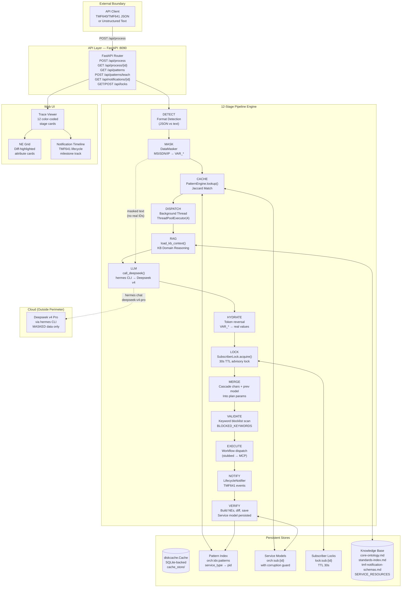
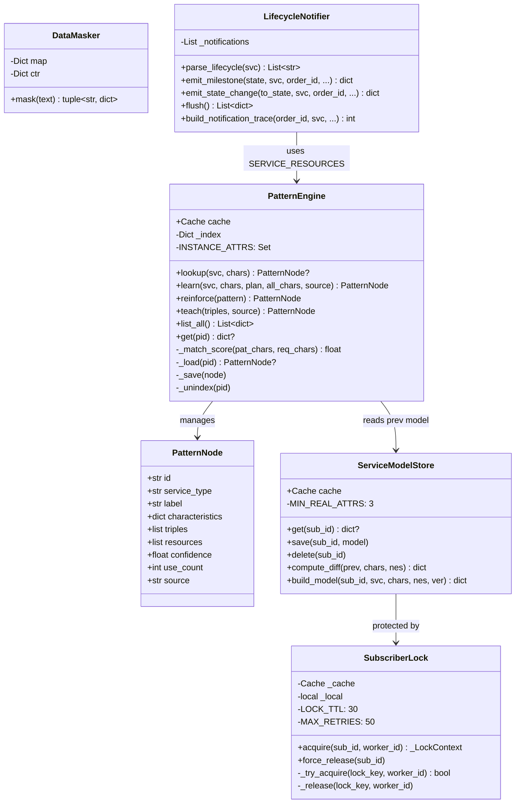
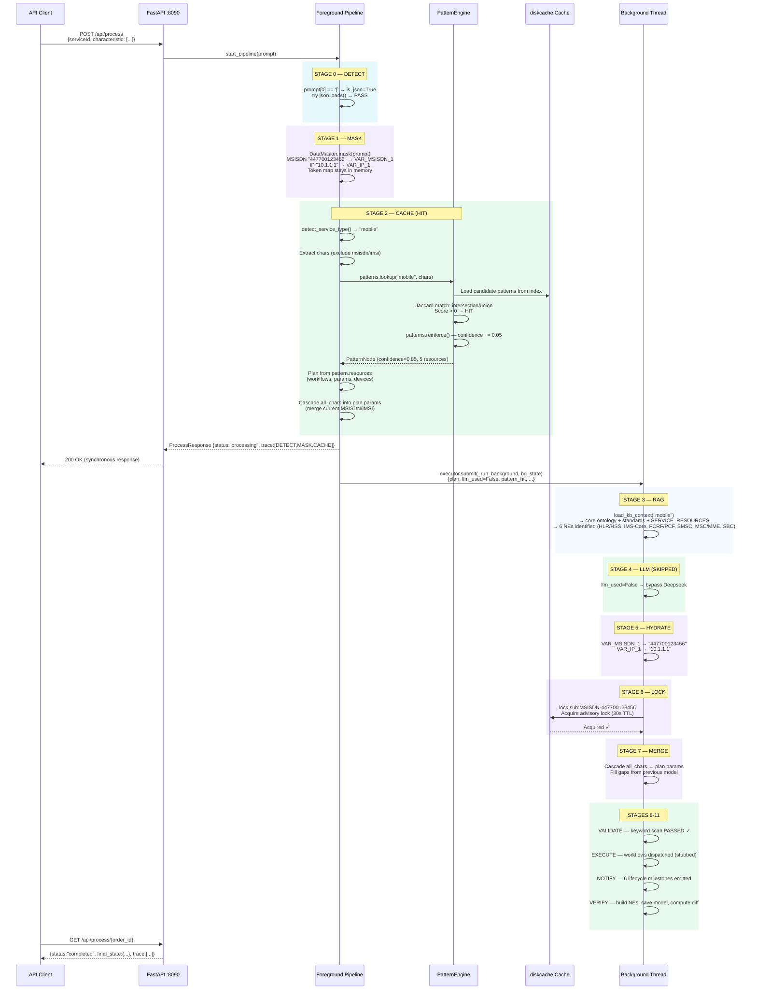
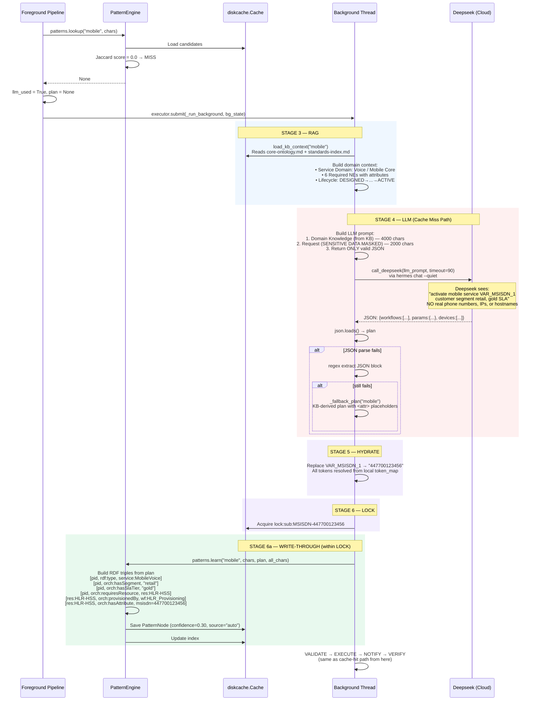
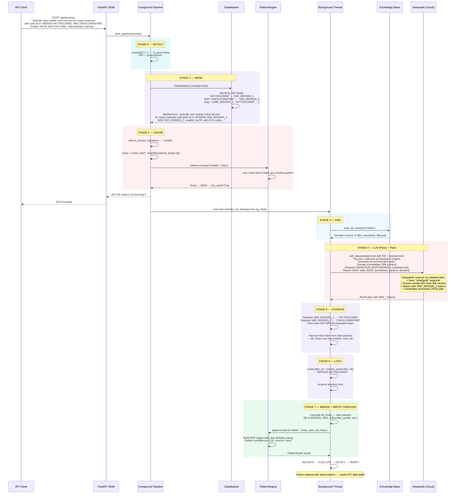
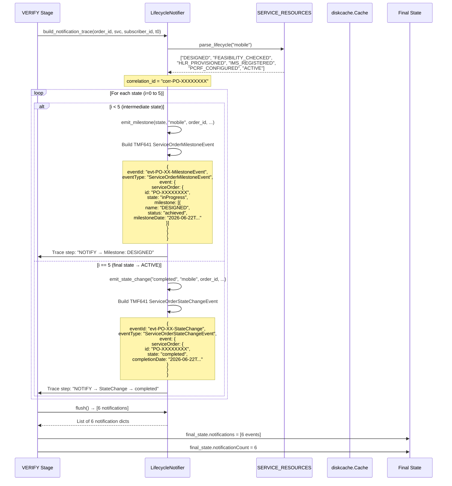
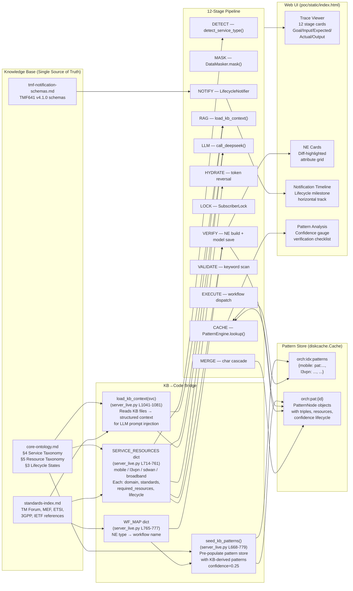
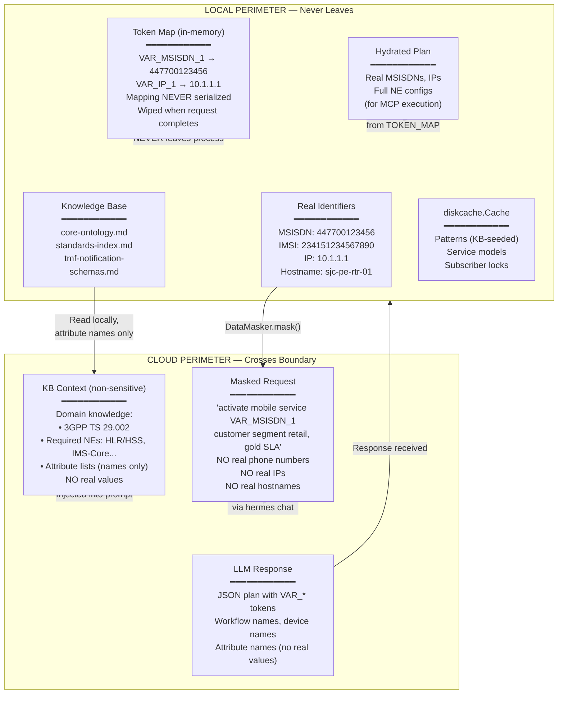

# Telecom Agentic Orchestration Engine — Architectural Blueprint

> **Document Version:** 1.0  
> **Date:** 2026-06-22  
> **Status:** Production PoC (v2.0.0)  
> **Server:** `poc/server_live.py` (1,848 lines), running on `0.0.0.0:8090` via uvicorn  
> **Web UI:** `poc/static/index.html` (727 lines)  
> **Build Plan:** `.hermes/plans/2026-06-22_160000-telecom-orchestrator-build.md` (2,505 lines)

---

## 1. System Identity and Goals

### 1.1 What This System IS

| Identity | Description |
|----------|-------------|
| **Telecom Service Orchestration Engine** | Accepts TMF640 Service Activation and TMF641 Service Order requests and produces fully-provisioned services across mobile voice, L3VPN, SD-WAN, and broadband domains. |
| **Cache-First Reasoning Pipeline** | Every request queries the RDF-inspired pattern store first. Cache HIT → instant plan (<5ms decision). Cache MISS → mask → LLM reason → learn pattern → write-through. |
| **KB-Driven Knowledge Engine** | All network element definitions, attributes, workflows, and lifecycle states derive from the knowledge base (`knowledge-base/ontologies/core-ontology.md` + `SERVICE_RESOURCES`), never from hardcoded lists. |
| **Data-Sovereign Gateway** | All sensitive identifiers (MSISDN, IMSI, IP addresses, hostnames) are tokenized via `DataMasker` before any cloud LLM call. The token→real mapping never leaves in-process memory. |
| **RDF/OWL-Inspired Pattern Store** | Orchestration patterns are modeled as named graphs of triples `(subject, predicate, object)` with Jaccard similarity matching, confidence lifecycle, and auto-learning via `PatternEngine`. |
| **TMF641-Compliant Notification Emitter** | `LifecycleNotifier` emits `ServiceOrderMilestoneEvent` for intermediate lifecycle states and `ServiceOrderStateChangeEvent` for completion, per TM Forum Open API v4.1.0. |
| **Concurrent-Modification-Safe Service Model** | `SubscriberLock` provides per-subscriber advisory locks protecting the MERGE→VERIFY→STORE critical section. |
| **Web-Visible Trace Viewer** | Every pipeline stage produces structured `Goal/Input/Expected/Actual/Output` trace cards with color coding, diff highlighting, and pattern analysis in the single-file web UI. |

### 1.2 What This System IS NOT

| Non-Goal | Clarification |
|----------|---------------|
| **NOT a device configuration engine** | The EXECUTE stage is stubbed; real provisioning is designed to route through MCP servers (NetBox, Ansible, device drivers). |
| **NOT a resource inventory system** | The VERIFY stage constructs network element state from KB + plan, not from an external inventory database. |
| **NOT a CRM integration hub** | Only TMF640 (activation) and TMF641 (ordering) ingress. No TMF622 Product Order decomposition. |
| **NOT a real-time network monitoring system** | Service assurance, alarm correlation, and network health checks are separate cron/scheduled concerns. |
| **NOT a full RDF/OWL reasoner** | The pattern engine uses an RDF-inspired *data model* with Jaccard similarity — it does not perform subsumption, transitivity, or OWL-DL reasoning. |

---

## 2. Architecture Overview

### 2.1 12-Stage Async Pipeline

The orchestrator implements a **12-stage pipeline** split across synchronous (foreground) and asynchronous (background) execution:

```
FOREGROUND (API request thread, returns 202 immediately):
  DETECT → MASK → CACHE ──→ dispatch to background ──→ return ProcessResponse

BACKGROUND (ThreadPoolExecutor worker):
  RAG → LLM → HYDRATE → LOCK → MERGE → VALIDATE → EXECUTE → NOTIFY → VERIFY
```

| Stage | Name | Location | Description |
|-------|------|----------|-------------|
| **0** | DETECT | `start_pipeline()` L1137-1148 | Classify request as structured JSON (TMF640/TMF641) or unstructured text |
| **1** | MASK | `start_pipeline()` L1160-1182 | `DataMasker` tokenizes MSISDNs, IPs, hostnames → VAR_* tokens |
| **2** | CACHE | `start_pipeline()` L1184-1313 | `PatternEngine.lookup()` — Jaccard match against RDF pattern store; HIT or MISS |
| **3** | RAG | `_run_background_inner()` L1390-1403 | `load_kb_context(svc)` — load core ontology, standards, SERVICE_RESOURCES |
| **4** | LLM | `_run_background_inner()` L1405-1467 | On cache miss: `call_deepseek()` via `hermes chat` CLI; on hit: skipped |
| **5** | HYDRATE | `_run_background_inner()` L1472-1489 | Reverse VAR_* tokens → real values using local `token_map` |
| **6** | LOCK | `_run_background_inner()` L1516-1540 | `SubscriberLock.acquire()` — per-subscriber advisory lock (30s TTL, 5s retry budget) |
| **7** | MERGE | `_run_background_inner()` L1543-1574 | Cascade request characteristics + previous model attributes into plan params |
| **8** | VALIDATE | `_run_background_inner()` L1591-1609 | Blocked keyword scan (`BLOCKED_KEYWORDS`: erase, reload, format, shutdown, etc.) |
| **9** | EXECUTE | `_run_background_inner()` L1611-1618 | Stubbed — logs workflow dispatch; real path routes through MCP servers |
| **10** | NOTIFY | `_run_background_inner()` L1684-1688 | `LifecycleNotifier.build_notification_trace()` — walk KB lifecycle, emit TMF641 events |
| **11** | VERIFY | `_run_background_inner()` L1620-1709 | Build network elements from KB, compute diff, save service model, emit final state |

### 2.2 Component Diagram



### 2.3 Core Class Relationships



---

## 3. Sequence Diagrams

### 3.1 TMF640/TMF641 Cache-Hit Flow (Fast Path)

When a structured JSON request matches an existing pattern:



### 3.2 Cache-Miss / LLM Fallback Flow

When no matching pattern exists, the system invokes Deepseek with masked data:



### 3.3 Unstructured Text Flow

Natural language requests must be parsed into structured form before the normal pipeline applies:



### 3.4 Notification Lifecycle Flow

The `LifecycleNotifier` walks the KB-defined lifecycle state machine and emits TMF641-standard events:



---

## 4. Data Flow Diagram

### 4.1 KB → SERVICE_RESOURCES → Pipeline Stages → Pattern Store → UI



### 4.2 Detailed Data Flow Through Pipeline Stages

```
Request (JSON or Text)
    │
    ▼
[DETECT] ──► is_json: bool, fmt: "tmf640" | "unstructured"
    │
    ▼
[MASK]  ──► DataMasker.mask(prompt)
    │         └─► masked_text (VAR_* tokens), token_map (local only)
    │
    ▼
[CACHE] ──► detect_service_type(prompt) → svc
    │        extract chars (exclude INSTANCE_ATTRS)
    │        patterns.lookup(svc, chars)
    │         ├─ HIT:  PatternNode → plan, llm_used=False
    │         └─ MISS: plan=None, llm_used=True
    │
    ▼
[DISPATCH to Background Thread]
    │
    ▼
[RAG]   ──► load_kb_context(svc) → KB context string
    │         Reads: core-ontology.md + standards-index.md + SERVICE_RESOURCES
    │
    ▼
[LLM]   ──► if llm_used:
    │         call_deepseek(kb_context + masked_text) → JSON plan
    │         else: skip (plan already from cache)
    │
    ▼
[HYDRATE] ──► Reverse token_map: VAR_* → real values
    │          Harvest real chars from params for unstructured text
    │
    ▼
[LOCK]  ──► SubscriberLock.acquire(subscriber_id, order_id)
    │         Disk-backed advisory lock, 30s TTL, 5s retry budget
    │
    ▼
[MERGE] ──► Cascade all_chars → plan.params
    │         Fill gaps from previous_model.characteristics
    │         if llm_used: patterns.learn(svc, chars, plan, all_chars)
    │                       → new PatternNode with RDF triples
    │
    ▼
[VALIDATE] ──► Blocked keyword scan (erase, reload, format, shutdown, ...)
    │           BLOCKED → abort; PASSED → continue
    │
    ▼
[EXECUTE] ──► Log workflow dispatch (stubbed; real path → MCP servers)
    │
    ▼
[NOTIFY] ──► LifecycleNotifier.build_notification_trace()
    │          Walk SERVICE_RESOURCES[svc].lifecycle states
    │          Intermediate states → ServiceOrderMilestoneEvent
    │          Final ACTIVE state → ServiceOrderStateChangeEvent
    │
    ▼
[VERIFY] ──► Build network_elements[] from KB resource definitions
    │          attribute cascade: params → all_chars → chars → prev_model
    │          service_models.compute_diff(previous_model, all_chars, nes)
    │          service_models.build_model(sub_id, svc, all_chars, nes)
    │          service_models.save(sub_id, new_model)
    │
    ▼
[Final State] → {serviceId, state:"ACTIVE", networkElements[], patternMatch, ...}
```

---

## 5. Technology Stack

| Layer | Technology | Version | Role |
|-------|-----------|---------|------|
| **Language** | Python | 3.13.5 | All application logic |
| **Web Framework** | FastAPI | Latest | API routing, request validation, static file serving |
| **ASGI Server** | uvicorn | Latest | HTTP server on `0.0.0.0:8090` |
| **Pattern Store** | diskcache | Latest | SQLite-backed persistent cache (Redis-compatible API) |
| **Data Validation** | Pydantic | v2 | Request/response models (`ProcessRequest`, `ProcessResponse`, `TraceStep`) |
| **LLM Provider** | Deepseek v4 Pro | `deepseek-v4-pro` | Cloud AI reasoning (via `hermes chat` CLI subprocess) |
| **Orchestration Brain** | Hermes Agent | Latest | LLM client, KB integration, subprocess management |
| **Knowledge Base** | Markdown files | — | `core-ontology.md`, `standards-index.md`, `tmf-notification-schemas.md` |
| **Concurrency** | `concurrent.futures.ThreadPoolExecutor` | stdlib | Background pipeline execution (4 workers) |
| **Thread Safety** | `threading.Lock` | stdlib | Job store (`jobs_lock`), subscriber locking |
| **Frontend** | HTML5 + CSS3 + vanilla JS | — | Single-file web UI (`poc/static/index.html`) with JetBrains Mono font |
| **Process Management** | `subprocess.run` | stdlib | Hermes CLI invocation for Deepseek |
| **Hashing** | `hashlib.sha256` | stdlib | Pattern IDs, subscriber IDs, text hash for unstructured requests |
| **Regex** | `re` | stdlib | MSISDN detection (`\d{5,15}`), IPv4 detection, JSON extraction, HTML formatting |
| **Standards Compliance** | TM Forum TMF640/TMF641 v4.1.0 | — | Service activation, service ordering, notification events |

### 5.1 diskcache as Pattern Store

The system uses `diskcache.Cache` (SQLite-backed) instead of Redis for the PoC:

```python
cache = diskcache.Cache("/opt/data/telecom-orchestrator/poc/cache_store")
```

Key prefixes:
| Prefix | Purpose |
|--------|---------|
| `orch:pat:{id}` | PatternNode objects |
| `orch:idx:patterns` | Service-type → pattern ID index |
| `orch:sub:{id}` | Subscriber service models |
| `lock:sub:{id}` | Per-subscriber advisory locks (30s TTL) |

---

## 6. Deployment Architecture

### 6.1 Current PoC Deployment (Single-Node)

```
┌──────────────────────────────────────────────────────┐
│  Host: Linux (6.8.0-124-generic)                    │
│  Port: 0.0.0.0:8090                                 │
│                                                      │
│  ┌────────────────────────────────────────────┐     │
│  │  uvicorn (ASGI)                            │     │
│  │  └─ FastAPI app                            │     │
│  │     ├─ POST /api/process                   │     │
│  │     ├─ GET /api/process/{id}               │     │
│  │     ├─ GET /api/patterns                   │     │
│  │     ├─ GET /api/patterns/{id}              │     │
│  │     ├─ POST /api/patterns/teach            │     │
│  │     ├─ GET /api/samples                    │     │
│  │     ├─ GET /api/notifications/{id}         │     │
│  │     ├─ GET /api/locks/status               │     │
│  │     ├─ POST /api/locks/release             │     │
│  │     ├─ GET /health                         │     │
│  │     ├─ GET / (index.html)                  │     │
│  │     └─ /static/* (CSS, JS assets)          │     │
│  └────────────────────────────────────────────┘     │
│                                                      │
│  ┌────────────────────────────────────────────┐     │
│  │  ThreadPoolExecutor (max_workers=4)        │     │
│  │  └─ Background pipeline threads            │     │
│  └────────────────────────────────────────────┘     │
│                                                      │
│  ┌────────────────────────────────────────────┐     │
│  │  diskcache.Cache (SQLite)                  │     │
│  │  Path: poc/cache_store/                    │     │
│  └────────────────────────────────────────────┘     │
│                                                      │
│  ┌────────────────────────────────────────────┐     │
│  │  Knowledge Base (read-only)                │     │
│  │  Path: knowledge-base/                     │     │
│  └────────────────────────────────────────────┘     │
│                                                      │
│  ┌────────────────────────────────────────────┐     │
│  │  Deepseek v4 Pro (cloud)                   │     │
│  │  Invoked via: hermes chat subprocess       │     │
│  │  Only masked data crosses perimeter        │     │
│  └────────────────────────────────────────────┘     │
└──────────────────────────────────────────────────────┘
```

### 6.2 Production Target Deployment (per Build Plan)

```
                     ┌──────────────┐
                     │  Nginx       │
                     │  Reverse     │
                     │  Proxy       │
                     └──────┬───────┘
                            │
              ┌─────────────┼─────────────┐
              ▼             ▼             ▼
    ┌─────────────┐ ┌─────────────┐ ┌─────────────┐
    │ FastAPI     │ │ FastAPI     │ │ FastAPI     │
    │ Worker 1    │ │ Worker 2    │ │ Worker N    │
    │ (4 threads) │ │ (4 threads) │ │ (4 threads) │
    └──────┬──────┘ └──────┬──────┘ └──────┬──────┘
           │               │               │
           └───────────────┼───────────────┘
                           │
              ┌────────────┴────────────┐
              ▼                         ▼
    ┌──────────────────┐    ┌──────────────────┐
    │ RabbitMQ         │    │ Redis / diskcache│
    │ (message queue)  │    │ (pattern store)  │
    │ prefetch_count=1 │    │ + subscriber lock│
    └──────────────────┘    └──────────────────┘
              │
              ▼
    ┌──────────────────────────────────────┐
    │ MCP Servers                          │
    │ ├─ NetBox (inventory/source of truth)│
    │ ├─ Ansible (device configuration)    │
    │ └─ Device drivers (SSH, NETCONF)     │
    └──────────────────────────────────────┘
```

### 6.3 Startup Sequence

1. `python poc/server_live.py` executes as `__main__`
2. `diskcache.Cache` initialized at `poc/cache_store/`
3. `SERVICE_RESOURCES` dict loaded (L714-761)
4. `seed_kb_patterns()` pre-populates pattern store with KB-derived patterns (confidence=0.25)
5. `validate_and_repair_cache()` — startup integrity scan (L948-1038):
   - Scans subscriber models for duplicates (same MSISDN → keep highest version)
   - Validates pattern index integrity (removes stale entries)
   - Detects orphan patterns and re-indexes
   - Logs all repairs for audit
6. `uvicorn.run(app, host="0.0.0.0", port=8090)` — server ready

---

## 7. Security Boundaries

### 7.1 What Leaves the Perimeter vs. What Stays Local



### 7.2 Security Controls Detail

| Control | Implementation | Location |
|---------|---------------|----------|
| **Data Masking** | `DataMasker` (L333-357): `MSISDN_RE` (`\d{5,15}`) + `IP_RE` (`\b(?:\d{1,3}\.){3}\d{1,3}\b`). Bidirectional map stored in instance, never serialized. | STAGE 1: MASK |
| **Token Map Isolation** | `masker.map` is a plain Python dict on the `DataMasker` instance. It lives in the foreground pipeline scope, passed to background via `bg_state["token_map"]`. Destroyed when request completes. | In-process memory only |
| **Cloud Data Minimization** | Only masked text + KB context (attribute names, no values) sent to Deepseek. The LLM prompt explicitly states "SENSITIVE DATA MASKED" and instructs to use VAR_* tokens as-is. | STAGE 4: LLM |
| **Local Hydration** | `flatten_plan_params()` + string replacement of VAR_* tokens → real values. All sensitive data restored inside the local perimeter after LLM returns. | STAGE 5: HYDRATE |
| **Destructive Keyword Blocking** | `BLOCKED_KEYWORDS` (L362-363): `erase`, `reload`, `format`, `shutdown`, `no switchport`, `write erase`, `delete startup-config`, `boot system flash`. Scanned against plan JSON + masked text. | STAGE 8: VALIDATE |
| **Subscriber Locking** | `SubscriberLock` (L200-267): Per-subscriber advisory lock via diskcache key `lock:sub:{id}`. 30s TTL prevents deadlock. 5s retry budget. Re-entrant for same worker. | STAGE 6: LOCK |
| **Service Model Corruption Guard** | `ServiceModelStore.get()` (L50-104): Runtime validation on every read — detects `default_*` attributes, placeholder values, and fully-corrupt models. Salvages partial data or deletes corrupt entries. | Pre-MERGE model load |
| **Pattern Runtime Validation** | `PatternEngine._load()` (L611-644): Rejects patterns with empty resources, <3 triples, or unreadable data. Auto-deletes corrupt patterns. Logs `default_*` contamination warnings. | Every pattern load |
| **Startup Cache Integrity** | `validate_and_repair_cache()` (L948-1038): Cross-item scan for duplicate subscribers (same MSISDN), stale index entries, orphan patterns. Runs once on module load. | Module initialization |
| **Input Validation** | Pydantic v2 `ProcessRequest`: `prompt: str = Field(..., min_length=1)`. Rejects empty requests at API boundary. | POST /api/process |

### 7.3 Data Classification

| Data Category | Examples | Storage | Leaves Perimeter? |
|---------------|----------|---------|-------------------|
| **Highly Sensitive** | MSISDN, IMSI, IMEI, subscriber IPs, hostnames | In-memory only (token map) | **NO** — masked to VAR_* tokens |
| **Sensitive** | Customer segment, SLA tier, service profile | diskcache (service models) | **NO** — but may appear in KB context as attribute names (not values) |
| **Internal** | Workflow names, device names, NE types | diskcache (patterns), service models | **YES** — as part of LLM response (abstract plan structure) |
| **Public/KB** | Standards references, ontology definitions, attribute lists | Knowledge base (read-only files) | **YES** — injected into LLM prompt as domain context |
| **Metadata** | Order IDs, timestamps, pipeline stage durations | In-memory jobs dict | **YES** — returned to client in API responses |

---

## 8. Key Design Decisions & Rationale

### 8.1 Why diskcache Instead of Redis

The PoC uses `diskcache.Cache` (SQLite-backed) as a Redis-compatible drop-in:

- **Zero infrastructure**: No Redis server to install, configure, or maintain
- **Redis-compatible API**: `.get()`, `.set()`, `.delete()`, `.expire()` — transparent migration path
- **Persistence**: Survives process restarts (SQLite file at `poc/cache_store/`)
- **Production path**: Build plan targets Redis for multi-node horizontal scaling

### 8.2 Why Foreground/Background Split

The 12-stage pipeline is split for two reasons:

1. **Responsiveness**: The API returns a `ProcessResponse` within milliseconds with `status: "processing"`. The UI polls `GET /api/process/{id}` every 2 seconds for updates.
2. **LLM latency**: Deepseek calls take 30-90 seconds — blocking the request thread would be unacceptable.

### 8.3 Why RDF-Inspired Patterns (Not Full OWL)

The system models orchestration knowledge as named graphs of `(subject, predicate, object)` triples because:

- **Intuitive for telecom**: A pattern is "which resources are needed, provisioned by which workflows, with which attributes"
- **Matchable**: Jaccard similarity on service-defining characteristics is fast and effective for cache decisions
- **Learnable**: New patterns are auto-generated from LLM plans by extracting resource→workflow→attribute bindings
- **Not over-engineered**: Full OWL reasoning (subsumption, transitivity) would add complexity without proportional benefit for the cache-hit decision

### 8.4 Why KB-Seeded Patterns

`seed_kb_patterns()` (L668-779) pre-populates the pattern store at module load:

- Even the **very first request** finds a KB-seeded pattern (confidence=0.25, source="kb")
- KB-seeded patterns have **correct attribute names** from `SERVICE_RESOURCES` — no `default_*` placeholders reach the NE builder
- After one real orchestration, an auto-learned pattern (confidence=0.30, source="auto") with real values is created
- Subsequent requests match the auto-learned pattern; confidence increases with each HIT

---

## 9. API Surface

| Method | Path | Description | Returns |
|--------|------|-------------|---------|
| `POST` | `/api/process` | Submit TMF640/TMF641 JSON or unstructured text | `ProcessResponse` (immediate, status="processing") |
| `GET` | `/api/process/{order_id}` | Poll for pipeline completion | `ProcessResponse` (with final_state when done) |
| `GET` | `/api/patterns` | List all learned patterns | `{patterns: [{id, service_type, label, confidence, use_count, ...}]}` |
| `GET` | `/api/patterns/{id}` | Get full pattern with RDF triples | PatternNode as dict |
| `POST` | `/api/patterns/teach` | Manually teach a pattern via triples | `{status: "learned", pattern: {...}}` |
| `GET` | `/api/samples` | Get pre-built sample requests | `{samples: [{label, text}, ...]}` |
| `GET` | `/api/notifications/{order_id}` | Get TMF641 notifications for completed order | `{orderId, notifications: [...], count}` |
| `GET` | `/api/locks/status` | List all active subscriber locks | `{activeLocks: N, locks: [...]}` |
| `POST` | `/api/locks/release` | Admin: force-release a subscriber lock | `{status: "released", subscriberId}` |
| `GET` | `/health` | Health check | `{status: "ok", cache_size: N, redis_backend: "diskcache"}` |
| `GET` | `/` | Web UI | `index.html` |
| `GET` | `/static/*` | Static assets | Files from `poc/static/` |

---

## 10. File Map

```
poc/
├── server_live.py          # 1,848 lines — Full application
│   ├── ServiceModelStore    # L34-195   — Persistent subscriber models with corruption guard
│   ├── SubscriberLock       # L200-267  — Per-subscriber advisory lock (30s TTL)
│   ├── DataMasker           # L333-357  — MSISDN/IP tokenizer
│   ├── PatternNode          # L400-423  — RDF-inspired pattern dataclass
│   ├── PatternEngine        # L425-662  — Pattern store with Jaccard matching
│   ├── seed_kb_patterns()   # L668-779  — KB-to-pattern pre-seeding
│   ├── SERVICE_RESOURCES    # L714-761  — KB-derived resource definitions
│   ├── WF_MAP              # L765-777  — NE-type → workflow mapping
│   ├── LifecycleNotifier    # L785-945  — TMF641 notification emitter
│   ├── validate_and_repair_cache() # L948-1038 — Startup integrity scan
│   ├── load_kb_context()    # L1041-1081 — KB RAG context builder
│   ├── call_deepseek()     # L1086-1112 — Deepseek via hermes CLI
│   ├── detect_service_type() # L1115-1121 — Request classification
│   ├── start_pipeline()     # L1126-1342 — Foreground stages (DETECT→MASK→CACHE)
│   ├── _run_background()    # L1345-1361 — Background dispatcher
│   ├── _run_background_inner() # L1363-1718 — Background stages (RAG→LLM→...→VERIFY)
│   ├── _fallback_plan()     # L1721-1733 — KB-derived plan when LLM unavailable
│   └── API routes           # L1738-1848 — FastAPI endpoints
├── static/
│   └── index.html           # 727 lines — Single-file web UI
│       ├── Left panel       # Sample chips, textarea, submit button
│       └── Right panel      # Trace viewer, NE grid, notification timeline, pattern analysis
└── cache_store/             # diskcache SQLite database directory
```

---

## 11. References

| Reference | Path |
|-----------|------|
| Core Ontology | `knowledge-base/ontologies/core-ontology.md` |
| Standards Index | `knowledge-base/reference/standards-index.md` |
| TMF Notification Schemas | `knowledge-base/reference/tmf-notification-schemas.md` |
| Implementation Guide | `knowledge-base/reference/implementation-guide.md` |
| Orchestration Brain Design | `knowledge-base/reference/orchestration-brain-design.md` |
| CRM Integration Design | `knowledge-base/reference/solution-design-crm-integration.md` |
| Build Plan | `.hermes/plans/2026-06-22_160000-telecom-orchestrator-build.md` |
| Server Source | `poc/server_live.py` |
| Web UI Source | `poc/static/index.html` |
| Product Catalog | `knowledge-base/products/product-catalog.md` (planned) |

---

*Document generated from live code analysis of `server_live.py` v2.0.0, `index.html`, and build plan. All class names, stage ordering, method signatures, and data structures verified against source.*
