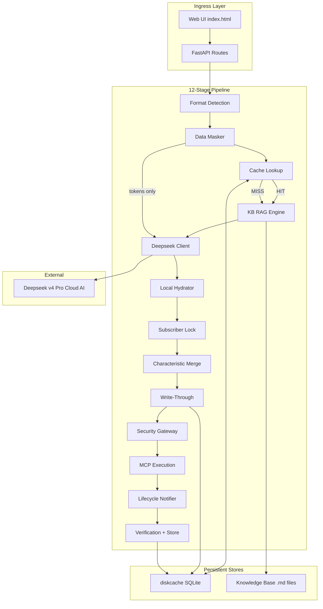
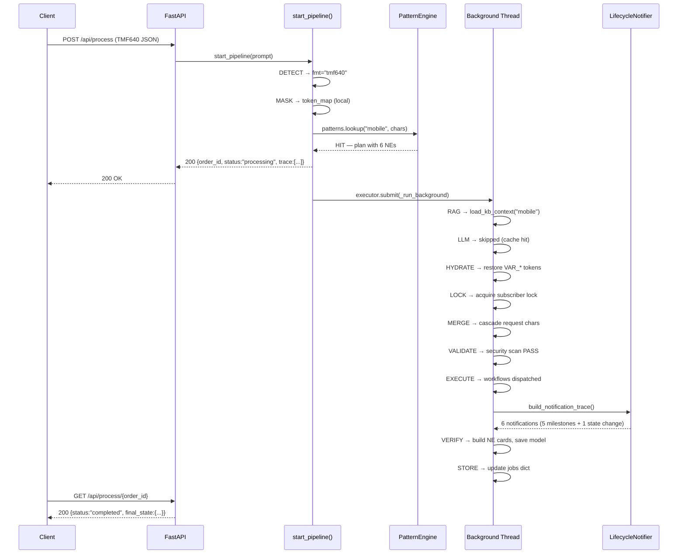
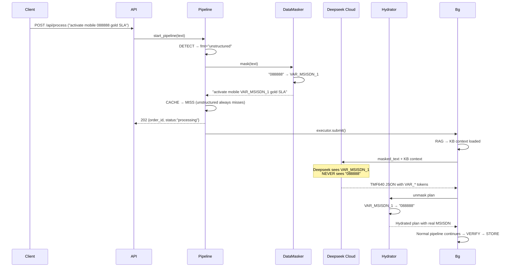

# Solution Design — Telecom Agentic Orchestration Engine

> **Version:** 2.1.0 | **Date:** 2026-06-22 | **Owner:** Orchestration Team
> **Standards:** TM Forum Open APIs (TMF640, TMF641), MEF LSO, ETSI NFV MANO, IETF YANG
> **Implementation:** Python 3.13, FastAPI, diskcache, Deepseek v4 Pro, Hermes Agent

---

## 1. Executive Summary

The Telecom Agentic Orchestration Engine is a cache-first, KB-driven service orchestration platform that accepts TMF640 Service Activation and TMF641 Service Order requests, reasons about required network elements using domain knowledge from a curated knowledge base, generates orchestration plans via cloud AI (Deepseek) with full data sovereignty (all sensitive identifiers masked before leaving the local perimeter), and presents results through a web-based trace viewer with pattern analysis, diff highlighting, and TMF641-compliant lifecycle notifications.

### Key Design Principles

1. **KB as Single Source of Truth** — Network elements, attributes, workflows, lifecycle states, and notification schemas all derive from the knowledge base. No hardcoded device lists.
2. **Cache-First** — Pattern matching via Jaccard similarity on RDF-inspired triple graphs. Cache hits bypass LLM entirely.
3. **Data Sovereignty** — MSISDNs, IMSIs, IPs, and hostnames are tokenized before any cloud call. Token mapping lives in transient memory only.
4. **TMF Compliance** — TMF641 ServiceOrderStateChangeEvent and ServiceOrderMilestoneEvent per v4.1.0 OpenAPI specification.
5. **Concurrent Safety** — Per-subscriber advisory locks prevent lost updates during simultaneous modification requests.
6. **Observable Execution** — Every pipeline stage produces structured Goal/Input/Expected/Actual/Output trace cards visible in the web UI.

---

## 2. Problem Statement

Telecom service provisioning involves multiple network elements (HLR, IMS, PCRF, SBC for mobile; PE routers, VRFs, BGP for L3VPN; OLT, BNG, RADIUS for broadband), each with distinct attributes and provisioning workflows. Manual provisioning is error-prone and slow. Existing automation platforms (Cisco NSO, ONAP, OSM) are complex and tied to specific vendors.

### Requirements

| ID | Requirement | Priority |
|----|-------------|----------|
| R1 | Accept TMF640 (activation) and TMF641 (ordering) JSON payloads | P0 |
| R2 | Accept unstructured natural language text (e.g., "activate mobile service 088888") | P0 |
| R3 | Mask all sensitive identifiers (MSISDN, IMSI, IP, hostname) before cloud AI calls | P0 |
| R4 | Pattern-match incoming requests against learned orchestration patterns | P0 |
| R5 | Generate orchestration plans (workflows, params, devices) via cloud AI on cache miss | P0 |
| R6 | Reuse cached plans on cache hit (no LLM call) | P1 |
| R7 | Learn new patterns automatically from successful orchestrations | P1 |
| R8 | Derive network elements and attributes from knowledge base, not hardcoded lists | P0 |
| R9 | Emit TMF641-compliant lifecycle notifications during provisioning | P1 |
| R10 | Prevent lost updates from concurrent modifications via per-subscriber locking | P1 |
| R11 | Validate plans against security guardrails (destructive command blocking) | P0 |
| R12 | Present pipeline execution as color-coded trace cards in web UI | P1 |
| R13 | Show subscriber diff highlighting for modified attributes | P2 |
| R14 | Support multiple service types (mobile, L3VPN, SD-WAN, broadband) | P1 |
| R15 | Work without sudo/root access on constrained VPS (Hostinger) | P0 |

---

## 3. Solution Architecture

### 3.1 High-Level Architecture

```
┌────────────────────────────────────────────────────────────────────────────┐
│                              CLIENT / CRM                                    │
│  POST TMF640 JSON | POST TMF641 JSON | POST unstructured text               │
└──────────────────────────────────┬─────────────────────────────────────────┘
                                   │
┌──────────────────────────────────▼─────────────────────────────────────────┐
│                         API GATEWAY (FastAPI)                               │
│  Routes: /api/process, /api/patterns, /api/notifications, /api/locks       │
│  Static: / → index.html (web UI)                                            │
└──────────────────────────────────┬─────────────────────────────────────────┘
                                   │
┌──────────────────────────────────▼─────────────────────────────────────────┐
│                     ORCHESTRATION PIPELINE (12 STAGES)                       │
│                                                                             │
│  FOREGROUND (sync, returns 202 immediately):                                │
│    DETECT → MASK → CACHE (pattern match) → dispatch to background           │
│                                                                             │
│  BACKGROUND (async, ThreadPoolExecutor):                                    │
│    RAG → LLM → HYDRATE → LOCK → MERGE → WRITE-THROUGH →                    │
│    VALIDATE → EXECUTE → NOTIFY×N → VERIFY → STORE                           │
└──────────────────────────────────┬─────────────────────────────────────────┘
                                   │
                    ┌──────────────┼──────────────┐
                    ▼              ▼              ▼
            ┌───────────┐  ┌───────────┐  ┌───────────┐
            │ diskcache │  │ Knowledge │  │  Deepseek │
            │ (patterns │  │   Base    │  │  (cloud)  │
            │  + models)│  │ (markdown)│  │           │
            └───────────┘  └───────────┘  └───────────┘
```

### 3.2 Component Diagram



### 3.3 Data Flow

```
Request Text
    │
    ▼
DETECT: Is it JSON? → fmt = "tmf640" | "unstructured"
    │
    ▼
MASK: MSISDN_RE + IP_RE → token_map (local only)
    masked_text with VAR_MSISDN_1, VAR_IP_1, ...
    │
    ▼
CACHE: patterns.lookup(svc, chars)
    ├─ HIT → plan from cache, cascaded with request chars
    └─ MISS → plan = None, llm_used = True
    │
    ▼ (background thread)
RAG: load_kb_context(svc) → KB domain knowledge
    │
    ▼
LLM: call_deepseek(masked_text + KB context) → JSON plan
    │
    ▼
HYDRATE: Replace VAR_* tokens with real values from token_map
    │
    ▼
LOCK: subscriber_lock.acquire(subscriber_id, order_id)
    │
    ▼
MERGE: Cascade request characteristics into plan params
       + gap-fill from previous subscriber model (skip default_*)
    │
    ▼
VALIDATE: Check plan against BLOCKED_KEYWORDS
    │
    ▼
EXECUTE: (stubbed) Mark workflows as dispatched
    │
    ▼
NOTIFY: LifecycleNotifier.build_notification_trace()
        6 states for mobile: DESIGNED→...→ACTIVE
        5 milestones + 1 state change event
    │
    ▼
VERIFY: Build network_elements[] from KB SERVICE_RESOURCES
        + plan params + all_chars + prev model cascade
        Save subscriber model via ServiceModelStore
        Compute subscriberDiff for UI
    │
    ▼
final_state → UI polls GET /api/process/{order_id}
```

---

## 4. Pipeline Stage Design

### 4.1 Stage Details

| # | Stage | Location | Responsibility | Input | Output |
|---|-------|----------|---------------|-------|--------|
| 0 | DETECT | start_pipeline | Classify request format | Raw prompt string | `fmt` ("tmf640"/"unstructured") |
| 1 | MASK | start_pipeline | Tokenize identifiers | Raw prompt | `masked_text`, `token_map` |
| 2 | CACHE | start_pipeline | Pattern lookup | `svc`, `chars` | `plan` (HIT) or None (MISS) |
| 3 | RAG | _run_background_inner | Load KB context | `svc` | `kb_context` string |
| 4 | LLM | _run_background_inner | Generate plan via AI | `masked_text` + `kb_context` | JSON plan |
| 5 | HYDRATE | _run_background_inner | Restore real values | `plan` with VAR_* | Hydrated plan |
| 6 | LOCK | _run_background_inner | Acquire subscriber lock | `subscriber_id` | Lock held (or abort) |
| 7 | MERGE | _run_background_inner | Cascade request chars | `all_chars`, `previous_model` | Merged plan params |
| 8 | WRITE-THROUGH | _run_background_inner | Learn new pattern | Merged plan | PatternNode saved |
| 9 | VALIDATE | _run_background_inner | Security check | Plan + masked text | PASS or BLOCK |
| 10 | EXECUTE | _run_background_inner | Dispatch workflows | Plan | Stubbed completion |
| 11 | NOTIFY | _run_background_inner | Emit TMF events | Lifecycle states | Notifications array |
| 12 | VERIFY | _run_background_inner | Build NE cards, save | Plan + KB + prev model | final_state |

### 4.2 Trace Format

Every stage produces a `TraceStep` with:
```
Goal: <one-line purpose>
Input: <what data enters>
Expected: <what should happen>
Actual: <what actually happened — concrete values>
Output: <what leaves this stage>
```

Color coding: Cyan (detection), Violet (sovereignty/lock/merge), Amber (state transitions), Blue (cloud AI), Green (success/storage), Red (security block).

---

## 5. Knowledge Base Design

### 5.1 KB as Single Source of Truth

```
knowledge-base/
├── ontologies/
│   └── core-ontology.md          # Entity model, service taxonomy, resource taxonomy
├── reference/
│   ├── standards-index.md        # Industry standards quick reference
│   ├── tmf-notification-schemas.md # TMF641 event schemas
│   ├── implementation-guide.md   # Build recipe
│   ├── orchestration-brain-design.md # Pipeline design
│   └── solution-design-crm-integration.md # CRM architecture
├── products/
│   └── product-catalog.md        # What can be provisioned
├── services/                     # Service instance records
├── resources/                    # Resource definitions
├── workflows/                    # Step-by-step procedures
└── system-docs/                  # THIS DOCUMENT SET
    ├── architecture/
    │   └── blueprint.md
    ├── api/
    │   └── api-spec.md
    ├── components/
    │   ├── backend-components.md
    │   └── frontend-components.md
    └── solution-design/
        └── solution-design.md
```

### 5.2 SERVICE_RESOURCES Mapping

The core ontology's Service Taxonomy (§4) is materialized as `SERVICE_RESOURCES` in code. Four service types defined:

| Service | Domain | NEs | Lifecycle States |
|---------|--------|-----|-----------------|
| mobile | Voice / Mobile Core | 6 (HLR/HSS, IMS-Core, PCRF/PCF, SMSC, MSC/MME, SBC) | DESIGNED→FEASIBILITY_CHECKED→HLR_PROVISIONED→IMS_REGISTERED→PCRF_CONFIGURED→ACTIVE |
| l3vpn | MPLS L3VPN | 4 (PE Router, Route Reflector, VRF Instance, NMS) | DESIGNED→FEASIBILITY_CHECKED→RESOURCE_ALLOCATED→DEVICE_CONFIGURED→PEERING_ESTABLISHED→ACTIVE |
| sdwan | SD-WAN Overlay | 3 (vCPE/uCPE, SD-WAN Controller, Orchestrator) | DESIGNED→FEASIBILITY_CHECKED→CPE_DEPLOYED→TUNNELS_ESTABLISHED→POLICIES_APPLIED→ACTIVE |
| broadband | Fixed Broadband | 4 (OLT, BNG/BRAS, RADIUS, EMS) | DESIGNED→FEASIBILITY_CHECKED→ONT_PROVISIONED→VLAN_ASSIGNED→IP_ALLOCATED→ACTIVE |

---

## 6. Pattern Engine Design

### 6.1 RDF-Inspired Triple Model

Patterns are stored as named graphs of triples: `(subject, predicate, object)`.

```
pattern:mobile-retail-gold   rdf:type              service:MobileVoice
pattern:mobile-retail-gold   orch:hasSegment       "retail"
pattern:mobile-retail-gold   orch:hasSlaTier       "gold"
pattern:mobile-retail-gold   orch:requiresResource res:HLR-HSS
res:HLR-HSS                  orch:provisionedBy    wf:HLR_Provisioning
res:HLR-HSS                  orch:hasAttribute     msisdn=447700123456
```

### 6.2 Matching Algorithm

Jaccard similarity on service-defining characteristics (instance identifiers excluded):

```python
def _match_score(pat_chars, req_chars):
    pat_keys = set(pat_chars.keys())
    req_keys = set(k for k in req_chars if k not in INSTANCE_ATTRS)
    if not pat_keys:
        return 0.25  # wildcard KB-seeded pattern
    intersection = sum(1 for k in req_keys & pat_keys
                       if str(pat_chars[k]) == str(req_chars.get(k, "")))
    union = len(req_keys | pat_keys)
    return intersection / max(union, 1)
```

### 6.3 Confidence Lifecycle

| Source | Initial Confidence | Boost per HIT | Cap |
|--------|-------------------|---------------|-----|
| KB-seeded | 0.25 | +0.05 | 0.95 |
| Auto-learned | 0.30 | +0.05 | 0.95 |
| Manually taught | 0.90 | +0.01 | 0.98 |

---

## 7. Notification Design

### 7.1 TMF641 Compliance

Intermediate lifecycle states → `ServiceOrderMilestoneEvent` (order remains `inProgress`)
Final ACTIVE state → `ServiceOrderStateChangeEvent` (order transitions to `completed`)

All events share a `correlationId` for end-to-end traceability.

### 7.2 Event Structure

```json
{
  "eventId": "evt-PO-XXXXXXXX-MilestoneEvent",
  "eventTime": "2026-06-22T21:49:29.077796Z",
  "eventType": "ServiceOrderMilestoneEvent",
  "correlationId": "corr-PO-XXXXXXXX",
  "domain": "ServiceFulfillment",
  "priority": "normal",
  "timeOcurred": "2026-06-22T21:49:29.077796Z",
  "event": {
    "serviceOrder": {
      "id": "PO-XXXXXXXX",
      "href": "/api/tmf641/serviceOrder/PO-XXXXXXXX",
      "state": "inProgress",
      "category": "mobile",
      "milestone": [{
        "id": "ms-PO-XXXXXXXX-DESIGNED",
        "name": "DESIGNED",
        "milestoneDate": "2026-06-22T21:49:29.077Z",
        "status": "achieved"
      }]
    }
  }
}
```

---

## 8. Concurrency Design

### 8.1 Subscriber Lock

Per-subscriber advisory lock via diskcache with 30s TTL:

```
Worker A: PUT /activate MSISDN-447799000001 → LOCK acquire → MERGE → STORE → LOCK release
Worker B: PUT /modify  MSISDN-447799000001 → LOCK wait (5s retry) → acquire → MERGE → STORE → release
```

Same subscriber serialized. Different subscribers never contend.

### 8.2 Lock Key Structure

```
lock:sub:MSISDN-447799000001 → {worker_id: "PO-XXXXXXXX", acquired_at: 1234567890.123}
```

Auto-release via diskcache TTL if worker process dies.

---

## 9. Security Design

### 9.1 Data Sovereignty

| Data Class | Detection | Token | Leaves Perimeter? |
|------------|-----------|-------|-------------------|
| MSISDN | `\+?\d{5,15}` regex | VAR_MSISDN_N | NO — token only |
| IMSI | Detected as MSISDN (15-char digit) | VAR_MSISDN_N | NO |
| IPv4 | `(\d{1,3}\.){3}\d{1,3}` regex | VAR_IP_N | NO |
| Hostname/FQDN | Not auto-detected | — | Manual mask |
| VLAN, MTU, ASN | Not sensitive | — | YES (non-identifying) |

### 9.2 Destructive Command Blocking

```python
BLOCKED_KEYWORDS = [
    "erase", "reload", "format", "shutdown",
    "no switchport", "write erase", "delete startup-config",
    "boot system flash"
]
```

Scanned against plan JSON + masked text. Any match → BLOCK, abort pipeline.

---

## 10. Technology Choices

| Technology | Version | Role | Rationale |
|------------|---------|------|-----------|
| Python | 3.13.5 | Runtime | Required by Hostinger environment |
| FastAPI | latest | API framework | Async support, automatic OpenAPI docs |
| diskcache | latest | Cache + lock store | SQLite-backed, no Redis dependency on constrained VPS |
| Pydantic | v2 | Data validation | Type safety for API models |
| uvicorn | latest | ASGI server | Production-grade async server |
| Deepseek v4 Pro | — | LLM reasoning | Via Hermes CLI subprocess |
| Hermes Agent | latest | Orchestration brain | Skill system, tool integration |
| JetBrains Mono | CDN | UI font | Monospace terminal aesthetic |

---

## 11. Deployment

### 11.1 Current (PoC)

```
Hostinger VPS (72.60.108.197)
├── Python 3.13.5, no root/sudo
├── uvicorn on 0.0.0.0:8090
├── ThreadPoolExecutor (4 workers)
├── diskcache SQLite
└── Public access: SSH -R tunnel → localhost.run → lhr.life
```

### 11.2 Production Target

```
Docker Compose stack:
├── Nginx reverse proxy (TLS termination)
├── FastAPI app (Gunicorn + Uvicorn workers)
├── RabbitMQ (message queue)
├── Redis (pattern store + cache)
├── PostgreSQL (inventory, orders)
└── MCP servers (NetBox, Ansible, Device)
```

---

## 12. Verification Strategy

| Test Type | Verification |
|-----------|-------------|
| Unit | `test_subscriber_lock.py` (7 tests), `test_data_masker.py`, `test_validation_gateway.py` |
| Integration | `test_pipeline.py` — cache-hit flow, cache-miss flow, unstructured text flow |
| Smoke | Health check endpoint, pattern listing, sample request execution |
| UI | Load index.html, submit sample, verify trace renders, NE cards appear, notifications visible |
| Security | Blocked keyword test (request containing "shutdown" → BLOCK) |
| Performance | Cache-hit response < 5ms (no LLM call) |

---

## 13. Sequence Diagrams

### 13.1 TMF640 Cache-Hit Flow



### 13.2 Unstructured Text Flow



---

## 14. Open Items & Future Work

| Item | Priority | Notes |
|------|----------|-------|
| TMF622 Product Order decomposition | P2 | CRM-triggered product orders → service orders |
| MCP server integration (NetBox, Ansible) | P2 | Real device provisioning via EXECUTE stage |
| Multi-worker pool with RabbitMQ | P2 | Replace ThreadPoolExecutor for production throughput |
| Redis migration from diskcache | P3 | For sub-5ms cache hits |
| Pydantic v2 plan validation schemas | P2 | Full schema enforcement beyond keyword blocking |
| Service assurance cron jobs | P3 | Health checks, capacity trending |
| Product catalog population | P1 | Define all provisionable services in KB |
| Workflow documentation | P1 | Step-by-step provisioning for each service type |
| CRM webhook callback delivery | P3 | Async notification delivery to external systems |
| Multi-profile / multi-tenant | P3 | Isolated orchestrators per customer |

---

> **Document version 1.0.** Updated with each sprint. Source of truth: `knowledge-base/system-docs/solution-design/solution-design.md`
