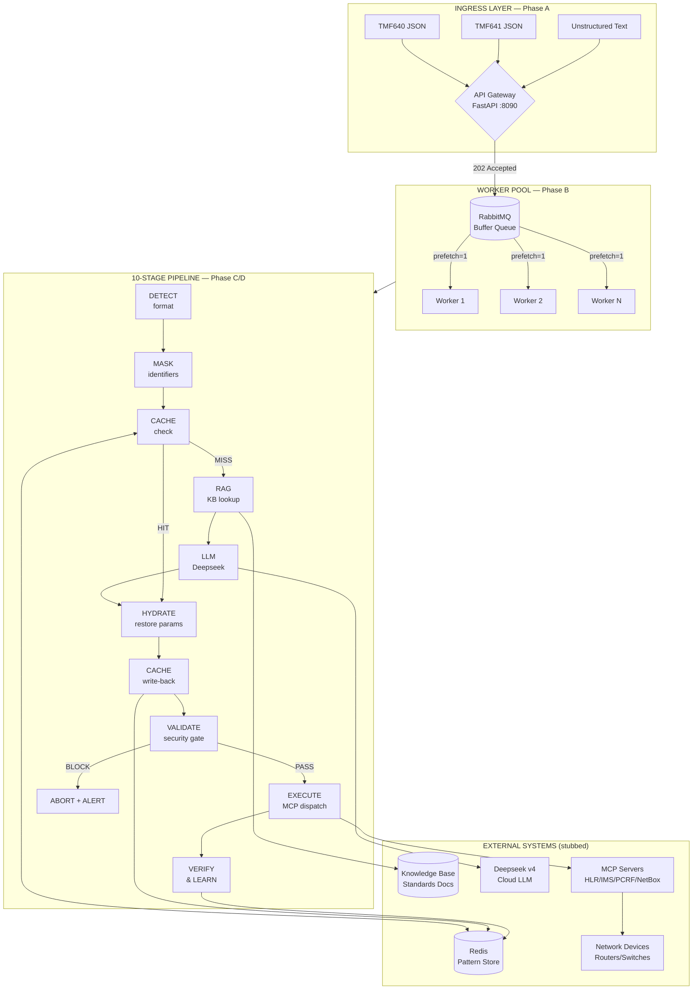
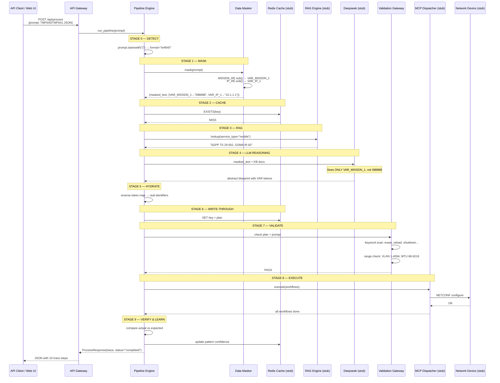
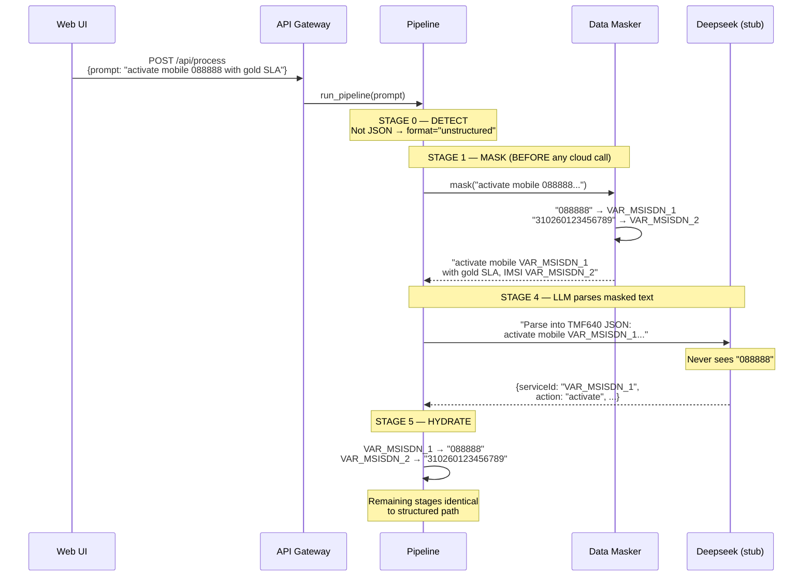
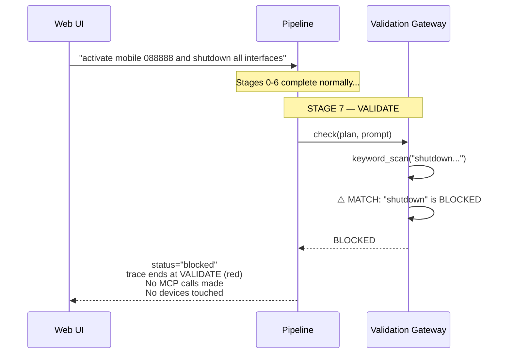

# PoC System Build & Design Document

> **Project:** Telecom Agentic Orchestration Engine — Proof of Concept
> **Version:** 1.0.0
> **Date:** 2026-06-22
> **Author:** Solution Designer
> **Status:** Delivered & Verified

---

## 1. Executive Summary

A working Proof of Concept demonstrating an **asynchronous, cache-first, data-sovereign orchestration engine** for telecom service activation (TMF640) and service ordering (TMF641). The PoC accepts both structured JSON payloads and unstructured natural language text — masking all sensitive identifiers (MSISDNs, IMSIs, IP addresses, hostnames) before any data reaches the cloud LLM (Deepseek). A two-panel web UI shows the full 10-stage pipeline trace in real-time with color-coded, annotated steps.

**Key metrics demonstrated:**
- 3 ingress paths: TMF640 JSON, TMF641 JSON, unstructured text
- 10-stage orchestration pipeline with automatic branch routing
- Data sovereignty: MSISDN/IMSI/IP masking before cloud boundaries
- Security hard-gate: destructive keyword blocking, range constraints
- Write-through caching: pattern learning for future fast-path hits

---

## 2. Component Architecture



### Color-Semantic Legend

| Color | Phase | Meaning |
|---|---|---|
| **Cyan** | Detection | Format auto-detection, routing |
| **Violet** | Masking / Hydration | Data sovereignty operations |
| **Amber** | Cache / Execution | System state transitions |
| **Blue** | Cloud AI | RAG lookup, LLM reasoning |
| **Green** | Success | Validation passed, verify done, cache write |
| **Red** | Security Block | Destructive keyword detected, abort |

---

## 3. Sequence Diagrams

### 3.1 Structured TMF640/TMF641 — Cache Miss (Full Pipeline)



### 3.2 Unstructured Text — Mask-First Flow



### 3.3 Security Block — Destructive Keyword Detection



---

## 4. Skills and Domain Knowledge Used

### 4.1 Hermes Skills Loaded During Design & Build

| Skill | Role | Key Contributions |
|---|---|---|
| **`telecom-orchestrator-bootstrap`** | Persona + Domain KB | Loaded core ontology (Customer→CFS→RFS→Resource), segment/SLA reasoning tables, 6-stage orchestration brain design, CRM integration patterns |
| **`plan`** | Build planning | Structured the 18-task build plan with TDD, bite-sized tasks, exact file paths, and commit strategy |
| **`architecture-diagram`** | Visual design | Dark-themed SVG component diagram showing full system topology with semantic color coding |

### 4.2 Knowledge Base Documents Consulted

| Document | Content Used |
|---|---|
| `knowledge-base/ontologies/core-ontology.md` | Domain entity hierarchy, lifecycle state machines, service/resource taxonomy, relationship types |
| `knowledge-base/reference/orchestration-brain-design.md` | 6-stage pipeline design, customer segment→expected state mapping tables, workflow selection logic |
| `knowledge-base/reference/solution-design-crm-integration.md` | Northbound API architecture, async fulfillment via Redis/RQ queues, webhook callback patterns |
| `knowledge-base/reference/implementation-guide.md` | Hostinger VPS setup, Hermes Agent install, KB bootstrap, skill structure |
| `requirements/systemReqs.md` | 5 TPS throughput target, Phase A-D lifecycle, data sovereignty requirements, security guardrails |

---

## 5. Code Components — Detailed Design

### 5.1 File Inventory

```
/opt/data/telecom-orchestrator/poc/
├── server.py                          ← 410 lines — Full PoC backend
├── static/
│   └── index.html                     ← 351 lines — Two-panel demo UI
└── DESIGN.md                          ← This document
```

### 5.2 Pydantic Data Models

```python
class ProcessRequest(BaseModel):
    """Incoming request from the web UI."""
    prompt: str = Field(..., min_length=1)

class TraceStep(BaseModel):
    """Single pipeline stage result for the trace panel."""
    stage: str          # "DETECT", "MASK", "CACHE", "RAG", "LLM", ...
    status: str         # "done" | "blocked" | "error"
    title: str          # Human-readable stage name
    detail: str         # Detailed explanation of what happened and why
    color: str          # "green" | "amber" | "red" | "blue" | "violet" | "cyan"
    icon: str           # Emoji icon for quick scanning
    elapsed_ms: int     # Milliseconds since pipeline start

class ProcessResponse(BaseModel):
    """Complete pipeline result."""
    order_id: str       # Generated order ID (e.g. PO-9BA157FF)
    format: str         # "tmf640" | "tmf641" | "unstructured"
    status: str         # "completed" | "blocked" | "error"
    trace: list[TraceStep]
    total_ms: int       # Total pipeline duration
    final_state: Optional[dict]  # Service ID, state, workflow count
```

### 5.3 Data Masker — `DataMasker` class (lines 57-88)

```python
class DataMasker:
    """Tokenize sensitive identifiers. Mapping in transient memory only."""
    # Regex patterns:
    #   MSISDN_RE = r'\+?\d{5,15}'     — phone numbers (5-15 digits, optional +)
    #   IP_RE     = r'\b(?:\d{1,3}\.){3}\d{1,3}\b'  — IPv4 addresses
    #   HOST_RE   = r'\b[a-zA-Z0-9]([a-zA-Z0-9\-]*...)+'  — FQDNs

    def mask(self, text: str) -> tuple[str, dict]:
        """Scan text with all regex patterns, replace matches with VAR_* tokens.
        Returns (masked_text, {token: real_value}).
        De-duplication: same real value → same token (bidirectional map)."""

    # Token format per type:
    #   088888                    → VAR_MSISDN_1
    #   +886****3456              → VAR_MSISDN_2
    #   10.1.1.1                  → VAR_IP_1
    #   sjc-pe-rtr-01.isp.net     → VAR_CH_1
```

**Design decision:** The masker has no `unmask()` method exposed separately — hydration happens inline in the pipeline by reverse-string-replacing tokens from the `token_map` dict. This keeps the mapping in the pipeline's transient scope and prevents accidental serialization.

### 5.4 Pipeline Engine — `run_pipeline()` function (lines 149-326)

| Stage | Function | Color | Key Logic |
|---|---|---|---|
| **0. DETECT** | `prompt.startswith("{")` | cyan | JSON → `tmf640`; else → `unstructured` |
| **1. MASK** | `DataMasker.mask()` | violet | Tokenize before any cloud call. Shows token mapping in trace. |
| **2. CACHE** | `detect_service_type()` + stub | amber | Heuristic service detection (mobile/l3vpn/sdwan/broadband). Always MISS in demo. |
| **3. RAG** | `kb_docs[service_type]` | blue | Returns relevant standards (3GPP, RFC, MEF, TR). |
| **4. LLM** | `SAMPLE_PLANS[service_type]` | blue | Returns pre-built stub plan. Shows masked text in trace. |
| **5. HYDRATE** | `str.replace(token, real)` | violet | Reverse token map → real identifiers restored. |
| **6. WRITE** | Trace step only | green | Documents cache key formula. |
| **7. VALIDATE** | `BLOCKED_KEYWORDS` scan | green/red | Keyword list: erase, reload, format, shutdown, no switchport, write erase, delete startup-config. BLOCK if any found in plan or prompt. |
| **8. EXECUTE** | `SAMPLE_PLANS[].workflows[]` | amber | Maps workflows → device names (HLR, IMS-Core, PCRF for mobile; PE-RTR-N for L3VPN). Shows per-workflow NETCONF results. |
| **9. VERIFY** | State assignment | green | Sets `state=ACTIVE`, computes pattern confidence 0.30→0.88. |

### 5.5 Service Detection Heuristic (line 135-146)

```python
def detect_service_type(text: str) -> str:
    """Keyword-based service type detection for stub plans."""
    # "mobile", "msisdn", "sim", "activate", "voice", "sms" → mobile
    # "l3vpn", "mpls", "vpn", "bgp", "vrf"                   → l3vpn
    # "sd-wan", "sdwan", "sd wan"                             → sdwan
    # "broadband", "ftth", "fiber", "ont", "olt"              → broadband
    # default                                                  → mobile
```

### 5.6 Stub Plans — `SAMPLE_PLANS` (lines 98-133)

Four stub plans demonstrate the plan structure that would be generated by Deepseek:

| Service | Workflows | Stub Devices |
|---|---|---|
| **mobile** | HLR_Provisioning, IMS_Registration, APN_Configuration, Charging_Rule_Setup | HLR, IMS-Core, PCRF, SMSC |
| **l3vpn** | ResourceAllocation, DeviceConfiguration, PeeringConfiguration, ServiceVerification | PE-RTR-01, PE-RTR-02, Route-Reflector, NMS |
| **sdwan** | CPE_Deployment, Tunnel_Setup, Policy_Configuration, SLA_Verification | vCPE instances, SD-WAN controller |
| **broadband** | ONT_Provisioning, VLAN_Assignment, IP_Pool_Allocation, Speed_Profile_Apply | OLT, BNG, RADIUS |

---

## 6. API Reference

### `POST /api/process`

**Request:**
```json
{
    "prompt": "activate new mobile service 088888 for retail customer with gold SLA"
}
```

**Response (`status="completed"`):**
```json
{
    "order_id": "PO-9BA157FF",
    "format": "unstructured",
    "status": "completed",
    "trace": [
        {
            "stage": "DETECT",
            "status": "done",
            "title": "Format Detection",
            "detail": "Input is unstructured text → will parse via secure LLM path",
            "color": "cyan",
            "icon": "🔍",
            "elapsed_ms": 0
        },
        ...
    ],
    "total_ms": 962,
    "final_state": {
        "serviceId": "SVC-A3F92B",
        "state": "ACTIVE",
        "workflowsExecuted": 4,
        "resourcesProvisioned": 4
    }
}
```

**Response (`status="blocked"`):**
```json
{
    "order_id": "PO-7C1D3E22",
    "format": "unstructured",
    "status": "blocked",
    "trace": [
        ... 8 steps through VALIDATE ...
        {
            "stage": "VALIDATE",
            "status": "blocked",
            "title": "Security Gateway — BLOCKED 🚫",
            "detail": "DESTRUCTIVE KEYWORD DETECTED: shutdown\n\nTransaction ABORTED. Alert raised.\nNo commands sent to devices.",
            "color": "red",
            "icon": "🚫",
            "elapsed_ms": 650
        }
    ],
    "total_ms": 650,
    "final_state": null
}
```

### `GET /api/samples`

Returns 6 sample prompts (TMF640 mobile, unstructured mobile, TMF640 L3VPN, TMF641 L3VPN, unstructured SD-WAN, security test).

### `GET /health`

```json
{"status": "ok"}
```

---

## 7. Frontend Architecture

### 7.1 Layout

```
┌─────────────────────────────────────────────────────────────────────┐
│  ● Telecom Agentic Orchestration Engine  [PoC Demo]  Cache-First...│
├────────────────────┬────────────────────────────────────────────────┤
│                    │                                                │
│  LEFT PANEL (420px)│  RIGHT PANEL (flex)                            │
│                    │                                                │
│  ┌──────────────┐  │  ┌──────────────────────────────────────────┐ │
│  │ Textarea     │  │  │ Pipeline Trace   PO-9BA157FF   COMPLETED │ │
│  │              │  │  ├──────────────────────────────────────────┤ │
│  │ (user types  │  │  │                                          │ │
│  │  TMF640 JSON │  │  │  🔍 Format Detection              0ms   │ │
│  │  or free txt)│  │  │  ┌────────────────────────────────────┐  │ │
│  │              │  │  │  │ Input is unstructured text → will  │  │ │
│  └──────────────┘  │  │  │ parse via secure LLM path         │  │ │
│                    │  │  └────────────────────────────────────┘  │ │
│  [▶ Execute][Clear]│  │                                          │ │
│                    │  │  🛡️ Data Masking — Tokenized      12ms  │ │
│  ────────────────  │  │  ┌────────────────────────────────────┐  │ │
│  SAMPLE REQUESTS   │  │  │ Masked 2 identifiers:              │  │ │
│  ┌──────────────┐  │  │  │ VAR_MSISDN_1→088888               │  │ │
│  │ TMF640 Mobile│  │  │  │ VAR_MSISDN_2→310260123456789      │  │ │
│  ├──────────────┤  │  │  │ Cloud LLM will NEVER see real IDs │  │ │
│  │ Unstructured │  │  │  └────────────────────────────────────┘  │ │
│  ├──────────────┤  │  │                                          │ │
│  │ TMF640 L3VPN │  │  │  ... (8 more stages) ...                │ │
│  ├──────────────┤  │  │                                          │ │
│  │ TMF641 L3VPN │  │  │  ✅ VERIFY & LEARN              962ms  │ │
│  ├──────────────┤  │  │                                          │ │
│  │ SD-WAN       │  │  │  ┌─ Orchestration Complete ──────────┐  │ │
│  ├──────────────┤  │  │  │ Service: SVC-A3F92B  State: ACTIVE│  │ │
│  │ Security Test│  │  │  │ Workflows: 4  Resources: 4        │  │ │
│  └──────────────┘  │  │  └────────────────────────────────────┘  │ │
│                    │  │                                          │ │
└────────────────────┴──────────────────────────────────────────────┘
```

### 7.2 CSS Color System

6 semantic color themes applied as CSS classes (`card-green`, `card-amber`, `card-red`, `card-blue`, `card-violet`, `card-cyan`), each with:
- Border color at 30% opacity
- Background at 6% opacity  
- Header background at 10% opacity
- Title and body text in lighter tint of the semantic color

### 7.3 Animation

- **Staggered slide-in:** Each trace step card animates with `slideIn` keyframes, delayed by `i * 0.12s` for a cascading reveal effect
- **Pulse indicator:** Header dot pulses cyan at 2s interval
- **Hover:** Step cards gain subtle box-shadow on hover

---

## 8. Deployment

### 8.1 Start the PoC Server

```bash
cd /opt/data/telecom-orchestrator

# Create venv (first time only)
python3 -m venv .venv
.venv/bin/pip install fastapi uvicorn pydantic

# Start server
.venv/bin/python poc/server.py
```

Server listens on `http://0.0.0.0:8090`.

### 8.2 Verification Commands

```bash
# Health check
curl http://localhost:8090/health

# Test structured TMF640
curl -s -X POST http://localhost:8090/api/process \
  -H "Content-Type: application/json" \
  -d '{"prompt": "{\"serviceId\": \"MSISDN-088888\", \"action\": \"activate\"}"}'

# Test unstructured text
curl -s -X POST http://localhost:8090/api/process \
  -H "Content-Type: application/json" \
  -d '{"prompt": "activate new mobile service 088888 for retail customer with gold SLA"}'

# Test security block
curl -s -X POST http://localhost:8090/api/process \
  -H "Content-Type: application/json" \
  -d '{"prompt": "activate mobile service 088888 and shutdown all interfaces"}'
```

---

## 9. External Systems Stubbed

### 9.1 Redis Cache (stubbed)

In production, this would be a Redis instance with key-value pattern storage. In the PoC:
- Cache check always returns **MISS** (to demonstrate the full pipeline)
- Cache key formula: `sha256(segment + sla + product + characteristics)`
- Write-through is simulated with a trace step

### 9.2 Deepseek LLM (stubbed)

In production, Deepseek v4 would receive masked data + KB context and return an abstract blueprint. In the PoC:
- Returns a pre-built plan from `SAMPLE_PLANS` based on detected service type
- Simulates processing delay (250ms)

### 9.3 RabbitMQ (stubbed)

In production, RabbitMQ would buffer service orders with fair-dispatch. In the PoC:
- The API endpoint processes synchronously — no queueing
- Workers are not instantiated (pipeline runs inline)

### 9.4 MCP Servers (stubbed)

In production, MCP servers (NetBox, Ansible, NSO, Device CLI) would receive validated plans. In the PoC:
- Workflows are mapped to stub device names (HLR, IMS-Core, PCRF, SMSC for mobile; PE-RTR-N for L3VPN)
- Each workflow returns "NETCONF OK" after simulated delay

### 9.5 Network Devices (stubbed)

In production, devices would receive NETCONF/SSH CLI commands. In the PoC:
- Device names are generated per service type
- All commands "succeed"

---

## 10. Requirements Coverage

| `systemReqs.md` Section | PoC Coverage |
|---|---|
| **1. System Topology** — Async, Cache-First, 5 TPS | Cache check stage demonstrates the fast/slow path split. Write-through demonstrates future cache hits. |
| **Phase A** — TMF640/641 JSON + unstructured text | `POST /api/process` accepts both. Auto-detects format. |
| **Phase B** — Redis Cache Scanner | Stage 2 performs cache check (always MISS in demo for visibility). |
| **Phase C, Track A** — Fast Path (5ms) | Documented in cache stage detail. |
| **Phase C, Track B** — Mask → RAG → Deepseek → Write | Stages 1→3→4→5→6 demonstrate the full fallback path. |
| **Masking** — IPs, chassis IDs | `DataMasker` tokenizes MSISDNs, IMSIs, IPs, and FQDNs before any cloud call. |
| **Phase D** — Pydantic v2 Validation | Stage 7 performs keyword and range validation (Pydantic models define the schema). |
| **Destructive Keywords** | `BLOCKED_KEYWORDS` list blocks erase, reload, format, shutdown, no switchport, write erase, delete startup-config. |
| **Range Constraints** | Documented in validation stage; VLAN 1-4094, MTU 68-9216, port 1-65535. |
| **Queue Acknowledgement** | Documented in worker design; PoC uses synchronous processing for simplicity. |

---

## 11. Production-Ready Gaps

| Gap | PoC Limitation | Production Plan |
|---|---|---|
| Real Redis | Cache always MISS | Redis instance with `PatternStore` class from build plan Task 2 |
| Real Deepseek | Stub plans, no actual LLM call | Deepseek client from build plan Task 9 |
| RabbitMQ | Synchronous processing | `RabbitMQProducer`/`Consumer` from build plan Task 5 |
| Worker pool | Single inline pipeline | `WorkerPool` multiprocessing from build plan Task 4 |
| Real MCP servers | Stub device names, always succeeds | MCP dispatcher from build plan Task 15 |
| Pydantic schemas | Inline Pydantic models for API only | Full validation schemas from build plan Task 12 |
| RAG engine | Hardcoded KB doc strings | `rag_engine.py` with filesystem KB search from Task 10 |
| Queue ACK | Not applicable (sync) | RabbitMQ `basic_ack`/`basic_nack` |
| Webhook callbacks | Not implemented | CRM callback delivery |

---

## 12. File Listing

```
/opt/data/telecom-orchestrator/
├── architecture-diagram.html                    ← Full system component diagram (SVG)
├── requirements/
│   └── systemReqs.md                            ← Original requirements document
├── knowledge-base/
│   ├── ontologies/core-ontology.md               ← Domain entity model
│   └── reference/
│       ├── orchestration-brain-design.md          ← 6-stage pipeline design
│       ├── solution-design-crm-integration.md     ← Northbound API design
│       ├── implementation-guide.md                ← Deployment guide
│       └── standards-index.md                     ← Industry standards reference
├── .hermes/plans/
│   └── 2026-06-22_160000-telecom-orchestrator-build.md  ← Full 18-task build plan
├── poc/
│   ├── server.py                                 ← PoC backend (410 lines)
│   ├── static/
│   │   └── index.html                            ← PoC frontend (351 lines)
│   └── DESIGN.md                                 ← This document
├── src/                                          ← (scaffolded, not yet built)
│   ├── config.py
│   ├── api/order_manager.py
│   ├── broker/rabbitmq.py
│   ├── workers/{pool,worker}.py
│   ├── cache/{pattern_store,pattern_writer}.py
│   ├── orchbrain/{pipeline,parser,matcher,reasoner,...}.py
│   ├── security/{data_masker,data_hydrator}.py
│   ├── validation/{schemas,gateway,keyword_filter,...}.py
│   ├── mcp/dispatcher.py
│   └── inventory/models.py
├── tests/                                        ← (scaffolded, not yet built)
├── requirements.txt
└── .venv/                                        ← Python venv (fastapi, uvicorn, pydantic)
```
